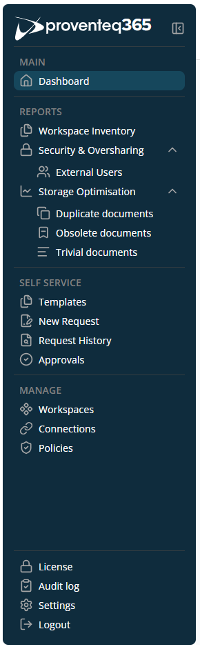

# Navigation Menu

The **Main** navigation menu in Proventeq365 provides quick access to key modules for **monitoring, reporting, self-service, and governance management** across your Microsoft 365 environment.

This menu includes the following modules:

**Main** — Contains the following submenu:

- **Dashboard** — Opens the application's dashboard screen. This screen shows consolidated insights and key metrics related to governance, security, and storage across your environment.

**Reports** — Contains the following submenus:

- **Workspace Inventory** — Opens the Workspace Inventory screen showing an overview of sites added to the workspace.
- **Security & Oversharing** — Opens the oversharing report screen, displaying permissions distributed over the site collection with potential security risks and content oversharing.
  - **External Users** — Opens the report for external users who have access to organisational content.
- **Storage Optimisation** — Three different analysis options are available under this menu. By clicking the down arrow icon next to the ROT Analysis option, the following sub-options appear:
  - **Obsolete Documents** — Opens the Obsolete Documents report showing outdated or unused documents.
  - **Duplicate Documents** — Opens the Duplicate Documents report showing redundant copies of documents.
  - **Trivial Documents** — Opens the Trivial Documents report showing low-value documents.

**Self Service** — Contains the following submenus:

- **Templates** — View available request templates.
- **New Request** — Create a new request using a selected template.
- **Request History** — Track the status and details of submitted requests.
- **Approvals** — Review and take action on requests awaiting approval.

**Manage** — Contains the following submenus:

- **Workspaces** — Displays a list of existing workspaces.
- **Connections** — Displays a list of supported external storage systems and lets you manage those connections.
- **Policies** — Displays a list of policies defined in the selected workspace.

**Systems** — Contains the following submenus:

- **License** — View Proventeq365 license information and re-activate the license.
- **Audit Log** — Review system activities for auditing and compliance purposes.
- **Settings** — Manage application-level configuration and preferences.
- **Logout** — Sign out of Proventeq365 securely.

Menu options shown in the navigation depend on the modules allocated by your license.
