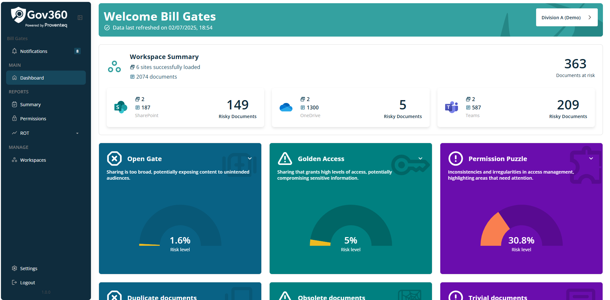

# Navigation Menu

Once Tenant Admin user logged into application, it will navigate to Dashboard module showing below view.

A vertical navigation menu is located on the left side, serving as the main menu for the application. This menu includes the following modules:

**Notifications --** Selecting this opens a list of notifications.

Main -- This contains the following submenus:

- Dashboard -- Selecting this opens the application\'s dashboard screen.

**Reports** -- This contains the following submenus:

- Permission -- Selecting this opens the permission oversharing report screen, displaying permissions distributed over the site collection.

- ROT -- Three different analysis options are available under this menu. By clicking the down arrow icon next to the ROT Analysis option, the following sub-options appear:

- Obsolete Documents -- Opens the obsolete documents report screen.

- Duplicate Documents -- Opens the duplicate documents report screen.

- Trivial Documents -- Opens the trivial documents report screen.

**Manage** -- This contains the following submenus:

- Workspace -- Selecting this displays a list of existing workspaces.

**Setting** -- Selecting this opens the General and Notification settings screen.

**Logout --** Selecting this logs the user out of the application.

Menu options in the navigation are accessible based on the user\'s role. Please refer to the table below for more information.

  ------------------------------------------------------------------------
  Menu                     Workspace Admin         Workspace User
  ------------------------ ----------------------- -----------------------
  Notification             Yes                     Yes

  Main - Dashboard         Yes                     Yes

  Report - Permission      Yes                     Yes

  Report - ROT             Yes                     Yes

  Manage - Workspace       Yes                     Yes

  Settings                 Yes                     Yes
  ------------------------------------------------------------------------
