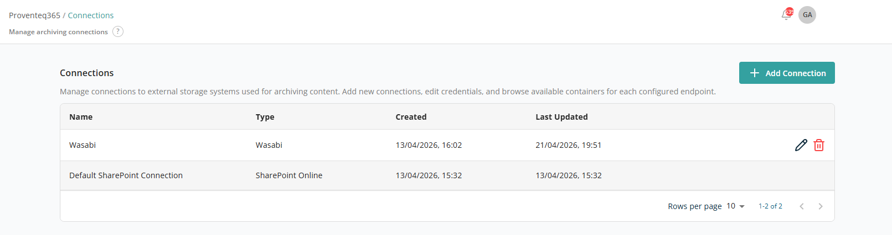
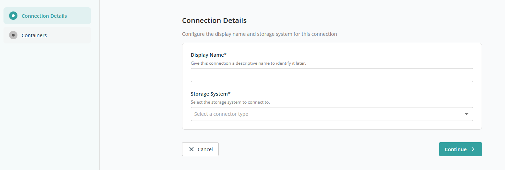
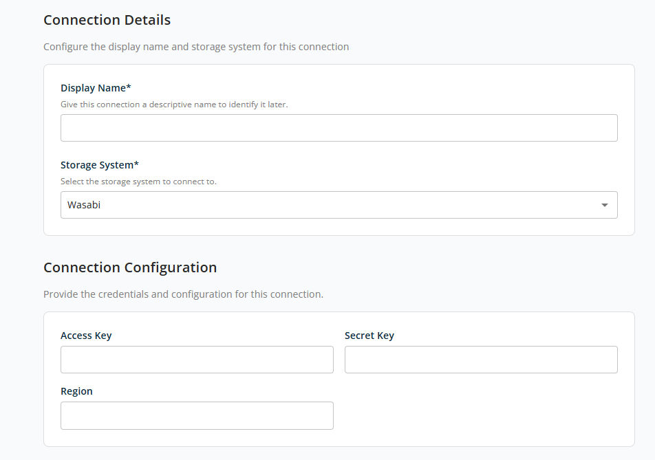
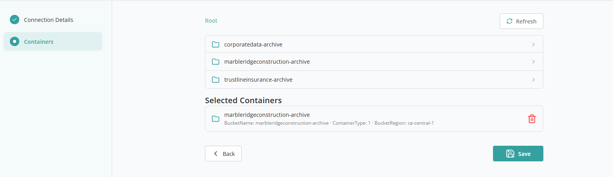

# Connections

The **Connections** page lets you manage external storage systems used for archiving content in Proventeq365 via the Obsolete Content Policy. From this page you can add new storage connections, review existing ones, update connection details, or remove connections that are no longer required.

When you click **Connections** in the menu, the following screen appears:

## Connections List

The main section of the page displays a list of all configured storage connections. Each row represents one connection and includes:

- **Name** — The friendly name assigned to the connection when it was created. This name helps you identify the connection when setting up archiving or governance policies.
- **Type** — The storage platform associated with the connection, such as SharePoint Online or a third-party object storage provider. This indicates where archived content will be stored.
- **Created** — The date and time when the connection was first created. Useful for audit and tracking.
- **Last Updated** — The most recent date and time when the connection was modified, for example when credentials or configuration details were updated.
- **Actions** — Icons to manage each connection:
  - **Edit** — Update settings or credentials. Typically used when credentials expire or connection details need to be changed.
  - **Delete** — Remove the connection. Connections actively used by archiving processes may not be removable until they are no longer in use.

At the bottom right of the list:

- **Rows Per Page** — Select the number of rows displayed per page (5, 10, 15, 20, 25, 30, 50, or 100). Default: 10.
- **Total Record Count** — Range and total record count, e.g. "0–10 out of 200".
- **Next/Previous Navigation** — Navigate between record sets using the `<` and `>` arrow icons.

## Add Connection

Click **Add Connection** to create a new connection to an external storage system. This screen lets you configure the details required to connect Proventeq365 to an external storage system for archiving.

### Connection Details

This section captures the basic identification and storage system information:

- **Display Name** — Required text field for a friendly, descriptive name for the connection.
- **Storage System** — Required dropdown listing the external storage systems available. The currently supported storage system is **Wasabi**.

Once **Wasabi** is selected, the **Connection Configuration** section appears:

### Connection Configuration

This section captures the authentication and technical details required to establish a secure connection to the selected storage system:

- **Access Key** — The access key provided by the storage system.
- **Secret Key** — The secret key associated with the access key.
- **Region** — The geographical region where the storage system is hosted.

Click **Next** to move to the next screen, then **Save** to save the connection. The available containers for archiving become visible after the connection is saved. Click **Back** then **Cancel** to discard and return to the list.

### Containers

After saving the connection, the **Containers** section becomes active. Containers (such as buckets or folders) define where archived content will be stored.

Before the connection is saved, this section displays the message: **"Save the connection first. You need to save the connection details before you can select containers."**

After saving, you can browse and select available containers from the configured storage system.

Use the **Refresh** option to reload the list of available containers. This is useful if:

- New containers were added externally.
- Access permissions were recently updated.

### Selected Containers

This section displays the containers that have been selected for archiving. Each entry shows:

- The container name.
- Additional metadata such as bucket name, container type, and region.

Use the **Delete** icon to remove a selected container. Once removed, the container will no longer be used for archiving. You can select a different container if required.
