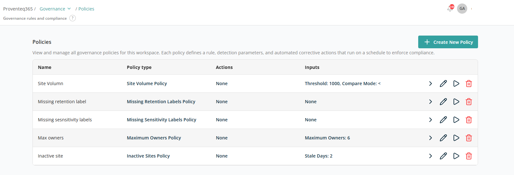
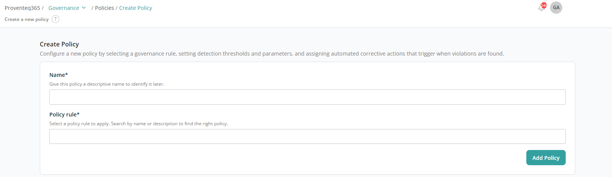

# Policies

The **Policies** screen lets you view and manage governance policies configured for the workspace. Each policy defines a rule, detection parameters, and optional automated actions that run on a schedule to support governance and compliance.

## Policies List

The table displays all configured policies with the following details:

- **Name** — The policy name, used to identify the rule.
- **Policy type** — The type of governance rule being enforced.
- **Actions** — Actions associated with the policy, performed on the scoped data.
- **Inputs** — Parameters used by the policy (for example, thresholds or limits).
- **Available actions** — Each policy row includes action icons to manage the policy:
  - **View** — View policy results.
  - **Edit** — Modify the policy settings.
  - **Run** — Manually trigger the policy.
  - **Delete** — Remove the policy from the workspace.

## Create New Policy

Click **+ Create New Policy** to add a new policy. The following screen appears for configuring the policy:

The available policy rules and their inputs/actions are documented in the [Predefined Policies](../../appendix/predefined-policies.md) appendix.
