# Workspaces

When you click on **Workspaces** in the menu, the Workspaces screen opens with the following view.

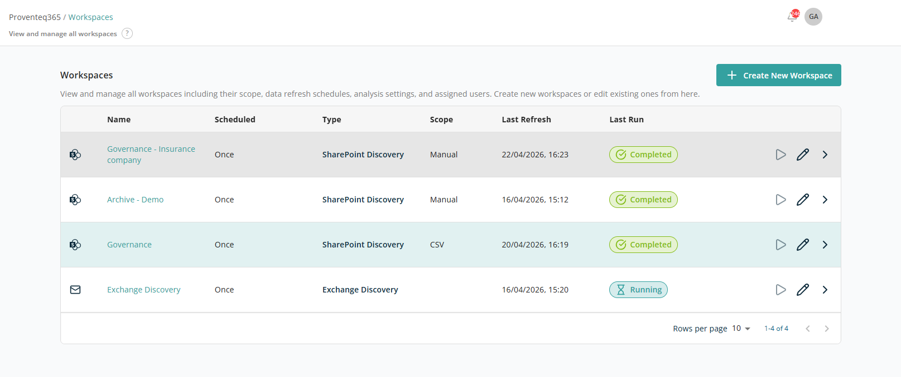

## Workspaces List

The main section of the page displays a list of all created workspaces. Each row represents one workspace and includes the following information:

- **Name** — The name assigned to the workspace.
- **Scheduled** — The scheduling type (Once or Repeating).
- **Type** — The workspace type. Possible values are Microsoft 365 Governance, Exchange Monitoring, and Content Migration.
- **Scope** — Which content is included. *Manual* means sites were picked by hand, *CSV* means a list was uploaded, and *All* means the entire tenant is in scope.
- **Last Refresh** — The date and time the workspace last pulled fresh data, in `DD/MM/YYYY, HH:MM` format.
- **Last Run** — The status of the most recent run: **Completed** (green), **Running** (blue, in progress), or **No runs** (orange, never executed).
- **Action** — Contains icons allowing users to Edit, Run, or Show Runs for the workspace:
  - **Run** — Immediately triggers discovery for the selected workspace.
  - **Edit** — Opens the workspace in edit mode.
  - **Delete** — Deletes the selected workspace.

Additional functionality is available at the bottom right of the list table:

- **Rows Per Page** — Select the number of rows displayed per page from a dropdown. Options include 5, 10, 15, 20, 25, 30, 50, and 100. The default is 10 records per page.
- **Total Record Count** — Shows the range and total number of records, e.g., "0–10 out of 200."
- **Next/Previous Navigation** — Navigate between record sets using the `<` and `>` arrow icons.

## Create Workspace

The **+ Create New Workspace** button at the top right lets you set up a new workspace from scratch. Clicking it opens a stepper wizard.

### For Microsoft 365 Governance

The first screen of the wizard is titled **Sources**.

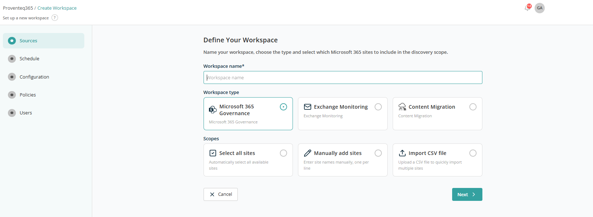

- **Workspace name** — Required text field for the workspace name.
- **Workspace type** — Three cards: Microsoft 365 Governance, Exchange Monitoring, Content Migration. By default the Microsoft 365 Governance card is selected.
- **Scopes** — Three radio options: Select all sites, Manually add sites, or Import CSV File. Only one can be selected at a time.

#### Select All Sites

When **Select All Sites** is chosen, two additional checkboxes appear to include site collections, OneDrives, or both. You can adjust this combination to suit your needs.

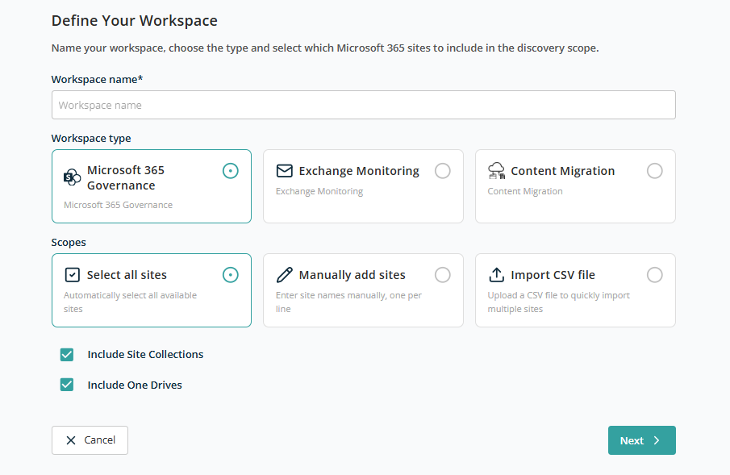

#### Manually Add Sites

When this option is selected, the following additional controls are displayed:

- Help text showing the sample format for SharePoint sites, Team sites, and OneDrives.
- A text box for entering site URLs. Multiple sites can be added; enter one site per line and press Enter to add another.

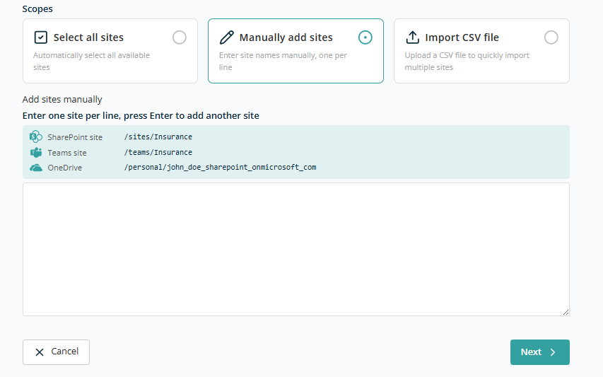

#### Import CSV File

When this option is selected, a drag-and-drop area appears for uploading a CSV file. You can drop the file into this area or click the highlighted region to open the standard file selection dialog.

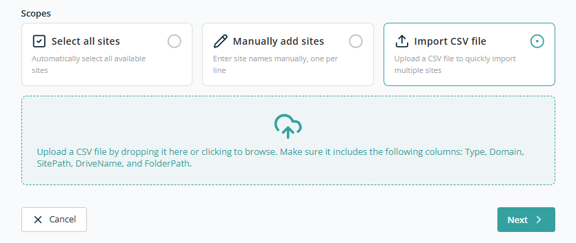

**Sample CSV Format:**

```csv
Type,Domain,SitePath,DriveName,FolderPath
Site,proventeq.sharepoint.com,/sites/Demo_Marketing,,
Site,proventeq.sharepoint.com,/sites/Demo_Training,,
Site,proventeq.sharepoint.com,/teams/Demo_HR,,
Site,proventeq.sharepoint.com,/personal/adelev_proventeqe5_onmicrosoft_com,,
```

After choosing the appropriate option, click **Next** to proceed to the Schedule screen. Clicking **Cancel** returns you to the Workspaces list.

#### Schedule

On the **Schedule** screen, the following sections and controls are displayed:

- **Header Text** — Reads "Data Refresh Schedule".
- **Type** — Two selectable cards: One time, Recurring.

When **One time** is selected:

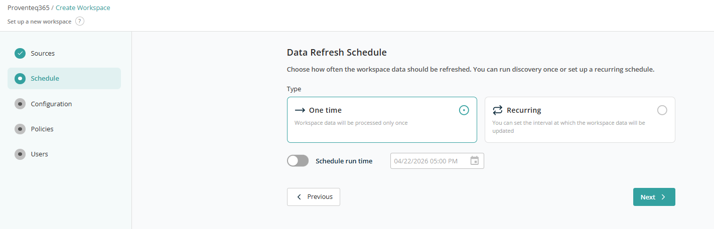

- **Schedule Run Time** — A toggle, set to OFF by default. Switching it ON activates the Date/Time selection control.
- **Date/Time Selection Control** — Defaults to the current date with the time rounded down to the nearest hour (for example, if the current date and time are January 25, 2025, 13:30 PM, the control will display `01/25/2025 13:00 PM`). The calendar icon opens the Date/Time selection interface.

**Note:** The date/time control does not allow selection of a date or time in the past.

When **Recurring** is selected, additional controls appear:

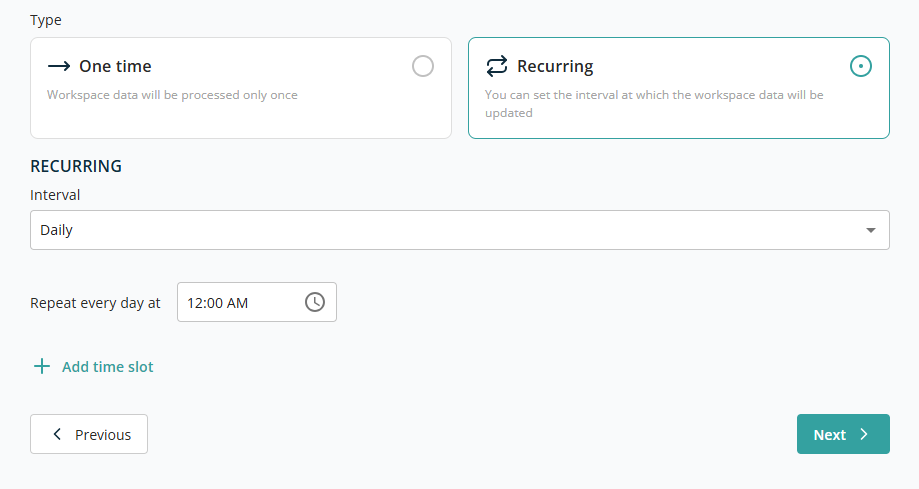

The **Recurring** dropdown lets you choose between Daily, Weekly, Monthly, or Hourly.

**Daily** — A time picker appears to set the repeat time (e.g., 11:00 AM, 1:30 PM).

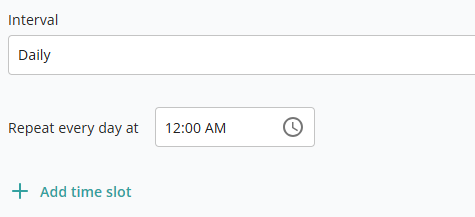

**Weekly** — Two controls appear: a dropdown to select a day from Monday to Sunday, and a time control to choose a specific time. Use **Add Time Slot** to schedule repeats on other days.

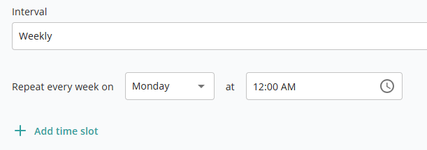

**Monthly** — Two controls appear: a dropdown to select a day of the month, and a time control to choose a specific time. Use **Add Time Slot** to schedule repeats on other days of the month.

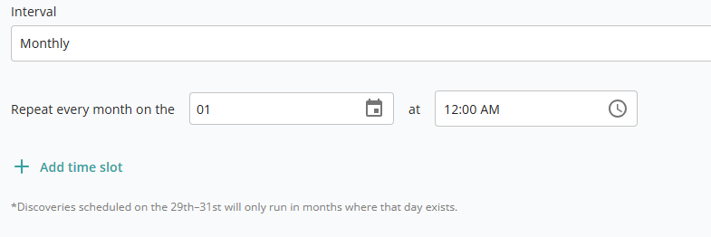

**Hourly** — A single dropdown to select a minute interval (0–59) at which the scan repeats during the same day.

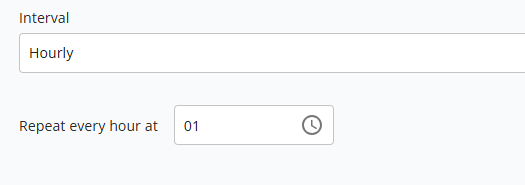

Click **Next** to proceed to the Configuration screen. Click **Cancel** to return.

#### Configuration

The Configuration screen contains the following sections and controls:

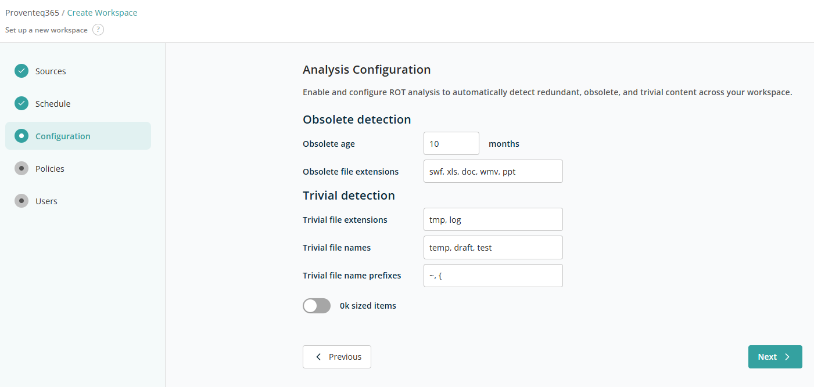

- **Obsolete detection** — Configures how obsolete content is identified:
  - **Obsolete age** — Text box for age in months. Default value is 10.
  - **Obsolete file extensions** — Text box for file extensions separated by commas. Default value: `swf, xls, doc, wmv, ppt`.
- **Trivial detection** — Configures how trivial content is identified:
  - **Trivial file extensions** — Text box for file extensions separated by commas. Default value: `tmp, log`.
  - **Trivial file names** — Text box for file names separated by commas. Default value: `temp, draft, test`.
  - **Trivial file name prefixes** — Text box for prefixes separated by commas. Default value: `~, {`.
  - **0kb sized items** — Toggle to include 0 KB files in analysis. OFF by default.

Click **Next** to proceed to the Policies screen.

#### Policies

The Policies screen contains the following sections and controls:

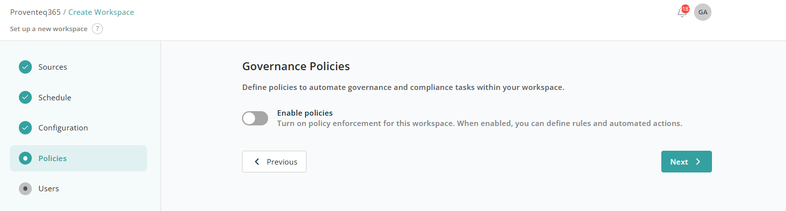

- **Enable policies** — A toggle that controls whether governance policies are enforced for the workspace:
  - **Enabled** — You can add governance policies and define automated actions. Selected policies are applied during workspace scans or analyses.
  - **Disabled** — No governance rules are enforced, even if policies are defined.

When the toggle is enabled, additional controls appear:

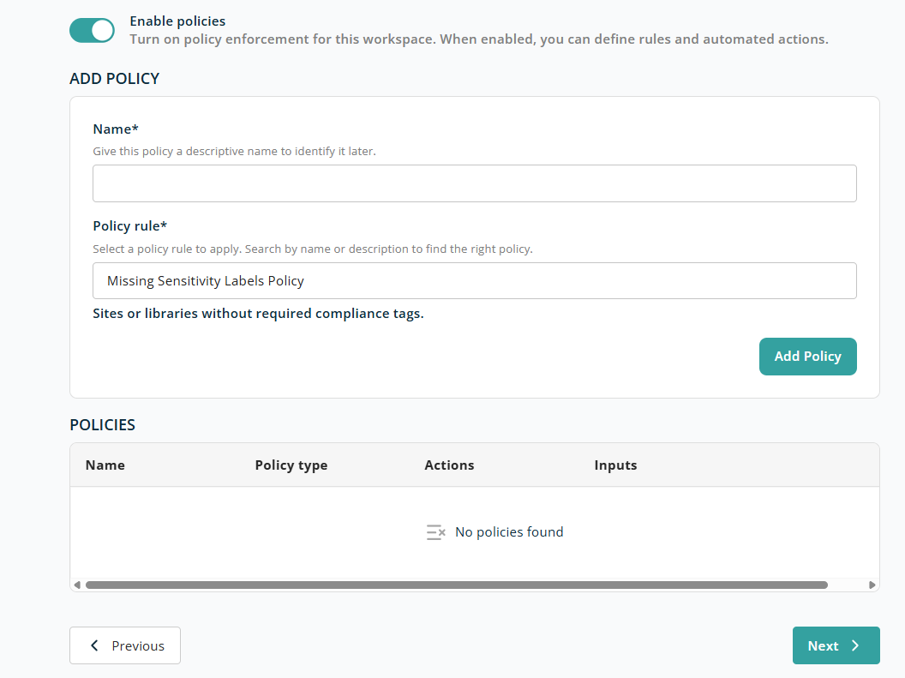

##### Add Policy

This section is for creating a new governance policy. To add a policy, supply the following required information:

- **Name** — A descriptive name for the policy. Required.
- **Policy rule** — Select a predefined policy rule from the list. Additional controls appear based on the selected rule. See [Predefined Policies](../../appendix/predefined-policies.md).

Once the required fields are populated, click **Add Policy** to save it and add it to the policy list at the bottom.

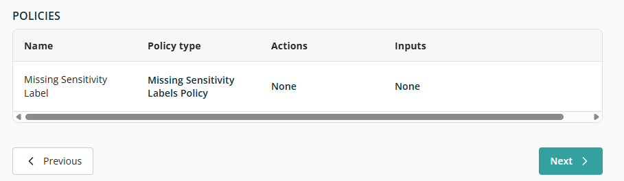

##### Policies List

This section displays all governance policies configured for the workspace. Each row represents one policy and includes:

- **Name** — The name you defined.
- **Policy type** — The type or category of the policy rule.
- **Actions** — The actions performed when the policy conditions are met. The available actions depend on the policy. See [Predefined Policies](../../appendix/predefined-policies.md) for the full list.
- **Inputs** — Parameters or values used by the policy rule.

If no policies have been added, the system displays **"No policies found."**

Click **Next** to proceed to the Users screen.

#### Users

The Users screen contains the following sections and controls:

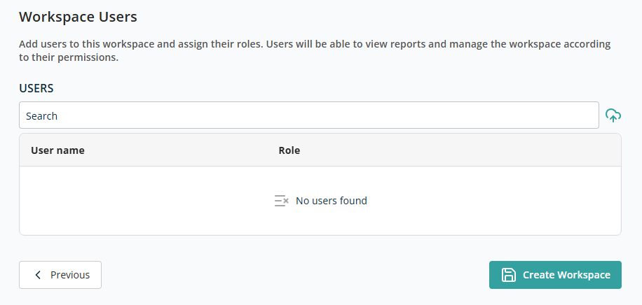

- **User Search Box** — Enter at least three characters to search for users. Click a result to add the user to the list below.

Each user in the list has a role dropdown with two options: **Workspace User** and **Workspace Admin**. A **Delete** icon next to each user allows removal.

A user cannot be added to the list more than once.

After selecting all required information, click **Create Workspace** to create the workspace and return to the Dashboard screen.

#### Role-Based Restrictions

Certain workspace features are restricted based on the logged-in user's role:

| Role | Can create workspace | Can edit existing workspace |
| --- | --- | --- |
| Workspace User | No | No |
| Workspace Admin | No | Yes (except scope of workspace) |
