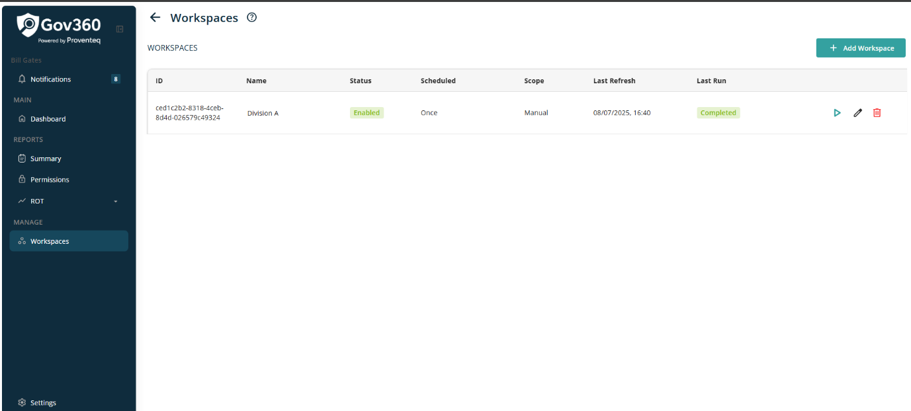

# Workspaces

When click on Workspaces menu, it will open workspaces screen with following view

In right side view of Workspaces, following section will be visible

### 2.1.1 Header

The header section will display the following details:

- **Header Text:** The header will read \"Workspaces.\"

- **Information Icon:** Clicking the icon will open a popup containing Text : **information about workspaces and their settings**. The popup includes a \"See More\" link, which redirects users to an external resource for further details.

### 2.1.2 Workspaces List

All created workspaces will be presented in a table format with the following columns:

- **ID:** Displays the unique identifier of the workspace.

- **Name:** Shows the name assigned to the workspace.

- **Status:** Indicates the current status of the workspace.

- **Scheduled:** Specifies the scheduling type (Once or Repeating).

- **Scope:** Outlines the scope associated with the workspace.

- **Last Refresh:** Provides the most recent refresh date and time.

- **Last Run:** Displays the most recent execution date and time.

- **Action:** Contains icons allowing users to Edit, Run, or Show Runs for the workspace.

- **Run:** Initiating this icon immediately triggers discovery for the selected workspace.

- **Edit:** Clicking this allows the workspace to be modified in edit mode.

- **Delete:** Deletes the selected workspace.

Additional functionalities are available at the bottom right of the workspace list table:

- **Rows Per Page:** Users can select the number of rows displayed per page using a dropdown menu. Options include 5, 10, 15, 20, 25, 30, 50, and 100, with the default set to 10 records per page.

- **Total Record Count:** Shows the range and total number of records, e.g., \"0--10 out of 200.\"

- **Next/Previous Navigation:** Users can navigate between record sets using left (\<) and right (\>) arrow icons.

### 2.1.3 Add Workspace

A button labeled \"Add Workspace\" is displayed at the top right corner of the screen, above the list. When clicked, it opens the following Wizard screen.

## Subsections

- [For SharePoint Source](./for-sharepoint-source.md)
- [For Exchange Source](./for-exchange-source.md)
