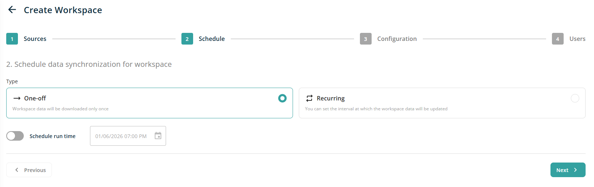
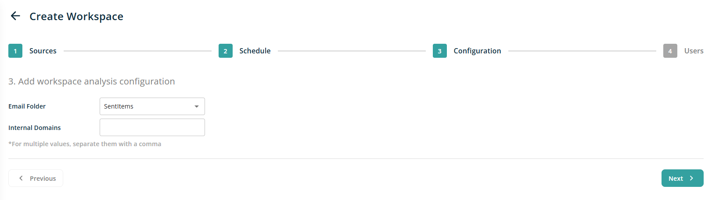

# For Exchange Source

While adding new workspace, when choose Exchange radio button and click on Next, user moved into Schedule screen and it will show following screen

This will be the same as we have for Sharepoint source type. After scheduling, click on Next button will show following screen on Configuration wizard screen.

