# For SharePoint Source

The first screen of the wizard is titled **Sites**. On the Sites screen, the following sections and controls are shown:

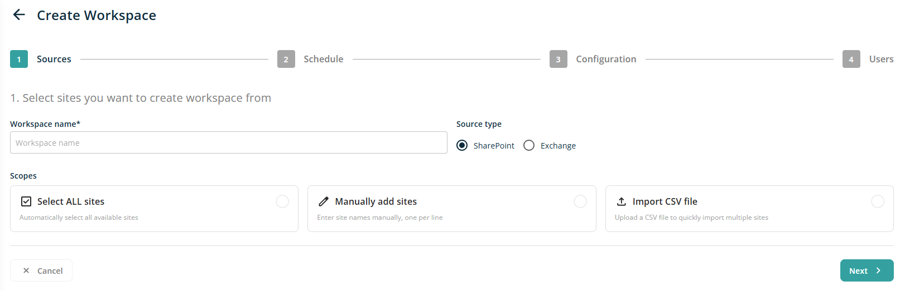

- **Header Text**: The header reads "1. Select sites you want to create workspace from."

- **Workspace Name**: This section contains a text box for entering the workspace name. Providing this information is required.

- **Source Type**: This field have two radio buttons : SharePoint, Exchange. By default, SharePoint radio button is selected.

- **Scopes**: This section allows the user to select one of three options using radio buttons---Select All Sites, Manually Add Site, or Import CSV File. Only one option can be selected at a time.

Each option within the Sites section has its own specific functionality.

**Select All Sites**

When the Select All Sites option is chosen, the following screen is displayed. This option does not present any additional controls for adding sites. By using this feature, users can initiate a scan across all sites available within the tenant to which they belong.

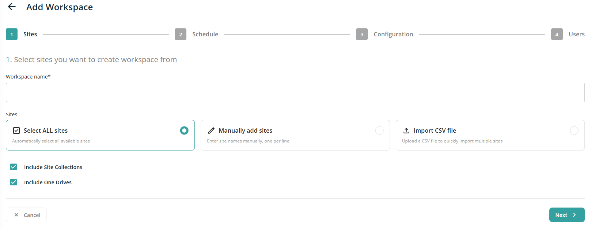

**Manually Add Site**

When this option is selected, the following additional controls are displayed on the screen:

- A group of radio button controls labeled: "Prepend /sites/ to each new line", "Prepend /teams/ to each new line", and "Prepend /personal/ to each new line". The selected radio button will prepend /sites/, /teams/, or /personal/ when Enter is pressed on the keyboard.

- A text box control for entering site names. Multiple sites can be added using this control; enter one site per line and press Enter to add another site.

- An information icon with the text: "Enter one site per line, press Enter to add another site".

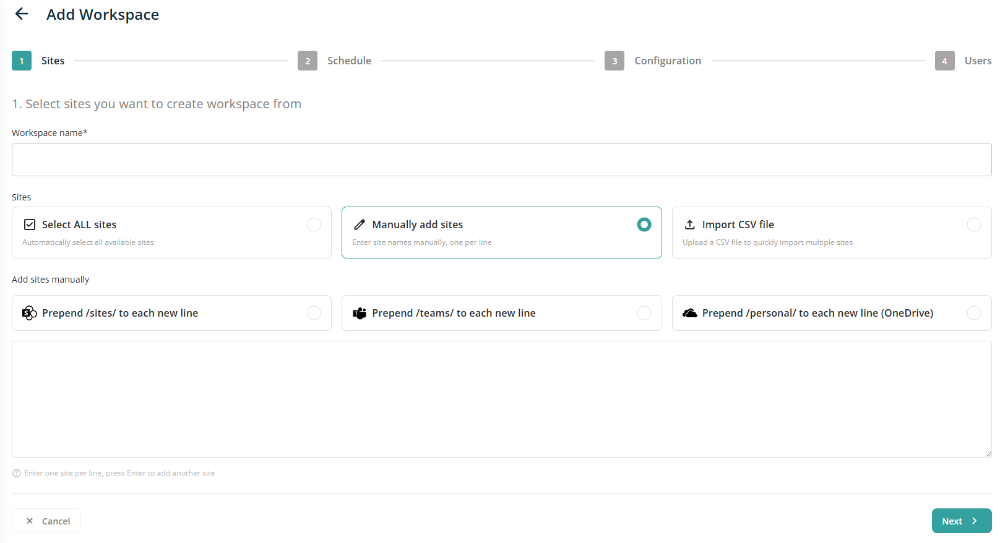

**Import CSV File**

When you select this option, additional controls will appear on the screen.

- A drag-and-drop area will be provided for uploading a CSV file. Users can either drop the CSV file into this area to import it or click the highlighted region to open the default file selection dialog.

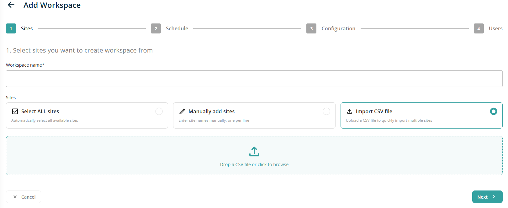

After selecting the appropriate option, clicking the \"Next\" button will proceed to the Schedule screen. If the \"Cancel\" button is clicked, the user will be redirected to the Sites screen.

Sample CSV Format :

| Type | Domain | SitePath | DriveName | FolderPath |
| --- | --- | --- | --- | --- |
| Site | proventeqe5.sharepoint.com | /sites/Demo_Marketing |  |  |
| Site | proventeqe5.sharepoint.com | /sites/Demo_Training |  |  |
| Site | proventeqe5.sharepoint.com | /sites/Demo_Insurance |  |  |
| Site | proventeqe5.sharepoint.com | /teams/Demo_HR |  |  |
| Site | proventeqe5.sharepoint.com | /personal/adelev_proventeqe5_onmicrosoft_com |  |  |
| Site | proventeqe5.sharepoint.com | /personal/duser_proventeqe5_onmicrosoft_com |  |  |
| Site | proventeqe5.sharepoint.com | /personal/leeg_proventeqe5_onmicrosoft_com |  |  |

After providing the necessary information on the Sites wizard screen, clicking the Next button opens the second screen, **Schedule**.

On the Schedule screen, the following sections and controls are displayed:

- **Header Text** -- The header reads "2. Schedule data synchronization for workspace".

- **Type** -- This section includes three selectable options, presented as radio buttons, allowing the user to choose only one at a time: One Off, Repeating.

When the One Off option is selected, additional controls appear on the screen.

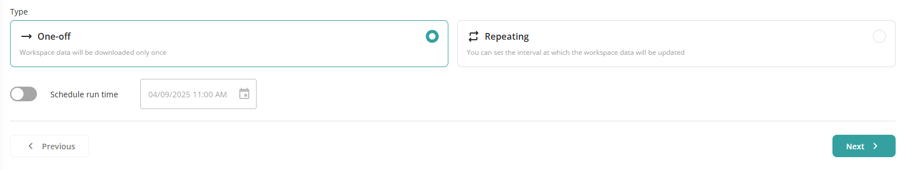

- **Schedule Run Time** -- This feature is controlled by a toggle button, which is set to OFF by default. When switched to ON, it activates the Date/Time Selection control.

- **Date/Time Selection Control** -- By default, this control displays the current date with the time rounded down to the nearest hour. For example, if the current date and time are January 25, 2025, 13:30 PM, the control will display 01/25/2025 13:00 PM. A calendar icon is included within the control; clicking this icon allows users to access the Date/Time selection interface.

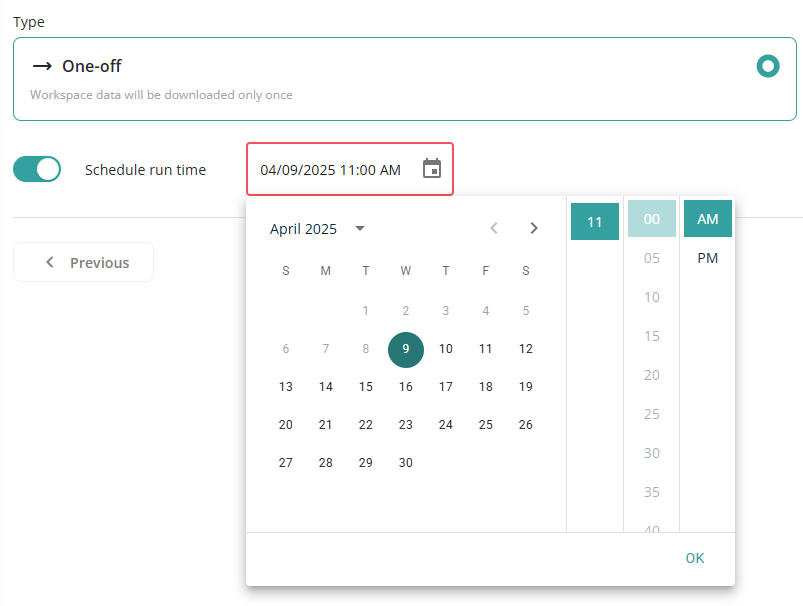

NOTE - This date/time control will not allow to select date/time in past

When the Repeating option is selected, additional controls will appear on the screen.

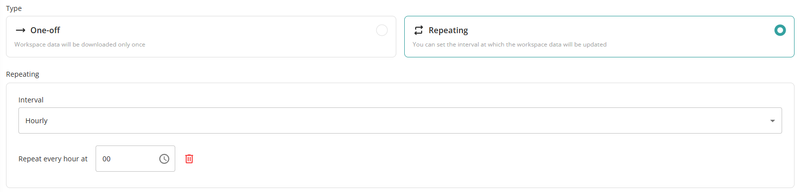

- **Repeating**: This dropdown lets you choose between Daily and Weekly.

When the **Daily** option selected, a time picker appears to set the repeat time (e.g., 11:00 AM, 1:30 PM).

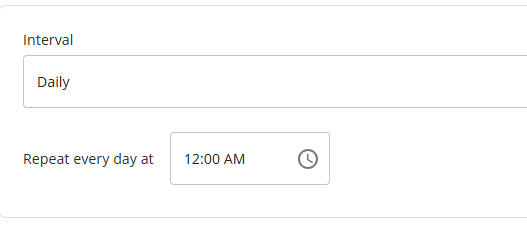

When the **Weekly** option is selected, two controls appear on the screen: a dropdown to select a day from Monday to Sunday, and a time control to choose a specific time, such as 11:00 AM or 13:30 PM. Users can add additional time slots with the Add Time Slot button to schedule repeats on other days.

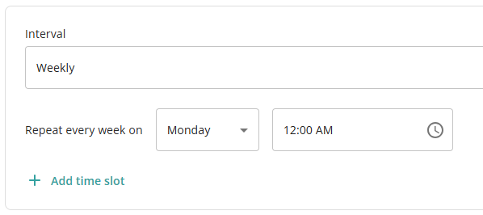

After selecting the relevant option and clicking the Next button, the user is directed to the Users screen. Selecting the Cancel button will return the user to the Schedule screen.

Upon entering the necessary information on the Schedule Wizard screen and proceeding by clicking Next, the third screen - **Configuration**.

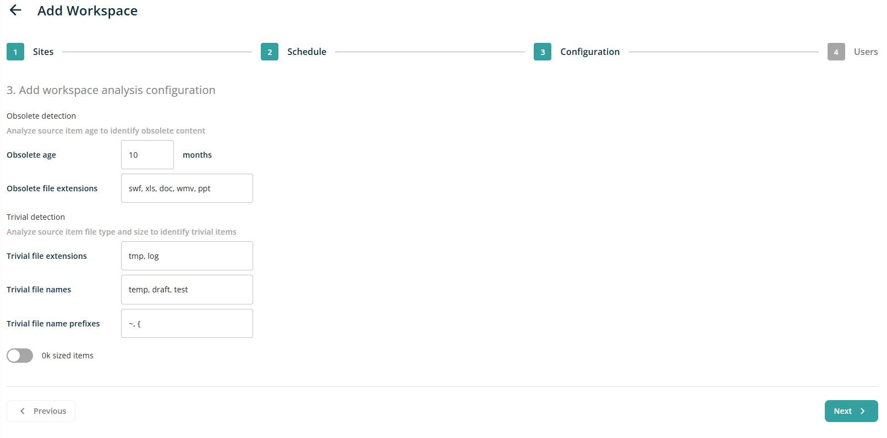

Configuration screen contains following sections and controls:

- **Header Text:** The header reads "3. Add workspace analysis configuration"

- **Obsolete detecton:** This section have following configuration options

  - **Obsolete age:** There will be a text box control to add age in Months. Default value in this text box will be 10

  - **Obsolete file extensions**: There will be a text box control to add file extensions separated by comma. Default value in the text box is swf, xls, doc, wmv, ppt.

- **Trivial detecton:** This section have following configuration options

  - **Trivial file extensions**: There will be a text box control to add file extensions separated by comma. Default value in the text box is: tmp, log

  - **Trivial file names**: There will be a text box control to add file name separated by comma. Default value in the text box is: temp, draft, test

  - **Trivial file name prefixes**: There will be a text box control to add file name prefix separated by comma. Default value in the text box is: \~, {

  - **0k sized items**: there will be a toggle control to analysed 0kb files. By default ths toggle is OFF.

Upon entering the necessary information on the Configuration Wizard screen and proceeding by clicking Next, the forth screen - **Policies**.

The Policies screen contains the following sections and controls:

Upon entering the necessary information on the Configuration Wizard screen and proceeding by clicking Next, the forth screen - **Users**.

The Users screen contains the following sections and controls:

- **Header Text:** The header reads "3. Add user to workspace and choose their role."

- **Search Box Control:** This text box allows users to search for other users. Entering at least three characters will display a list of matching users. Click on searched user will add it in to bottom list

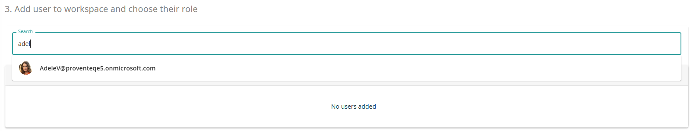

The list includes a dropdown control for selecting the user\'s role. The available options in the Role dropdown are Workspace User and Workspace Admin.

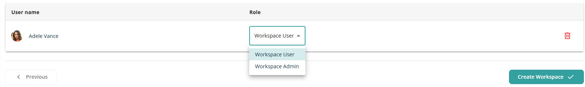

**A user cannot be added to the list more than once**. A Delete icon is displayed next to each user in the list to allow removal if needed.

After all required information has been selected, clicking the Create Workspace button will create a new workspace in the system and redirect the user to the Dashboard screen.

Certain workspace features may be restricted based on the role of the logged-in user. Refer to the table below for details.

| Role | Can create workspace | Can edit existing workspace |
| --- | --- | --- |
| Workspace User | No | No |
| Workspace Admin | Yes | Yes (Except Scope of workspace) |
