# Dashboard

When the Tenant Admin logs into the system for the first time, the Dashboard module is selected by default and its screen is displayed. A new workspace can be added by clicking the Add Workspace button, which redirects the user to the create workspace wizard.

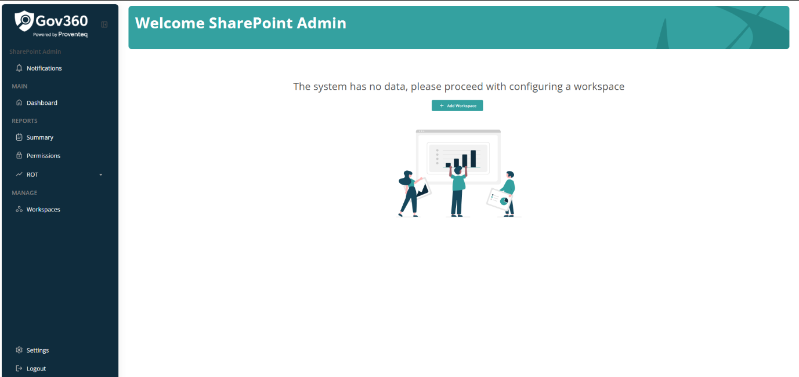

After the Tenant admin adds one or more workspaces, logging into the application as the Tenant Admin user will display the following screen.

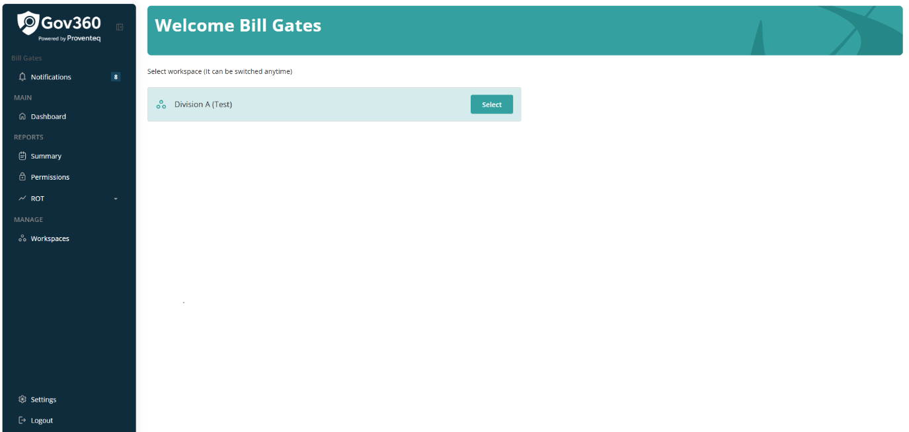

When the user hovers the mouse over the workspace name, a Select button appears, allowing selection of an existing workspace to view its data.

Clicking the Select button opens the Dashboard screen with the following view.

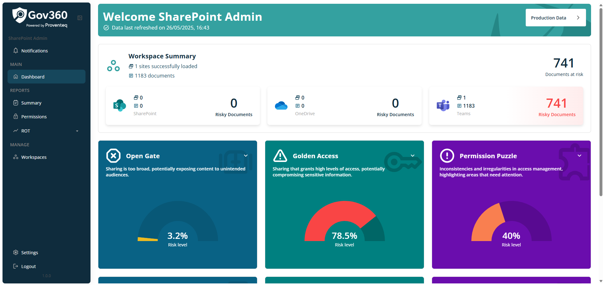

On the Dashboard screen, the following section is displayed:

### 3.1.1 Header

The header section includes the following elements:

- **Header Text**: The header reads \"Welcome \<Full name of Logged in user\>\"

- **Subheader Text**: Subheader text reads \"Data last refreshed on \<Date when item discovery happened\>\"

- **Current Workspace Name**: Presented as a button control with a \"\>\" icon indicating the currently selected workspace name. When clicked, this redirects the user to a page listing all added workspaces.

### 3.1.2 Workspace Summary

In Workspace summary section, it will show following information.

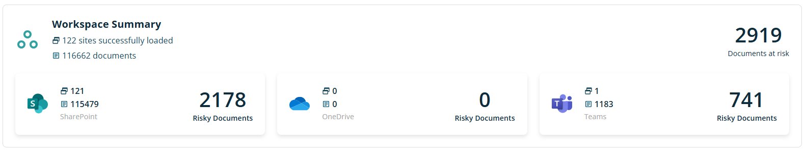

Under the Workspace Summary header, the system will display the number of sites successfully discovered within the workspace\'s scope, for example: **122 sites successfully discovered.**

Beneath this, the total number of documents identified will be shown (e.g., 116,662 documents).

On the right side, the count of Documents at Risk will be presented.

Below that section, three cards will provide data for SharePoint, OneDrive, and Teams Sites. Each card will include:

- An icon representing the respective type: SharePoint Site, OneDrive, or Teams,

- The total item count identified in each category,

- The total document count displayed below the item count,

- The number of risky documents indicated on the right side of each card.

### 3.1.3 Open Gate

An interactive card will be displayed with the header -- Open Gate. Below the header, descriptive text will state: Sharing is too broad, potentially exposing content to unintended audiences.

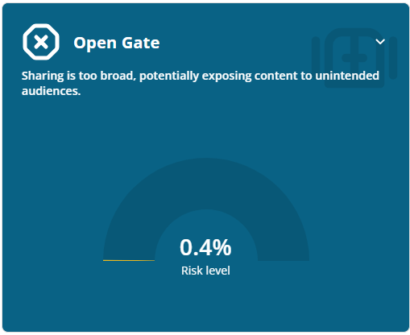

Below this text, a half pie chart will display the Risk Level percentage. A down arrow will be visible in the upper right corner; clicking this arrow will slide the current screen up to reveal various sharing categories, each accompanied by the corresponding document count.

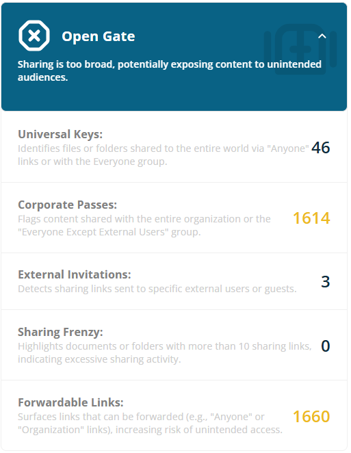

For Open Gate, the following categories display counts of documents classified accordingly:

- **Universal Keys**: Identifies files or folders shared through \"Anyone\" links or with the Everyone group.

- **Corporate Passes**: Flags content shared with the entire organization or the \"Everyone Except External Users\" group.

- **External Invitations**: Detects sharing links sent to specific external users or guests.

- **Sharing Frenzy**: Highlights documents or folders with more than 10 sharing links, indicating excessive sharing activity.

- **Forwardable Links:** Surfaces links that can be forwarded (e.g., \"Anyone\" or \"Organization\" links), increasing risk of unintended access.

Each category is clickable and opens a detailed permission report.

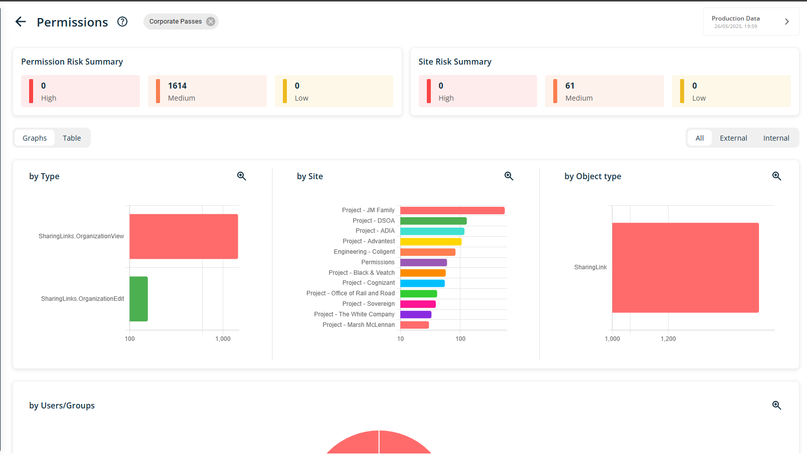

### 3.1.4 Golden Access

An interactive card will be displayed with the header -- Golden Access. Below the header, descriptive text will state: Sharing that grants high levels of access, potentially compromising sensitive information.

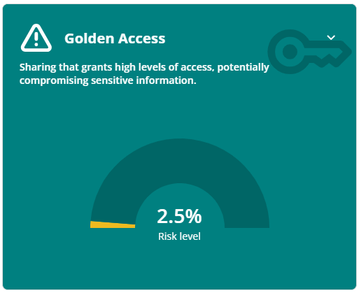

Below this text, a half pie chart will display the percentage of the Risk Level. A downward arrow will appear in the top right corner. When users click on this arrow, the current screen will slide up, revealing various sharing categories along with the count of documents associated with each category.

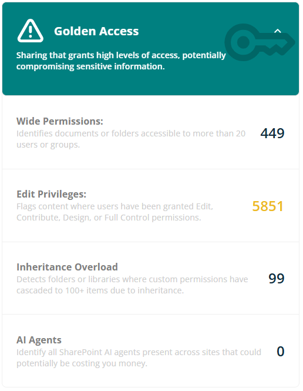

For Golden Access, the following categories display counts of documents that fall into each classification:

- **Wide Permissions:** Identifies documents or folders accessible to more than 20 users or groups.

- **Edit Privileges:** Flags content where users have been granted Edit, Contribute, Design, or Full Control permissions.

- **Inheritance Overload:** Detects folders or libraries where custom permissions have cascaded to 100+ items due to inheritance.

- **AI Agents:** Identify all SharePoint AI agents present across sites that could potentially be costing you money.

Each category is clickable and opens a detailed permission report.

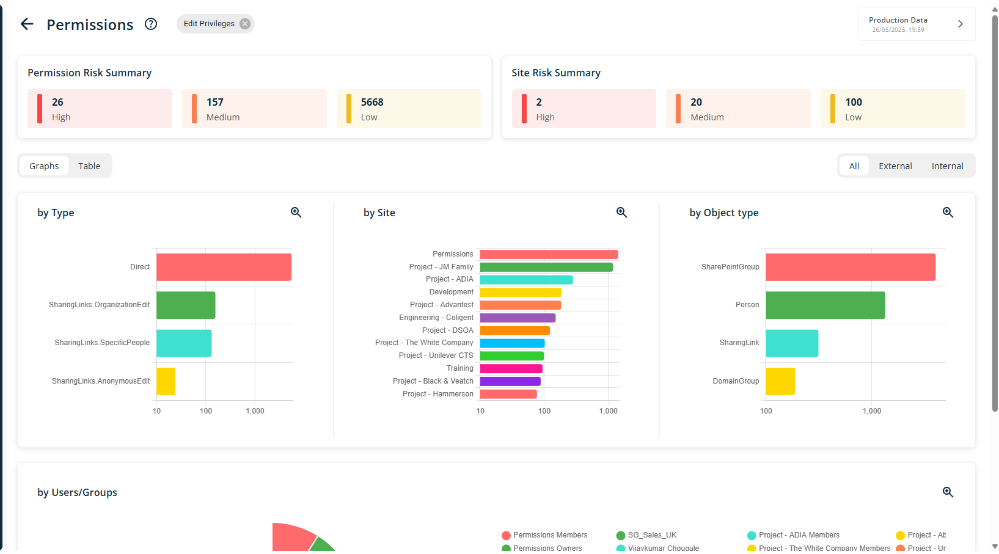

### 3.1.5 Permission Puzzle

An interactive card will be displayed with the header -- Permission Puzzle. Below the header, descriptive text will state: Inconsistencies and irregularities in access management, highlighting areas that need attention.

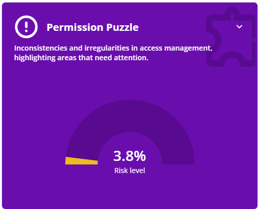

Below this section, a half pie chart will display the percentage of Risk Level. A down arrow icon will appear at the top right corner. When the user clicks on this arrow, the current screen will slide up, revealing various sharing categories along with the corresponding document counts for each category.

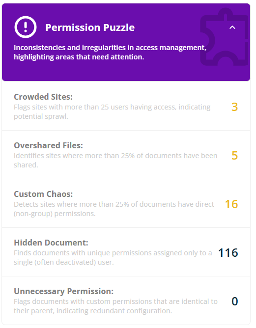

For Permission Puzzle, following are the categories showing counts of documents fall into it

- **Crowded Sites:** Flags sites with more than 25 users having access, indicating potential sprawl.

- **Overshared Files:** Identifies sites where more than 25% of documents have been shared.

- **Custom Chaos:** Detects sites where more than 25% of documents have direct (non-group) permissions.

- **Hidden Document:** Finds documents with unique permissions assigned only to a single (often deactivated) user.

- **Unnecessary Permission:** Flags documents with custom permissions that are identical to their parent, indicating redundant configuration.

Each category is clickable and opens a detailed permission report.

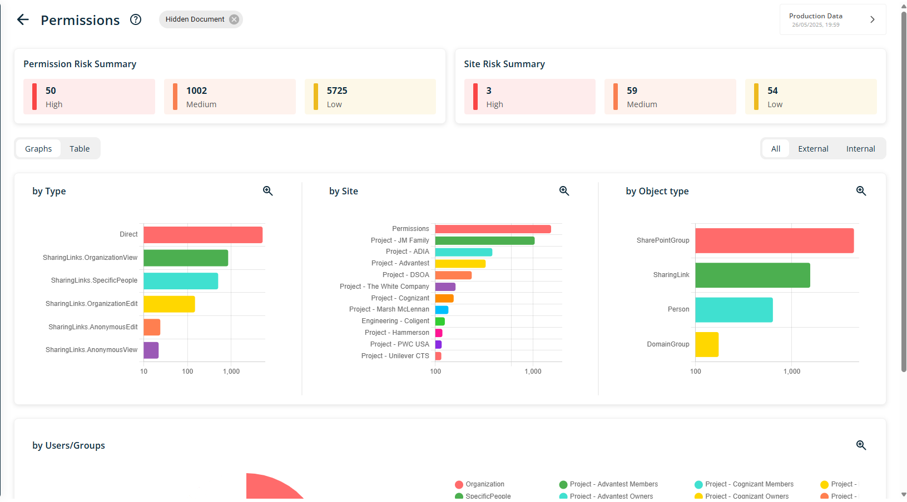

### 3.1.6 Duplicate documents

An interactive card will be displayed with the header -- Duplicate documents. Below the header, descriptive text will state: One or more exact copies of files stored on the system, which increases storage costs and increases risk of stale content

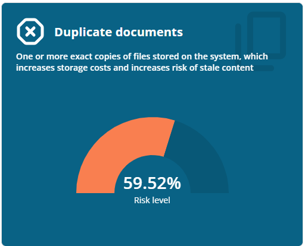

Below the descriptive text, a graph displays the percentage Risk Level. Clicking on the card redirects the user to the Duplicate Document Report screen.

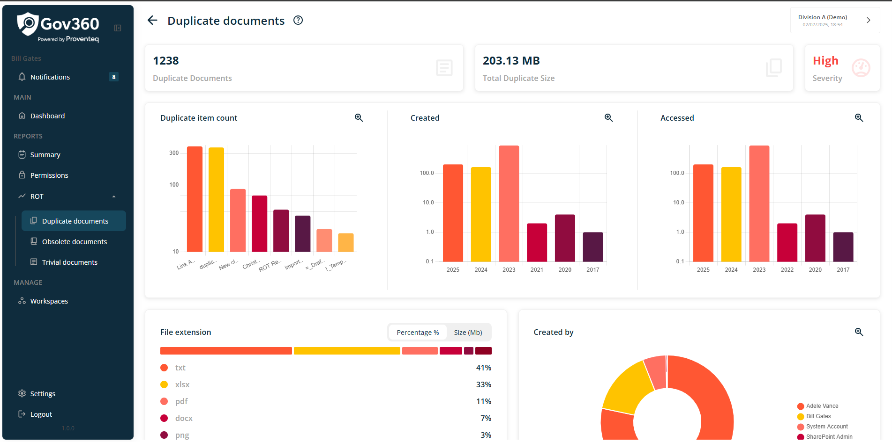

### 3.1.7 Obsolete documents

An interactive card will be displayed with the header -- Obsolate documents. Below the header, descriptive text will state: Information that is no longer in use, is out of date (modified older than 5 years), is no longer accurate or useful to the end user

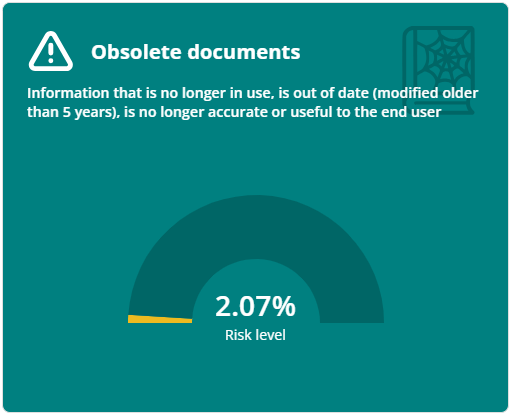

Beneath the descriptive text, a graph displays the percentage risk level. When a user clicks on the card, they are redirected to the Obsolete Document Report screen.

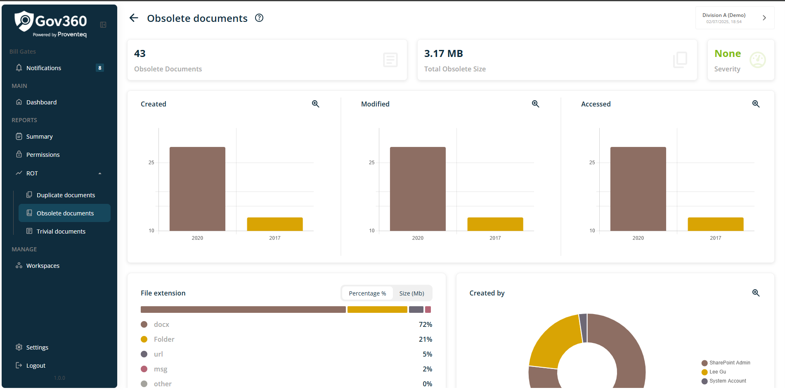

### 4.1.8 Trivial documents

An interactive card will be displayed with the header -- Trivial documents. Below the header, descriptive text will state: File type has no content value (trivial), such as executables, system files, log files, temp files or thumbnails

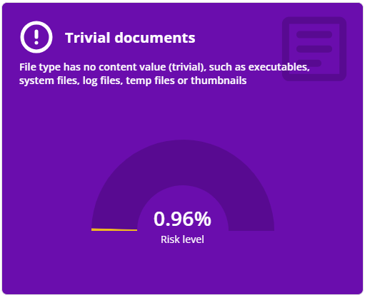

Below the descriptive text, a graph is displayed showing the percentage of Risk Level. Clicking on the card will redirect users to the Trivial Documents Report screen.

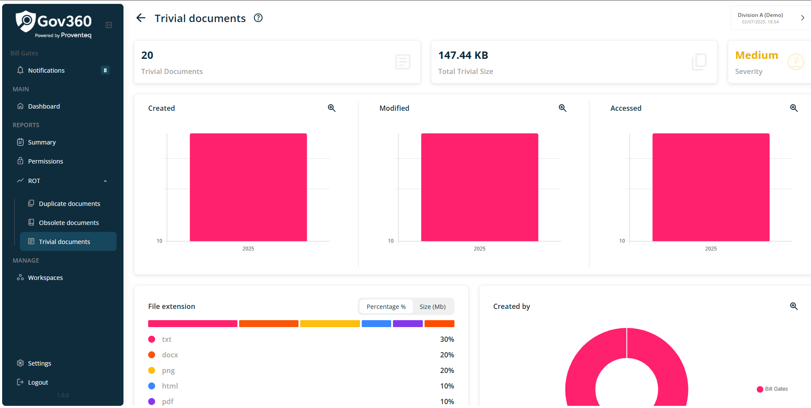
