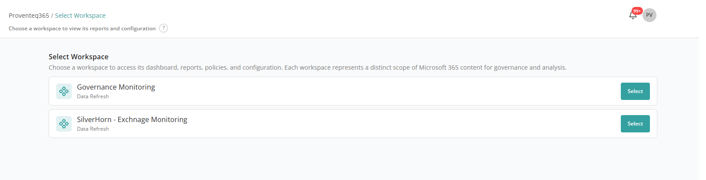
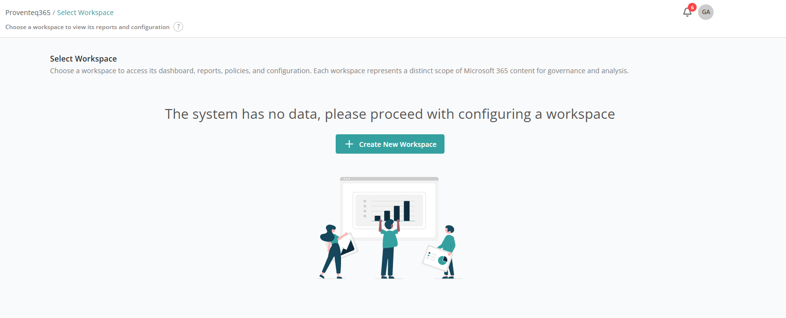
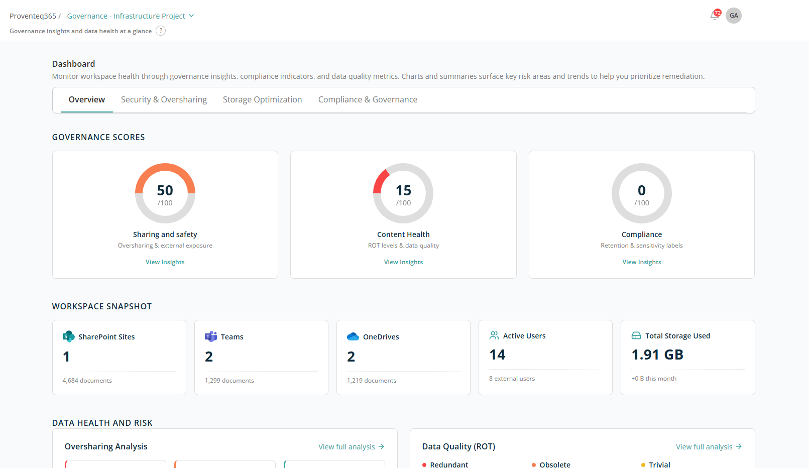
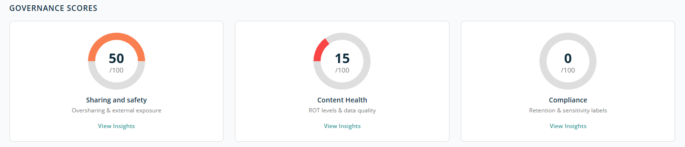
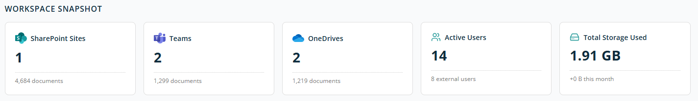
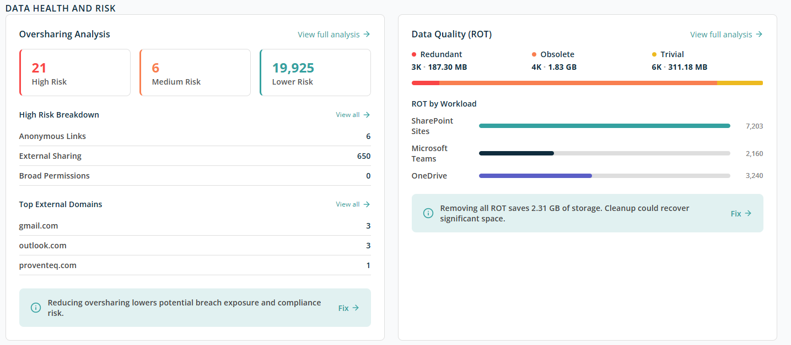

# Dashboard — Overview

The **Dashboard** is the default landing page for Tenant Admin users after sign-in. It surfaces workspace health, governance insights, compliance indicators, and data quality metrics so that risk areas and trends can be identified and prioritised for remediation.

The Dashboard landing page shows a list of existing workspaces to choose from. If no workspace is present yet, it shows a page with a **Create new workspace** button.

To open the Dashboard, select the workspace to analyse from the workspace selector at the top of the screen. Once a workspace is selected, the Dashboard populates the summaries and charts described below.

## Navigation Tabs

At the top of the Dashboard you can switch between different governance focus areas:

- **Overview** — Consolidated governance scores, workspace snapshot, and data health summary. *(This page.)*
- [Security & Oversharing](./security-oversharing.md) — Risk summary and detailed breakdown of sharing, access, and permission risks.
- [Storage Optimization](./storage-optimization.md) — Redundant, obsolete, and trivial content metrics to help optimise storage.
- [Compliance & Governance](./compliance-governance.md) — Active policies, files matched, and auto-remediation status.

## Governance Scores

This section displays overall governance scores on a **0–100 scale**, helping you quickly assess risk levels.

Three ring charts are displayed side by side, each showing a score out of 100 along with a short description and a **View insights** link:

- **Sharing and Safety** — Highlights issues related to oversharing and external user access. Lower scores indicate higher exposure risk.
- **Content Health** — Reflects the quality of content based on **ROT analysis**. Lower scores indicate healthy content with less presence of redundant, obsolete, or trivial content.
- **Compliance** — Score reflecting adherence to configured governance policies.

Each card includes a **View Insights** link to open the relevant tab.

## Workspace Snapshot

This section provides a quick summary of the workspace environment.

- **SharePoint Sites** — Total number of sites and number of documents stored in them.
- **Teams** — Number of Teams and number of documents stored in them.
- **OneDrives** — Number of user OneDrives and number of documents stored in them.
- **Active Users** — Count of active users, including external users.
- **Total Storage Used** — Combined storage consumption and monthly growth.

## Data Health and Risk

This section highlights areas where data may pose security risks or storage inefficiencies. It focuses on two key aspects:

- Oversharing risks
- Data quality (ROT)

### Oversharing Analysis

The **Oversharing Analysis** panel shows how much content is shared beyond recommended levels and categorises it by risk.

**Risk Levels:**

- **High Risk** — Content with the greatest exposure, such as anonymous links or sensitive data shared externally.
- **Medium Risk** — Content shared externally or broadly but with some limitations.
- **Lower Risk** — Content shared in a more controlled or restricted manner.

**High Risk Breakdown** — Explains *why* content is classified as high risk:

- **Anonymous Links** — Files or folders accessible via links that do not require sign-in.
- **External Sharing** — Content shared with users outside your organisation.
- **Broad Permissions** — Content shared with large internal groups such as "Everyone" or "All Users".

**Top External Domains** — Shows the most common external domains with which data is shared (for example, `gmail.com` or `outlook.com`). Helps identify unintended or risky external collaboration patterns.

Select **View all** to open a detailed report.

**Recommended Action** — An information message *"Reducing oversharing lowers potential breach exposure and compliance risk"* appears at the bottom. Select **Fix** to move on to the Security & Oversharing section for remediation actions.

At the top right of the panel, click **View full analysis** to open the detailed report.

### Data Quality (ROT)

The **Data Quality (ROT)** panel focuses on unnecessary data stored in the environment.

**ROT** stands for:

- **Redundant** — Duplicate or unnecessary copies of content.
- **Obsolete** — Outdated content no longer needed.
- **Trivial** — Low-value content with little business relevance.

**ROT Summary:**

- Number of files in each ROT category.
- Total storage consumed by each category.

The colour-coded bar visually represents how much space each category occupies.

**ROT by Workload** — Shows where ROT data exists across workloads: SharePoint Sites, Microsoft Teams, OneDrive.

**Storage Recovery Insight** — An informational message highlights the total storage that could be reclaimed if ROT data is removed (for example, **2.31 GB**). Select **Fix** to move on to the Storage Optimization section for cleanup if required.
