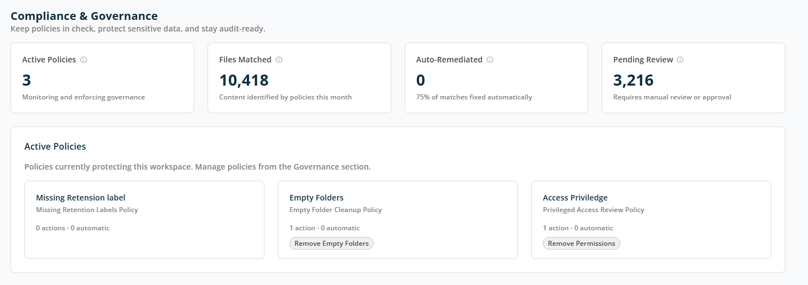

# Dashboard — Compliance & Governance

The **Compliance & Governance** screen helps you ensure that your Microsoft 365 environment remains policy-compliant, secure, and audit-ready. It provides visibility into active governance policies, how much content they affect, and what actions require attention.

## Compliance Summary

The summary cards at the top provide a quick snapshot of compliance activity in the workspace:

- **Active Policies** — The number of governance policies currently monitoring or enforcing rules in this workspace.
- **Files Matched** — Number of files identified by governance policies during the current period.
- **Auto-Remediated** — The number of issues resolved automatically without manual intervention.
- **Pending Review** — The number of items that require manual review or approval before action can be taken.

## Active Policies

This section lists the governance policies currently set up in the workspace. Each policy card shows its **Name**, **Policy rule name**, and current **activity status**. Each policy card is interactive — click on it to open the report screen for the selected policy.
