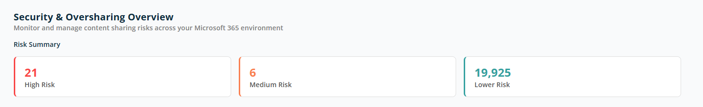
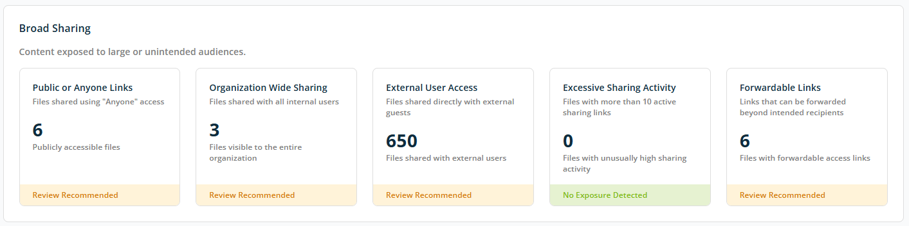
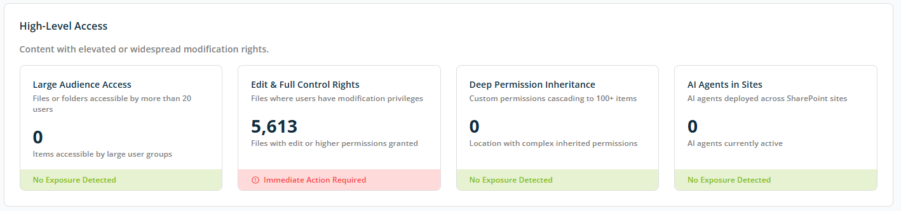
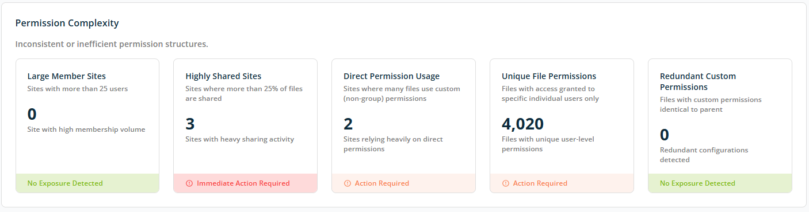

# Dashboard — Security & Oversharing

The **Security & Oversharing** overview screen provides a quick summary of **content sharing risks** across your Microsoft 365 environment. It helps you understand how securely information is shared and where potential exposure exists.

This view is designed to help you **identify risk levels at a glance** and decide where further investigation or remediation is required.

## Risk Summary

The **Risk Summary** section categorises shared content into three risk levels based on how widely and securely it is shared.

**High Risk** — Represents content with the highest exposure risk. Typically includes:

- Anonymous sharing links.
- Unrestricted external sharing.
- Highly permissive access settings.

High-risk items are most likely to lead to data leaks or compliance issues and should be reviewed urgently.

**Medium Risk** — Content with elevated exposure but with some access controls; often shared externally with known users or with limited safeguards. Medium-risk items may still violate internal policies and should be reviewed and tightened where needed.

**Lower Risk** — Content shared in a controlled and generally acceptable manner. Access is typically limited to specific internal users or groups. While lower risk, these items should still be monitored to ensure sharing does not expand unintentionally.

## Broad Sharing

The **Broad Sharing** section highlights content that may be exposed to **large or unintended audiences** within or outside your organisation. This view helps you quickly identify files that are shared too widely and may pose **security or compliance risks**.

### Sharing Risk Categories

Each category is displayed with a count of affected documents and a status of **Review Recommended** or **Action Required**:

- **Public or Anyone Links** — Files accessible by anyone with the link, without sign-in.
- **Organisation-Wide Sharing** — Files shared with groups such as "Everyone" or "All Users".
- **External User Access** — Files shared with guest users outside your organisation.
- **Excessive Sharing Activity** — Files with more than 10 active sharing links.
- **Forwardable Links** — Files with links that can be forwarded beyond the intended recipients.

Each card shows a recommended action — **No Exposure Detected**, **Review Recommended**, **Immediate Action Required**, or **Action Required** — based on the identified counts.

## High-Level Access

The **High-Level Access** section highlights content with elevated or widespread modification rights. This view helps you identify files, folders, or sites where users may have more control than necessary, which increases the risk of accidental data changes, misuse, or compliance issues.

### Access Risk Categories

- **Large Audience Access** — Files or folders accessible by large groups or audiences (more than 20 users).
- **Edit & Full Control Rights** — Files with excessive edit or full control permissions.
- **Deep Permission Inheritance** — Files with complex permission structures inherited across many items (typically 100+ items).
- **AI Agents in Sites** — SharePoint AI agents in use across sites that may incur additional cost or risk.

Each card shows a recommended action — **No Exposure Detected**, **Review Recommended**, **Immediate Action Required**, or **Action Required** — based on the identified counts.

## Permission Complexity

The **Permission Complexity** section highlights inconsistent, overly complex, or inefficient permission structures across your Microsoft 365 environment. Complex permissions make access harder to manage, increase security risk, and often lead to unintentional oversharing.

### Permission Complexity Indicators

- **Large Member Sites** — Number of SharePoint sites with very large memberships (typically more than 25 users).
- **Highly Shared Sites** — Number of SharePoint sites with unusually high sharing activity (typically where more than 25% of files are shared).
- **Direct Permission Usage** — Number of SharePoint sites that rely heavily on permissions assigned directly to individuals instead of groups (typically using custom, non-group permissions).
- **Unique File Permissions** — Files where each has its own custom permission set (permissions granted to specific individual users).
- **Redundant Custom Permissions** — Files with unnecessary permission customisations that add complexity without benefit (files with custom permissions identical to their parent).

Each card shows a recommended action — **No Exposure Detected**, **Review Recommended**, **Immediate Action Required**, or **Action Required** — based on the identified counts.
