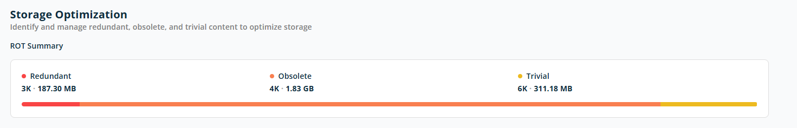
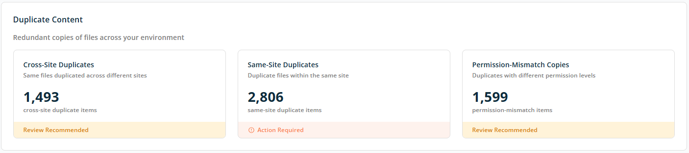
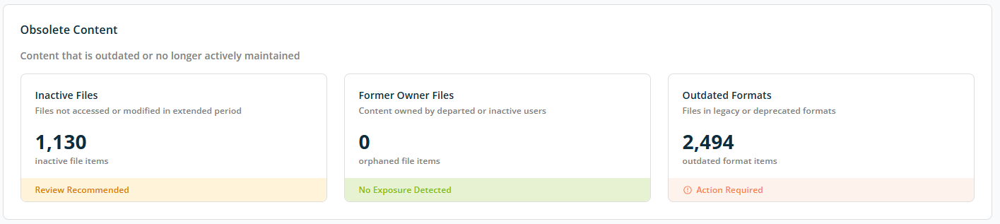
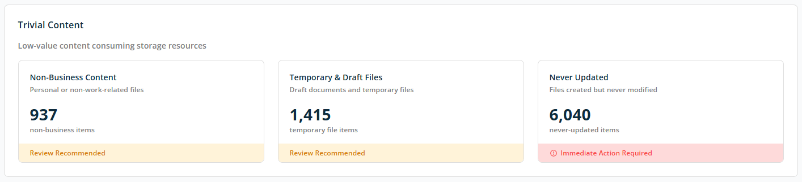

# Dashboard — Storage Optimization

The **Storage Optimization** screen helps you identify and manage **unnecessary content** in your Microsoft 365 environment. It focuses on **ROT data** — content that is **Redundant**, **Obsolete**, or **Trivial** — so you can reduce storage usage and improve overall content quality.

Use this screen to understand where storage space is being consumed by low-value data and to prioritise cleanup efforts.

## ROT Summary

The ROT Summary section provides a visual and numerical breakdown — with count and size — of unnecessary content grouped into three categories:

- **Redundant** — Duplicate or repeated copies of the same or very similar content.
- **Obsolete** — Outdated or no-longer-used content identified based on the workspace analysis configuration.
- **Trivial** — Low-value content such as drafts, temporary files, or test documents, identified based on the workspace analysis configuration.

The horizontal bar displays the proportional storage usage of each ROT category. Each colour represents a ROT type; longer segments indicate higher storage consumption.

## Duplicate Content

The **Duplicate Content** section helps you identify **redundant copies of files** across your Microsoft 365 environment. Duplicate files consume unnecessary storage, increase management effort, and can lead to confusion about which version is the correct or most up-to-date one.

### Duplicate Categories

Each card shows the number of duplicate items detected and a status indicating whether action is recommended or required:

- **Cross-Site Duplicates** — Identical files stored in multiple SharePoint sites or locations.
- **Same-Site Duplicates** — Identical files stored in the same SharePoint site or location.
- **Permission-Mismatch Copies** — Identical files stored in the same or multiple locations, but with different access permissions between copies.

Each card shows a recommended action — **No Exposure Detected**, **Review Recommended**, **Immediate Action Required**, or **Action Required** — based on the identified counts.

## Obsolete Content

This section highlights files that are outdated, no longer actively used, or no longer owned by active users. Such content often adds little business value while increasing storage usage, search clutter, and governance risk.

### Obsolete Content Categories

- **Inactive Files** — Files not viewed or updated within a defined time frame.
- **Former Owner Files** — Files whose original owners are no longer active in the organisation (content owned by departed or inactive users).
- **Outdated Formats** — Files in legacy or deprecated formats that may be unsupported or difficult to open.

Each card shows a recommended action — **No Exposure Detected**, **Review Recommended**, **Immediate Action Required**, or **Action Required** — based on the identified counts.

## Trivial Content

This section highlights low-value content that consumes storage but typically provides little or no business benefit. This includes personal files, drafts, temporary files, and content that was never meaningfully used.

### Trivial Content Categories

- **Non-Business Content** — Files that do not support business or operational needs (personal or non-work-related files).
- **Temporary & Draft Files** — Auto-saved drafts, temporary working files, or interim versions.
- **Never Updated** — Files that were created but never edited or meaningfully used.

Each card shows a recommended action — **No Exposure Detected**, **Review Recommended**, **Immediate Action Required**, or **Action Required** — based on the identified counts.
