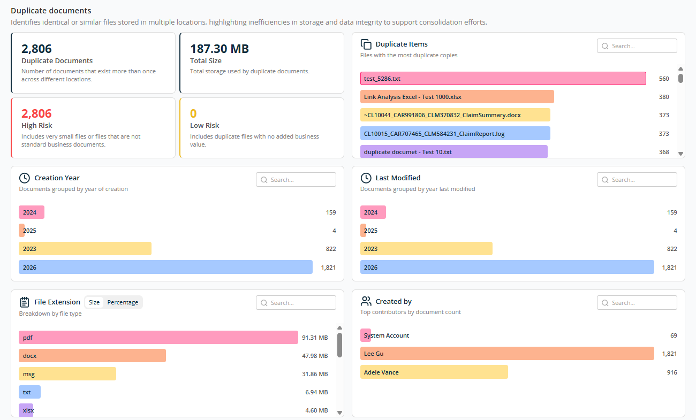
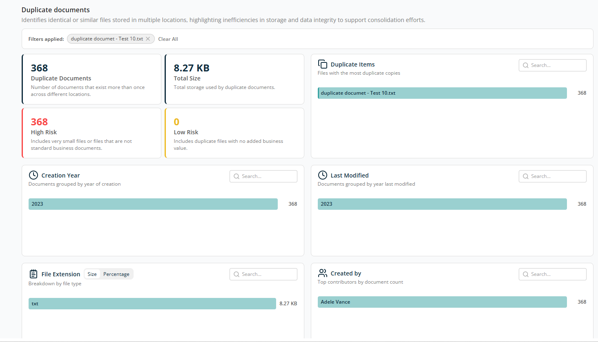
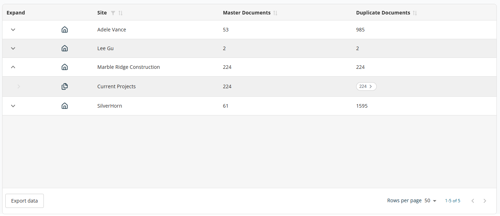
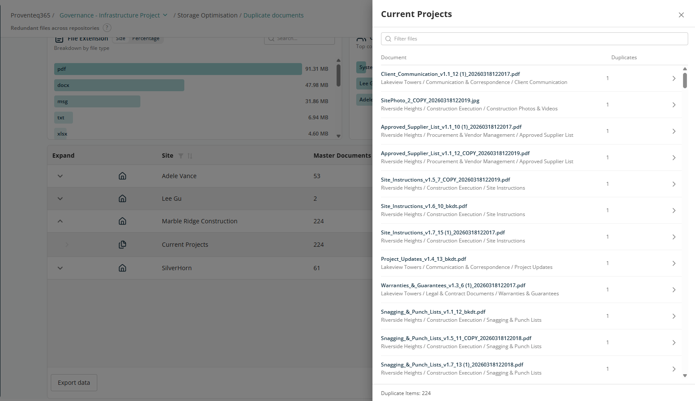
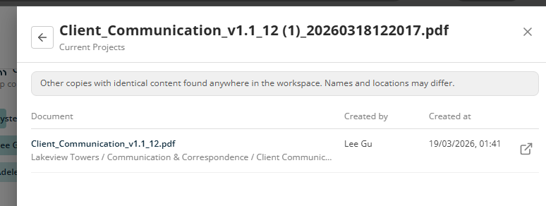

# Duplicate Documents Report

The **Duplicate Documents** screen helps you identify identical or very similar files stored in multiple locations across your environment. It highlights storage inefficiencies and potential data integrity issues, enabling informed decisions around content consolidation, cleanup, and governance.

## Overview

The summary section provides a quick snapshot of duplicate content and its impact:

- **Duplicate Documents** — Total number of documents that exist more than once across different locations.
- **Total Size** — The combined storage space used by all duplicate documents.
- **High Risk** — Duplicate files assessed as high risk, such as very small or non-standard business files and files with no clear business value.
- **Low Risk** — Duplicate files considered to have acceptable or necessary redundancy.

## Duplicate Items

Lists files with the number of duplicate copies in descending order from highest to lowest count. Each bar represents a file name; the number indicates how many duplicate copies exist. Use the **Search** box to locate a specific file by name.

## Creation Year

Shows duplicate documents grouped by their year of creation in descending order. Use the **Search** box to locate a specific year.

## Last Modified

Shows duplicate documents grouped by the year they were last updated in descending order. Use the **Search** box to locate a specific year.

## File Extension

Breaks down duplicate documents by **file type**, such as PDF, DOCX, MSG, TXT, XLSX. You can switch between:

- **Size view** — Storage consumed by each file type.
- **Percentage view** — Relative contribution to duplicate storage.

## Created By

Shows duplicate documents created by different users in descending order. Use the **Search** box to locate a specific user.

## Report Filtering

For all panels, each bar is clickable. The entire report filters based on the selected record, and the selected criteria appear next to **Filter by** at the top of the report. You can filter on multiple criteria simultaneously.

## Table View

The table at the bottom of the screen shows details of duplicate documents grouped by Site or OneDrive, with the following columns:

- **Expand** — Use the expand icon (arrow) to drill down into site-level or OneDrive-level details.
- **Site** — Name of the SharePoint site or OneDrive.
- **Master Documents** — Number of unique (original) documents. These are considered the primary versions of files.
- **Duplicate Documents** — Number of duplicate copies of documents found.

Sorting is available on Site, Master Documents, and Duplicate Documents. A filter is available for the Site column.

The table supports an expanded view for each row. Expanding a site displays specific locations within the site where duplicates exist. Example: *Marble Ridge Construction → Current Projects, 224 master documents and 224 duplicates.*

The **Export Data** button at the bottom left of the table downloads the report for offline analysis or reporting.

At the bottom right of the table:

- **Rows Per Page** — 5, 10, 15, 20, 25, 30, 50, or 100. Default: 10.
- **Total Record Count** — Range and total record count.
- **Next/Previous Navigation** — Arrow icons to navigate.

In the expanded view, clicking on a Duplicate item count opens a side panel listing duplicate documents and their counts.

There is a **>** arrow for each record to drill down to the next level to see the location and details of its duplicate documents.

