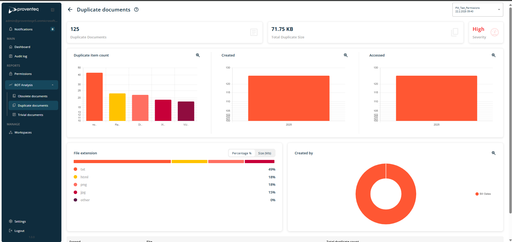
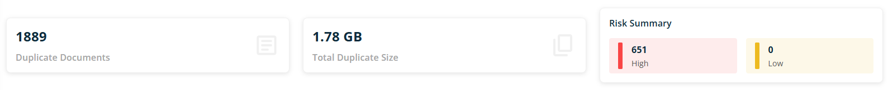
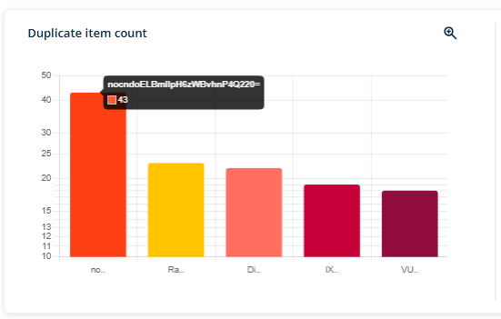
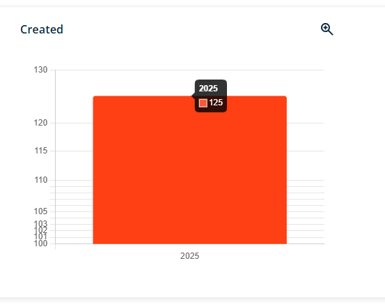
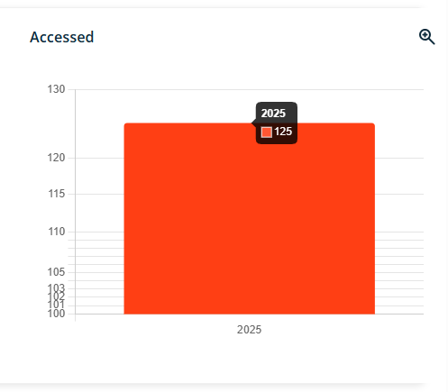
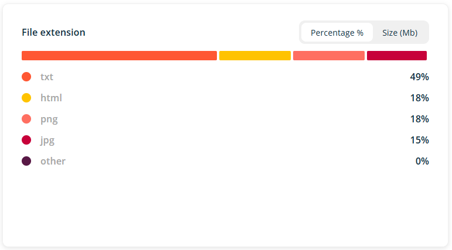
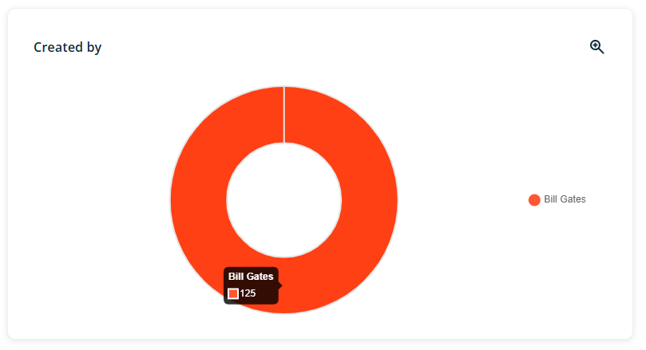
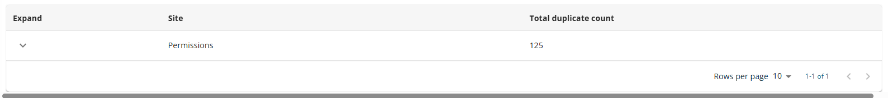
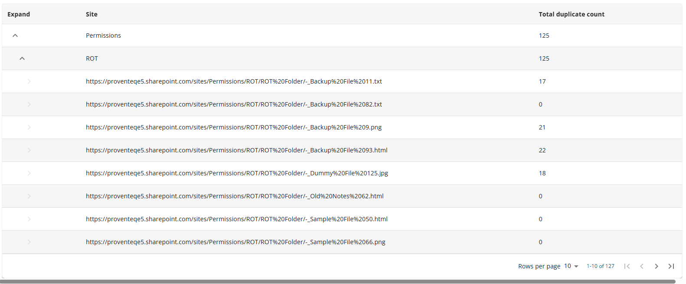

# Duplicate Documents Report

When you click the down arrow icon under the ROT Analysis menu, a sub-menu will appear allowing you to access the Duplicate Documents Report. This report provides detailed information on duplicate documents identified within the currently selected workspace scope.

When the user selects the duplicate documents menu, the following screen is displayed.

In Duplicate documents report, following section will be visible

### 4.5.1 Header

Header section will show following information/details

- **Header Text** -- The header reads - Duplicate documents

- **Information icon** -- when click on icon, it will open popup with text - **Detailed summary on duplicate data**. Popup will have See More link and when click on it, it redirect use to external link -

The current workspace name appears in the top right corner; clicking it opens the Dashboard, where users can view and switch between all available workspaces.

### 4.5.2 Count and Size Summary

This section will show count of duplicate documents, Total size of duplicate documents and Severity (None, Medium, High)

### 4.5.3 Duplicate Item count Graph

A bar chart will display the number of duplicate documents across sites within the workspace, showing document names versus their duplicate counts.

When mouse hover the respective pie chart, it will show count of items

### 4.5.4 Create in Year Graph

A graph will display the data by year of creation for site(s) within the workspace. The bar chart will present the count of records for each year.

When mouse hover the respective pie chart, it will show count of items

### 4.5.5 Accessed in Year Graph

A graphical representation will display data accessed by year across all sites within the workspace scope. The bar chart will differentiate data by year and corresponding count.

When mouse hover the respective pie chart, it will show count of items

### 4.5.6 File extension Graph

A bar chart will present a graphical representation of the analysed data by file extension. The chart will appear as illustrated below. Users can toggle between displaying data by percentage or by size using the option above the bar chart.

The data will be presented as percentages, categorized by file extension such as txt, docx, pptx, pdf, as well as folders and other types.

### 4.5.7 Created By Graph

A pie chart will display workspace data separated by user, with each user represented by a distinct color and legend.

When mouse hover the respective pie chart, it will show count of items

### 4.5.8 List of Duplicate Documents in Table view

A list of duplicate documents will be displayed at the bottom of the screen in list view.

Table will has the following columns

- **Expand** -- This column contains an arrow icon to expand or collapse the tree view for each site.

- **Site** -- This column displays the name of each site included in the workspace scope.

- **Total Duplicate count** -- This column shows the number of duplicate documents identified per site within the workspace scope.

When expand tree view of available record, data will be furture drill down to library level as like below

Additionally, in the bottom right corner of the workspace list table, several features are available:

- **Rows Per Page:** Users can adjust the number of rows displayed per page using the dropdown control in this section. Available options include 5, 10, 15, 20, 25, 30, 50, or 100 rows per page, with the default set to 10 records per page.

- **Total Record Count:** This feature displays the total number of records, for example, \"0-10 out of 200\".

- **Next/Previous Navigation:** Users can navigate between record sets using the \"\<\" and \"\>\" arrow icons to move to the previous or next set of records.
