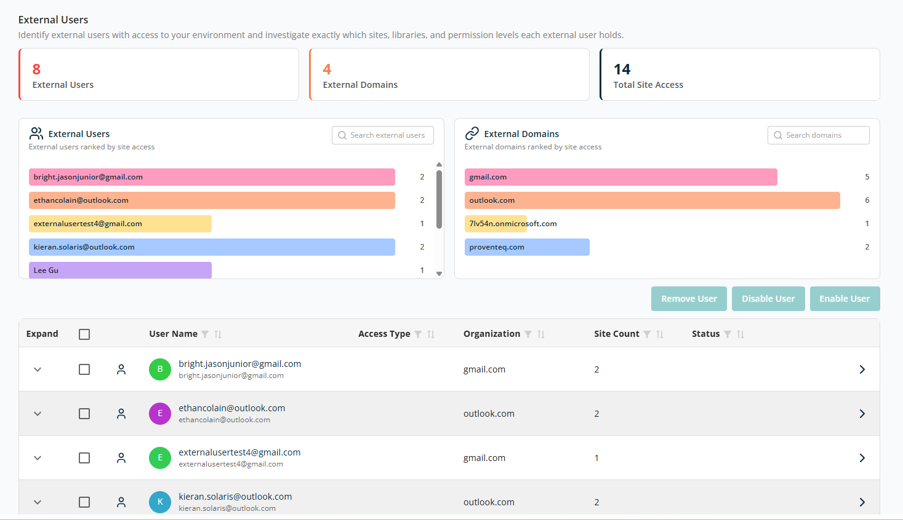
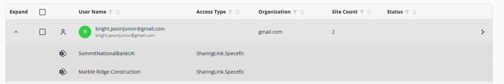

# External Users

The **External Users** screen helps you identify, review, and manage external users who have access to your Microsoft 365 environment. It provides visibility into who the external users are, which domains they belong to, and how many sites they can access, enabling you to reduce security and oversharing risks.

## Overview

At the top of the page, a high-level summary card displays counts:

- **External Users** — Total number of external (non-internal) users with access to your environment.
- **External Domains** — Number of unique external email domains (such as `gmail.com` or `outlook.com`).
- **Total Site Access** — Total number of site access relationships across all external users.

## External Users (Chart)

Shows external users ranked by the number of sites they can access. Each bar represents an individual external user. The number at the end of the bar indicates how many sites that user can access. Users with greater access are highlighted more prominently, helping you spot higher-risk users quickly. Use the **Search external users** box to find a specific user by name or email.

## External Domains

Shows external domains ranked by site access. Each bar represents a domain (for example, `gmail.com`, `outlook.com`). The value indicates how many site access permissions originate from that domain. This helps identify domains with widespread access across your environment. Use the **Search domains** box to focus on a specific external domain.

## External Users Table

The table at the bottom of the screen provides detailed, actionable information for each external user.

- **Expand** — Click to view more details about the sites and permissions assigned to the user.
- **Checkbox** — Select one or multiple records to remove or disable users.
- **User Name** — The external user's name and email address.
- **Access Type** — How the user was granted access (for example, direct permission or sharing).
- **Organization** — The user's email domain, helping identify where external access originates.
- **Site Count** — The number of SharePoint sites the user can access.
- **Status** — Whether the external user account is currently enabled or disabled.

The table supports sorting and filtering on all columns.

Three action buttons are displayed above the table for bulk actions:

- **Remove User** — Completely removes the external user's access from all sites.
- **Disable User** — Temporarily blocks access without deleting the user.
- **Enable User** — Restores access for a previously disabled external user.

At the bottom right of the table:

- **Rows Per Page** — 5, 10, 15, 20, 25, 30, 50, or 100. Default: 10.
- **Total Record Count** — Range and total record count.
- **Next/Previous Navigation** — Arrow icons to navigate.

Expand a row to see the access type detail in scanned sites:

For each row, the **>** icon at the end of the row opens the detailed Security & Oversharing report.
