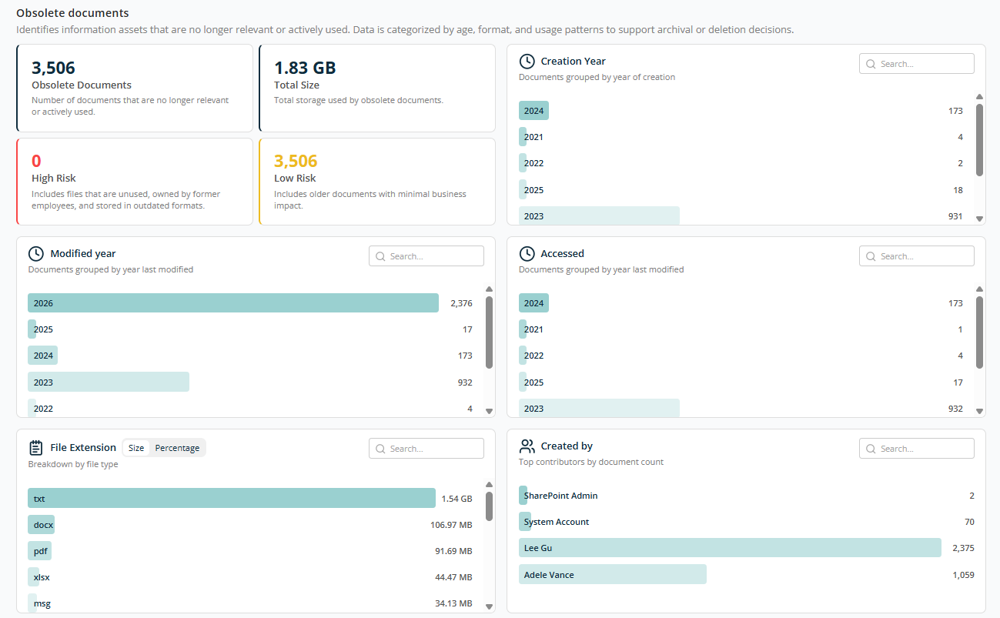
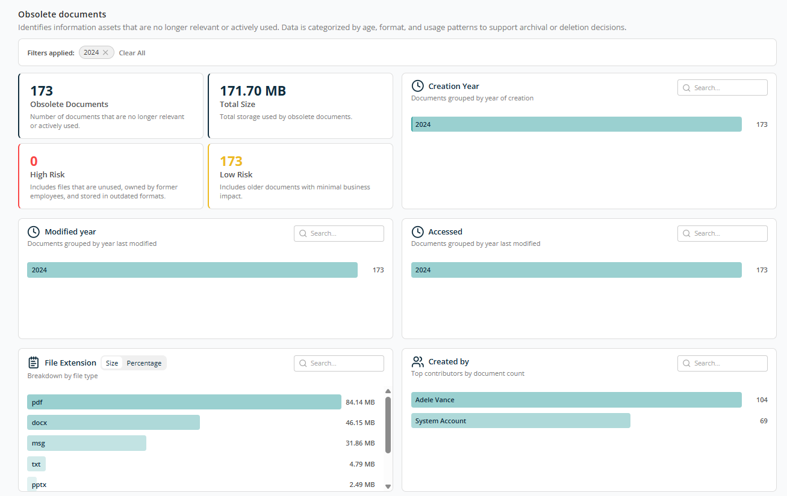
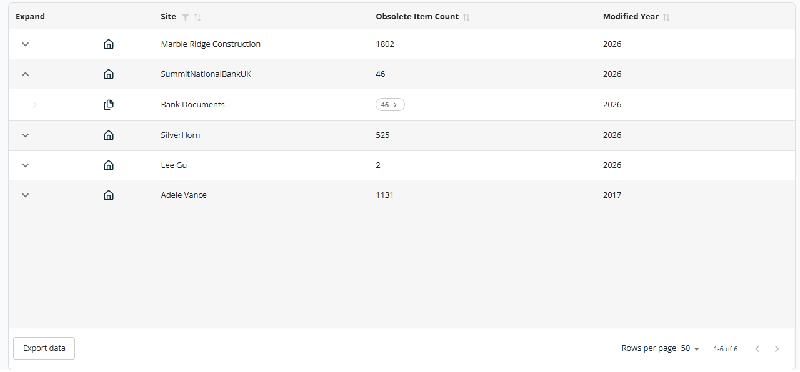
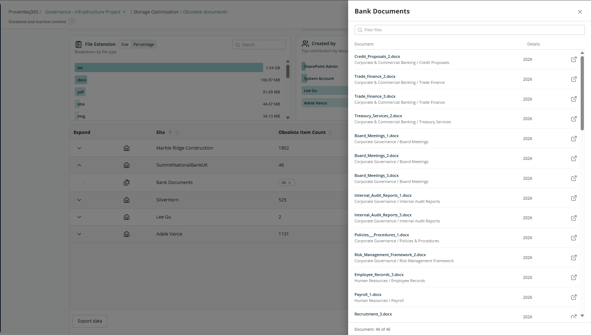

# Obsolete Documents Report

The **Obsolete Documents** screen helps you identify files that are no longer relevant, actively used, or required. It provides insights based on file age, usage patterns, format, and ownership. These documents are identified based on the obsolete criteria provided when creating the workspace.

## Overview

At the top of the screen, key metrics summarise obsolete content:

- **Obsolete Documents** — Total number of documents identified as obsolete.
- **Total Size** — Storage consumed by obsolete documents.
- **High Risk** — Obsolete files that pose higher governance risks. May include files owned by former employees, sensitive data in unused locations, or outdated file formats.
- **Low Risk** — Files with minimal business or compliance impact. Typically older, unused documents that can be cleaned up safely.

## Creation Year

Shows obsolete documents grouped by the year they were created. Helps identify how old the unused content is. Data is displayed in descending order. Use the **Search** box to locate a specific year.

## Modified Year

Shows obsolete documents grouped by the year they were last modified. Helps identify how long documents have remained unchanged. Use the **Search** box to locate a specific year.

## Accessed

Shows obsolete documents grouped by their last access (usage) year. Helps identify files that haven't been opened recently or are no longer actively used. Use the **Search** box to locate a specific year.

## File Extension

Breaks down obsolete documents by file type, such as PDF, DOCX, MSG, TXT, XLSX. You can switch between:

- **Size view** — Storage consumed by each file type.
- **Percentage view** — Relative contribution to obsolete storage.

## Created By

Shows obsolete documents created by different users in descending order. Use the **Search** box to locate a specific user.

## Report Filtering

For all panels, each bar is clickable. The entire report filters based on the selected record, and the selected criteria appear next to **Filter by** at the top of the report. You can filter on multiple criteria simultaneously.

## Table View

The table at the bottom of the screen shows details of obsolete documents grouped by Site or OneDrive, with the following columns:

- **Expand** — Use the expand icon (arrow) to drill down into site-level or OneDrive-level details.
- **Site** — Name of the SharePoint site or OneDrive.
- **Obsolete Item Count** — Total number of obsolete documents in the site or OneDrive.
- **Modified Year** — Last modified year for the obsolete items.

Sorting is available on Site, Obsolete Item Count, and Modified Year. A filter is available for the Site column.

The table supports an expanded view for each row. Expanding a site displays specific locations within the site where obsolete items exist. Example: *SummitNationalBankUK → Bank Documents, 46 obsolete item counts.*

The **Export Data** button at the bottom left of the table downloads the report for offline analysis or reporting.

At the bottom right of the table:

- **Rows Per Page** — 5, 10, 15, 20, 25, 30, 50, or 100. Default: 10.
- **Total Record Count** — Range and total record count.
- **Next/Previous Navigation** — Arrow icons to navigate.

In the expanded view, clicking on an obsolete item count opens a side panel listing the obsolete documents in that library or OneDrive location.

There is an icon for each record to open the document in the browser.
