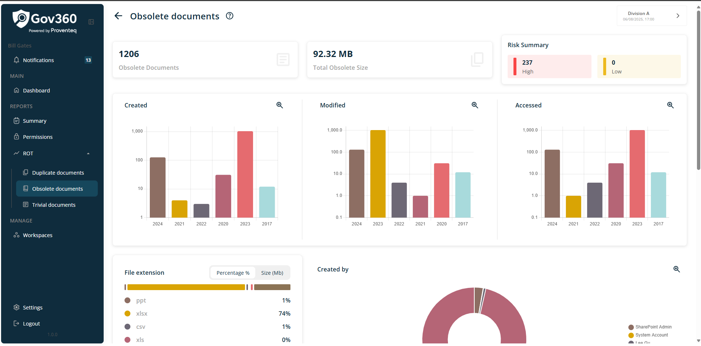
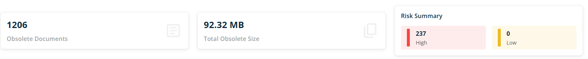
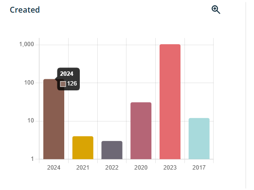
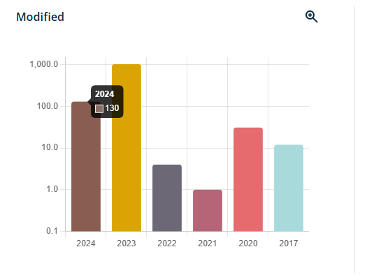
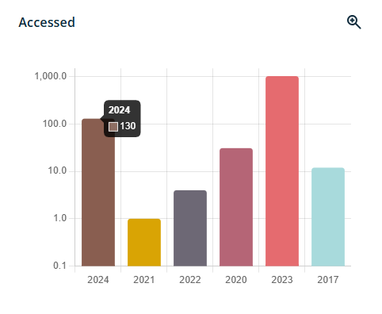
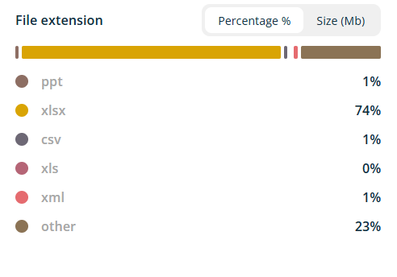
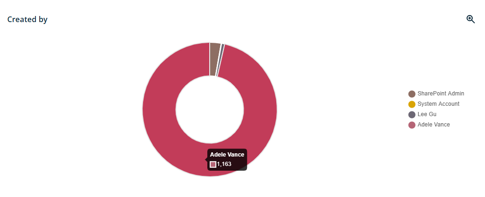
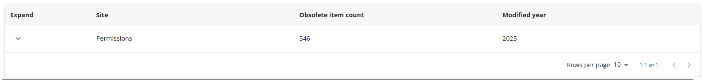
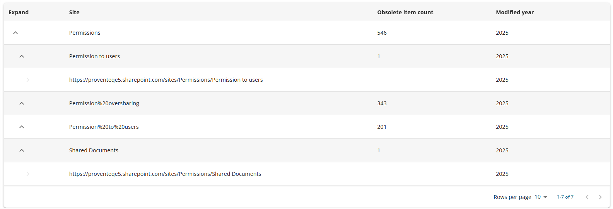

# Obsolete Documents Report

When you click the down arrow icon under the ROT Analysis menu, a sub-menu will appear allowing you to access the Obsolete Documents Report. This report provides detailed information on obsolete documents identified within the currently selected workspace scope.

When the user selects the obsolete documents menu, the following screen is displayed.

In right side view of Obsolete documents report, following section will be visible

### 4.6.1 Header

Header section will show following information/details

- **Header Text** -- The header reads - Obsolete documents

- **Information icon** -- when click on icon, it will open popup with text - **Detailed summary on obsolete data**. Popup will have See More link and when click on it, it redirect use to external link -

The current workspace name appears in the top right corner; clicking it opens the Dashboard, where users can view and switch between all available workspaces.

### 4.6.2 Count and Size Summary

This section will provide the count of obsolete documents, the total size of obsolete documents, and their severity levels (None, Medium, High).

### 4.6.3 Create in Year Graph

A graph will display data by year of creation within the workspace. The bar chart will represent the number of entries for each year.

When mouse hover the respective bar chart, it will show count of items

### 4.6.4 Modified in Year Graph

A bar chart will display the data categorized by the year of modification within the workspace. The graph will show the relationship between each year and the corresponding data count.

When mouse hover the respective bar chart, it will show count of items

### 4.6.5 Accessed in Year Graph

A graph will display data by year as accessed within the workspace. The graph will use a bar chart format to present the relationship between year and count.

When mouse hover the respective bar chart, it will show count of items

### 4.6.6 File extension Graph

A bar chart will represent the analysed data by file extension. The chart will display as shown below. Users can toggle between viewing percentage or size using the display option above the bar chart.

Data will be presented as percentages, categorized by file extensions such as .txt, .docx, .pptx, and .pdf, as well as folders and other types.

### 4.6.7 Created By Graph

A graphical representation will display data segmented by the user who created it within the workspace. The information will be presented in a pie chart format, with each user distinguished by unique color legends.

When mouse hover the respective pie chart, it will show count of items

### 4.6.8 List of Obsolete Documents in Table view

A list of obsolete documents will be displayed at the bottom of the screen in a list view format.

The table will include the following columns:

- **Expand**: This column will feature an arrow icon to allow users to expand or collapse the tree view for each site.

- **Site**: This column will display the name of each site included within the workspace scope.

- **Obsolete Item Count**: This column will show the number of obsolete documents identified for each site that are within the workspace scope.

- **Modified Year**: This column will indicate the year each document was last modified for sites included in the workspace scope.

In summary, the data in the table will be grouped first by site, followed by modification year. When expanding the tree view of available records, the data can be further drilled down to the library level as shown below.

Additionally, the bottom right of the workspace list table contains several features:

- **Rows Per Page**: Users can adjust the number of rows displayed per page using a dropdown menu. Options include 5, 10, 15, 20, 25, 30, 50, or 100 rows per page. The default setting is 10 rows per page.

- **Total Record Count**: This section displays the total number of records, for example, \"0-10 out of 200.\"

- **Next/Previous Navigation**: Users can navigate between pages of records using the \< and \> arrow icons.
