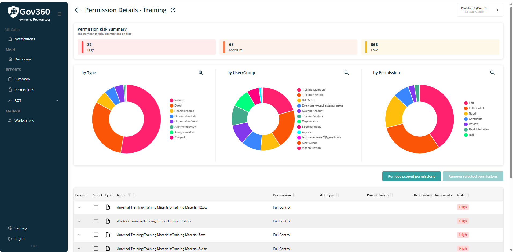
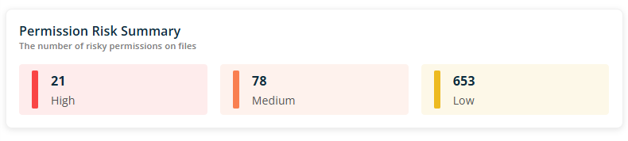
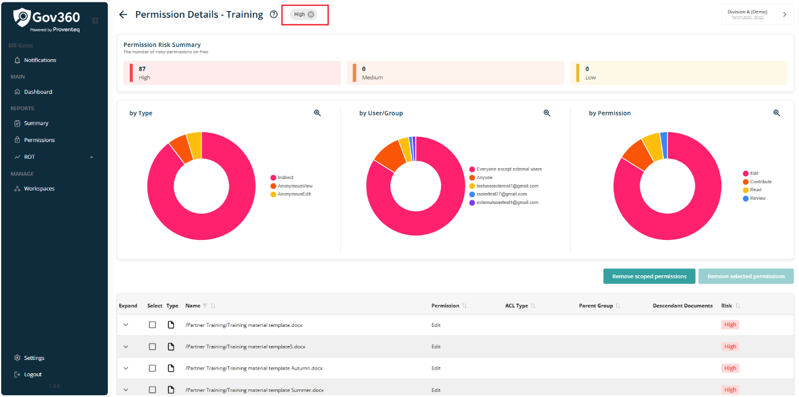
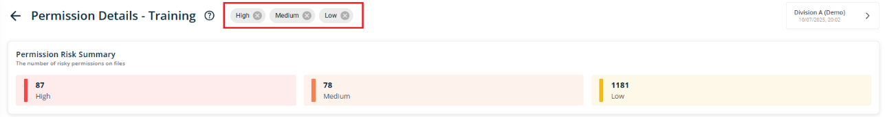
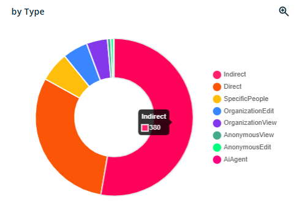
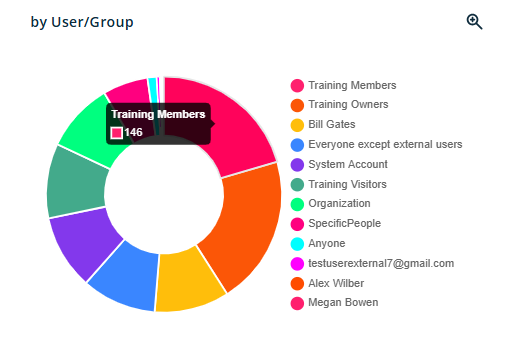
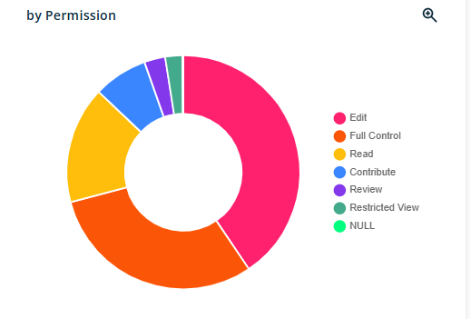
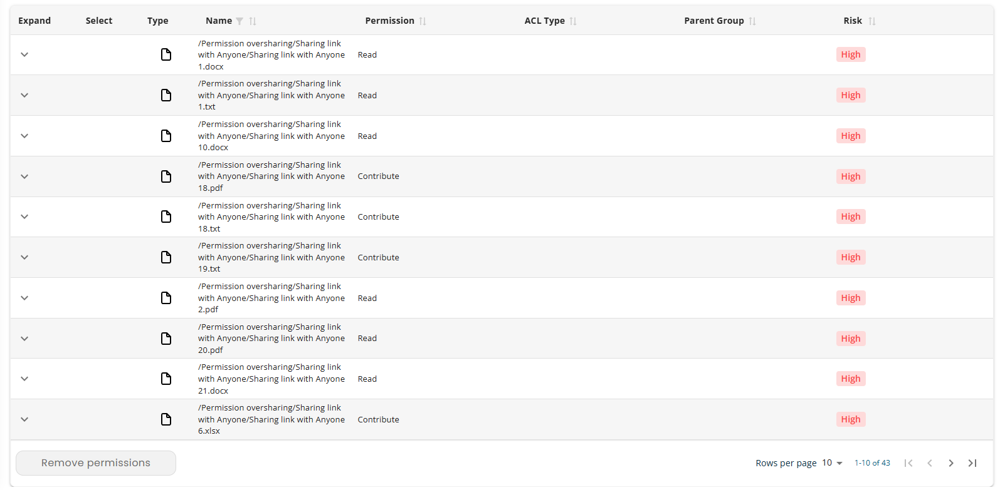
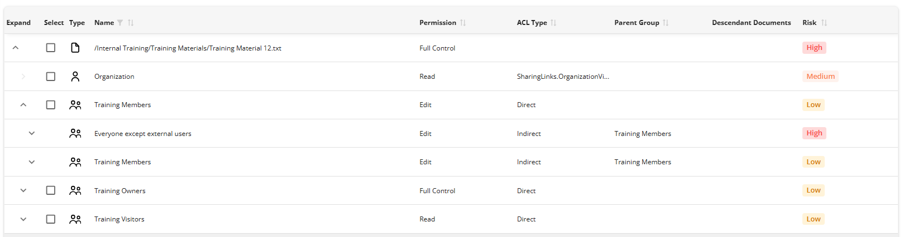

# Permission Details

Clicking any record in the permission table opens the following screen.

On the Permission detail page, the following section will be displayed.

### 4.3.1 Header

Header section will show following information/details

- **Header Text** -- The header reads - Permission Details - \<Name of the Site\>

- **Information icon** -- when click on icon, it will open popup with text - **Detailed information about a sites contents, severities, etc.** Popup will have See More link and when click on it, it redirect use to external link -

The current workspace name appears in the top right corner; clicking it opens the Dashboard, where users can view and switch between all available workspaces.

### 4.3.2 Permission Risk Summary

This section will provide a count of items categorized as High, Medium, or Low risk. The counts will be presented according to their respective risk categories.

Each category card is interactive and functions as a filter. When a user selects a card, it filters the bottom graphs accordingly and displays the applied filter at the top of the page next to the header text Permission.

For example, if the user filters data by clicking on the **High** card, the data will be displayed as shown below.

NOTE -- Users can apply multiple filters, which appear at the top of the page with a remove icon. Each filter can be removed individually by clicking its icon.

Data represented in graph view showing in three category

**Category - By Type**

This category presents data divided into the following subcategories by type. The count indicates the number of files.

- **Indirect** - Files with Indirect access are listed in this category

- **Direct** -- Files with direct access are listed in this category.

- **Specific People** -- Files accessible by designated individuals are included in this category.

- **Organisation Edit** -- Files with organisation-level access and editing permissions appear in this category.

- **Organisation View** -- Files with organisation-level access and viewing permissions are shown in this category.

- **Anonymous View** -- Files accessible at the anonymous level with viewing rights are found in this category.

- **Anonymous Edit** -- Files with anonymous-level access and editing rights are listed in this category.

- **AI Agent** -- Files with AI Agent-level access are included in this category.

Hovering the mouse over any bar will display the number of files in that category.

**Category - By User/Groups**

This category shows data on users and groups with file access. The graph indicates how many files each user or group can access, with a color legend and names.

Hovering the mouse over any bar will display the number of files in that category.

**Category - By Permission**

This category displays data according to various permission types, including Limited Access, Read, Edit, Full Control, and Contribute, along with their corresponding color legends.

Hovering the mouse over any bar will display the number of files in that category.

Below this graphs, there will be a table which show list of items which shows effected documents for permission risk

Table view having following columns

- **Expand** -- This column contains an arrow icon that allows users to expand or collapse the record details.

- **Select** -- This column displays a checkbox control in the expanded view of an item; the checkbox can be used to remove permissions for the selected item through the Remove Permissions feature.

- **Type** -- This column indicates whether the listed item is a File or Folder by displaying the corresponding icon.

- **Name** -- This column shows the name of the item identified as having a security risk.

- **Permission** -- This column specifies the type of permission associated with the item, such as Read, Edit, or Contribute.

- **ACL Type** -- This column presents the Access Control List (ACL) type.

- **Parent Group** -- This column displays the name of the parent group.

- **Descendant Documents --** This column displays count of decendant documents

- **Risk** - This column will show Type of Risk like High, Medium or Low

The table allows sorting by Name, Permission, ACL Type, Parent Group, and Risk. A filter is available for the Name column; users can click the filter icon next to the Name label to open the control.

When expand any row for item, it will show permissions applied on the item

Additionally, in the bottom right corner of the table, users will find enhanced functionality:

- **Rows Per Page:** Users can adjust the number of rows displayed per page using the dropdown control in this section. Available options include 5, 10, 15, 20, 25, 30, 50, and 100 rows per page, with a default setting of 10 records per page.

- **Total Record Count:** This displays the current range of records being viewed, such as \"0-10 out of 200\".

- **Next/Previous navigation** -- User can move to next / previous list of records using \< and \> arrow icons

Permission risk in the reports are categorised based on how the documents are being shared with different users.The following table shows how the severity will be assigned.

  ----------------------------------------------------------------------------------------
  Sharing methods                                        Permission Type     Severity
  ------------------------------------------------------ ------------------- -------------
  Sharing links with Anonymous                           View                High

                                                         Edit                High

                                                         Review              High

                                                         Block Download      High

  Sharing links with Specific People - External User     View                High

                                                         Edit                High

                                                         Review              High

                                                         Block Download      High

  Sharing links within Organiastion                      View                Medium

                                                         Edit                Medium

  Sharing links with Specific People - Internal User     View                low

                                                         Edit                low

                                                         Review              low

                                                         Block Download      low

  Sharing links with Specific Groups - SPO Group         View                low

                                                         Edit                low

                                                         Review              low

                                                         Block Download      low

  Sharing links with Specific Groups - Security Group    View                low

                                                         Edit                low

                                                         Review              low

                                                         Block Download      low

  Sharing links with Specific Groups - M365 Group        View                low

                                                         Edit                low

                                                         Review              low

                                                         Block Download      low

  Unique permissions - for users through Manage access   View                low

                                                         Edit                low

                                                         Review              low

                                                         Block Download      low

  Expired Sharing link                                   View                low

                                                         Edit                low

                                                         Review              low

                                                         Block Download      low

  Sharing links with Specific People -System user        View                low

                                                         Edit                low

                                                         Review              low

                                                         Block Download      low
  ----------------------------------------------------------------------------------------

### 4.3.3 Remove permission
