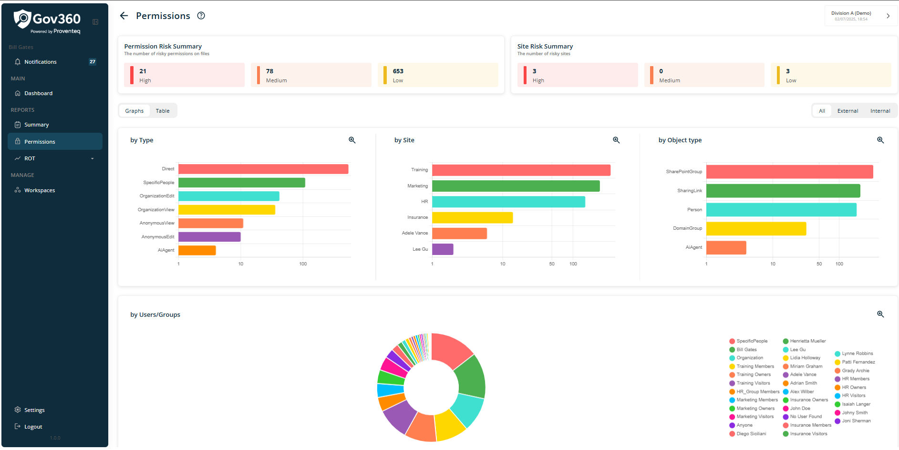
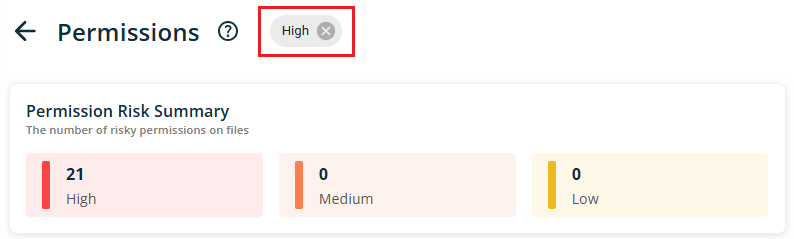
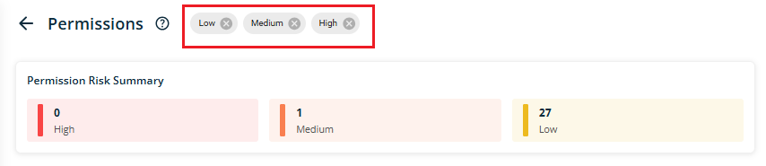
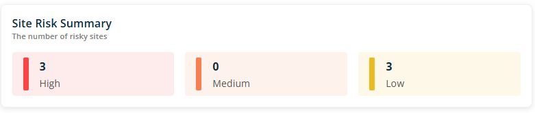
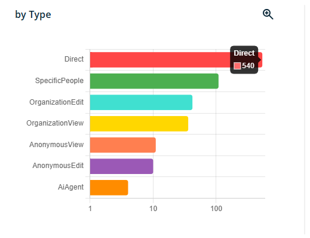
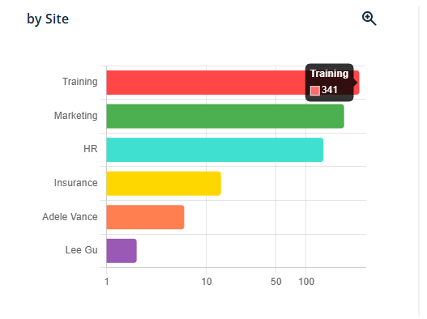
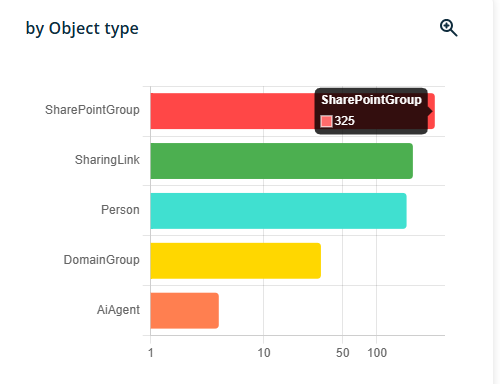
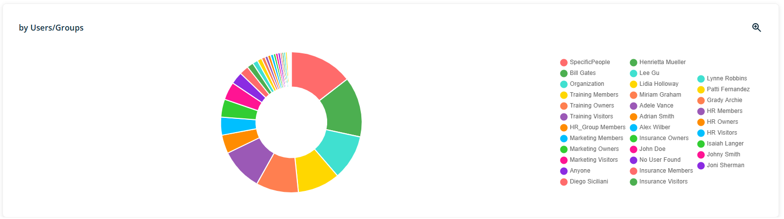
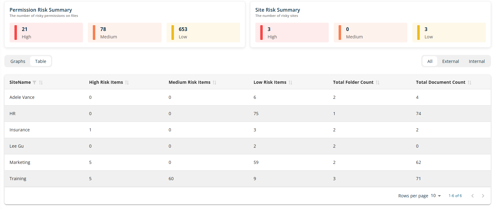
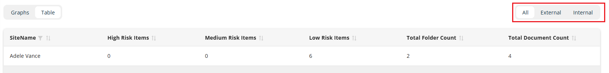

# Permissions

When select **Permissions** from the main menu, the following screen will appear.

In right side view of Permissions report, following section will be visible

### 4.2.1 Header

Header section will show following information/details

- **Header Text --** The header reads - Permissions

- Information icon -- when click on icon, it will open popup with text **- Information about permissions\' risks, site risks and their categorizations.** Popup will have See More link and when click on it, it redirect use to external link -

The current workspace name appears in the top right corner; clicking it opens the Dashboard, where users can view and switch between all available workspaces.

### 4.2.2 Permission Risk Summary

This section will provide a count of items categorized as High, Medium, or Low risk. The counts will be presented according to their respective risk categories.

Each category card is interactive and functions as a filter. When a user selects a card, it filters the bottom graphs accordingly and displays the applied filter at the top of the page next to the header text Permission.

For example, if the user filters data by clicking on the **High** card, the data will be displayed as shown below.

NOTE -- Users can apply multiple filters, which appear at the top of the page with a remove icon. Each filter can be removed individually by clicking its icon.

### 4.2.3 Site Risk Summary

This section provides an aggregate count of sites, categorised by risk levels: High, Medium, and Low. It will display the number of sites within each category when multiple sites are added to the workspace configuration.

### 4.2.4 Graph view of Report

Users can switch between the graph view and the table view using the toggle located below the Permission Risk Summary section. By default, the graph view is selected.

The permission report\'s graph view is divided into four main categories, each displaying data along with its relevant subcategories. The four primary report categories are: By Type, By Site, By Object Type, and By Users/Groups.

**Category - By Type**

This category presents data divided into the following subcategories by type. The count indicates the number of files.

- **Direct** -- Files with direct access are listed in this category.

- **Specific People** -- Files accessible by designated individuals are included in this category.

- **Organisation Edit** -- Files with organisation-level access and editing permissions appear in this category.

- **Organisation View** -- Files with organisation-level access and viewing permissions are shown in this category.

- **Anonymous View** -- Files accessible at the anonymous level with viewing rights are found in this category.

- **Anonymous Edit** -- Files with anonymous-level access and editing rights are listed in this category.

- **AI Agent** -- Files with AI Agent-level access are included in this category.

Hovering the mouse over any bar will display the number of files in that category.

**Category - By Site**

This category displays data divided into the following subcategories:

- Site: This section presents data categorized by sites (SharePoint, OneDrive, Teams). If multiple sites are configured, the graph will display data for each site individually.

Hovering the mouse over any bar will display the number of files in that sites.

**Category - By Object Type**

This category presents data divided into the following subcategories by type. The count indicates the number of files.

- **SharePoint Group** -- Files with permissions assigned to a SharePoint group are included in this category.

- **Person** -- Files with permissions assigned to individual user accounts are categorized here.

- **Domain Group** -- Files with permissions assigned to a Domain Group (a security group defined in Active Directory) are shown in this category.

- **Sharing Link** -- Files with assigned sharing links fall under this category.

- **AI Agent** -- Files with permissions assigned to any AI agent are listed in this category.

Hovering the mouse over any bar will display the number of files in that Object type.

**Category - By Uses/Groups**

This category displays file permission data by user and group. The pie chart shows the number of files per user or group, with a color legend indicating each name.

A magnifying glass with a plus icon appears at the top right corner of each category section. Users can click this icon to view the graph in an expanded view. In this extended view, a magnifying glass with a minus icon is available for users to return to the normal view.

### 4.2.5 Table view of Report

When users switch to Table view, the report displays data as shown below.

The table presents data across the following columns:

- **Site Name**: Displays the name of the site.

- **High Risk Items**: Indicates the number of folders and documents classified as high risk.

- **Medium Risk Items**: Indicates the number of folders and documents classified as medium risk.

- **Low Risk Items**: Indicates the number of folders and documents classified as low risk.

- **Total Folder Count**: Shows the total number of folders identified with risk.

- **Total Document Count**: Shows the total number of documents identified with risk.

The table provides sorting functionality on each column, allowing users to organize data in ascending or descending order. A filter is available for the Site Name column.

At the bottom right of the table, additional options are displayed:

- **Rows Per Page:** Users can select the number of rows shown per page from a dropdown menu, with options including 5, 10, 15, 20, 25, 30, 50, and 100. The default is 10 records per page.

- **Total Record Count:** This section displays the range of records currently visible, such as \"0-10 out of 200.\"

- **Next/Previous Navigation:** Arrow icons allow users to navigate to the next or previous set of records.

Selecting any row opens the permission detail report for that site.

Table data can be filtered additionally on All, Extenal , Internal users/group

