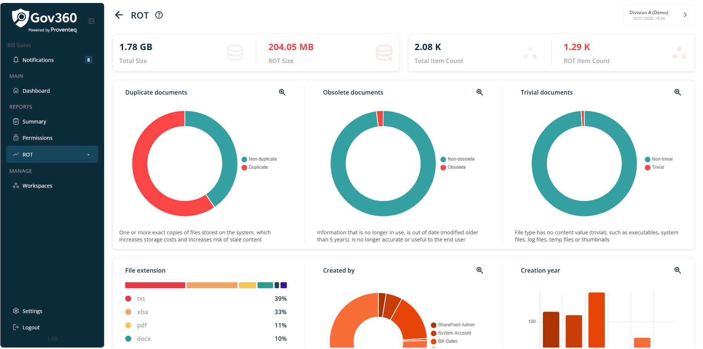
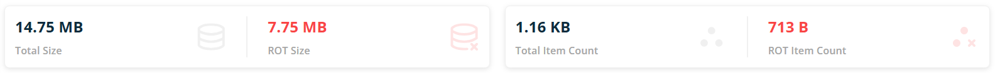
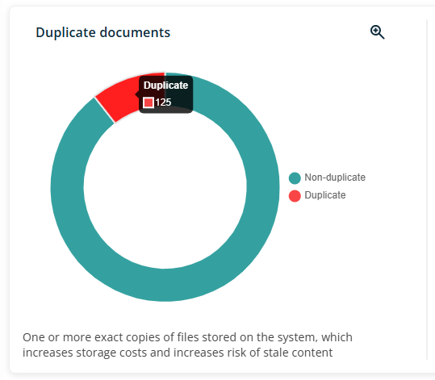
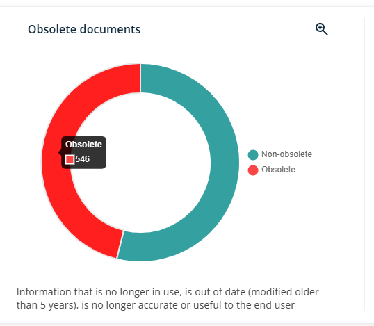
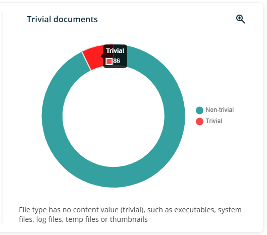
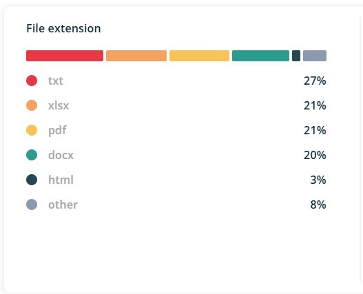
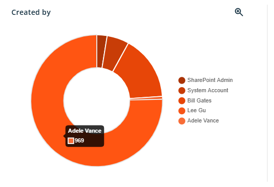
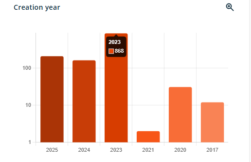

# ROT

When click on ROT menu, it will open following summary screen.

Following section will be visible on summary screen

### 4.4.1 Header

Header section will show following information/details

- **Header Text** -- The header reads - ROT

- **Information icon** -- when click on icon, it will open popup with text - **Summary of all ROT data available**. Popup will have See More link and when click on it, it redirect use to external link -

The current workspace name appears in the top right corner; clicking it opens the Dashboard, where users can view and switch between all available workspaces.

### 4.4.2 Count and Size Summary

Below the header, two sets of count cards will be displayed. The first set presents the total size of analysed items and the size of ROT items. The second set shows the total item count of analysed items and the ROT item count.

### 4.4.3 Duplicate Documents Count

A graphical representation will display data related to Duplicate Documents within the specified workspace scope. The graph, presented as a pie chart, will distinguish between Duplicate and Non-Duplicate categories using corresponding colour legends.

Below the pie chart, text -- **One or more exact copies of files stored on the system, which increases storage costs and increases risk of stale content** will display to explain what duplicate documents means.

When the user hovers over a specific section of the pie chart, the item count for that area will be displayed.

### 4.4.4 Obsolute Documents Count

A graphical representation will display the data for obsolete documents identified within the selected workspace scope. The graph will be presented as a pie chart, distinguishing between Obsolete and Non-Obsolete categories, with corresponding color legends.

Below the pie chart, text -- **Information that is no longer in use, is out of date (modified older than 5 years), is no longer accurate or useful to the end user** will display to explain what obsolete documents means.

When the user hovers over a specific section of the pie chart, the item count for that area will be displayed

### 4.4.5 Trivial Documents Count

A graphical representation will be provided to display data related to Trivial Documents within the selected workspace scope. The graph will utilise a pie chart format to distinguish between Trivial and Non-Trivial categories, accompanied by a corresponding colour legend.

Below the pie chart, text -- **File type has no content value (trivial), such as executables, system files, log files, temp files or thumbnails** will display to explain what obsolete documents means.

When the user hovers over a specific section of the pie chart, the item count for that area will be displayed

### 4.4.6 File extension analysis

A graphical representation of the analysed data by file extension will be provided in the form of a bar chart. The chart will visually display the data as illustrated below.

Data will show in percentage, differentiated by file extension like txt, doc, ppt.

### 4.4.7 Create by Graph

A pie chart will display data segmented by user within the workspace, with each user represented by a distinct colour legend.

When the user hovers over a specific section of the pie chart, the item count for that area will be displayed

### 4.4.8 Creation Year Graph

There will be a graph representation of data segregated by year of its creation in scope of workspace. Graph will show data in bar chart format differentiated year vs count along with its color legends.

When mouse hover the respective bar chart, it will show count of items

For **Duplicate documents, Obsolete documents, Trivial documents, Created by, Creation year** graphs, A magnifying glass with a plus icon appears at the top right corner of each category section. Users can click this icon to view the graph in an expanded view. In this extended view, a magnifying glass with a minus icon is available for users to return to the normal view.
