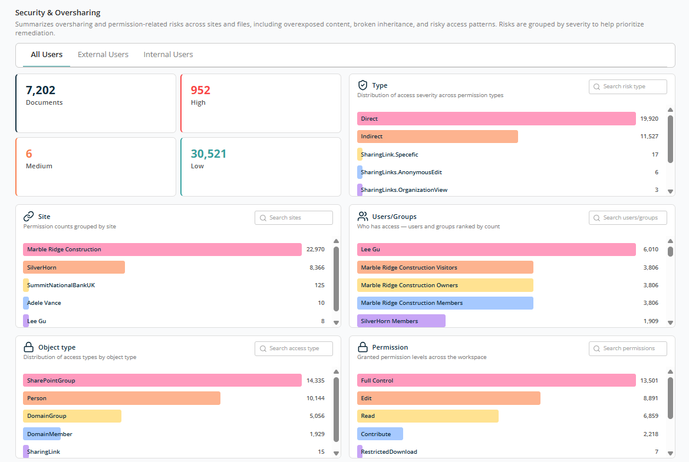
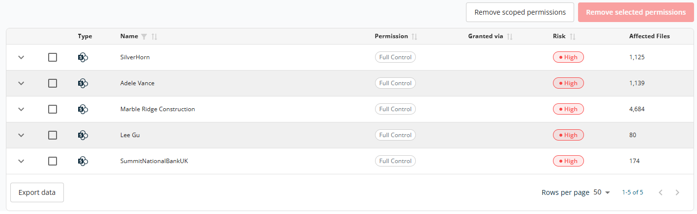
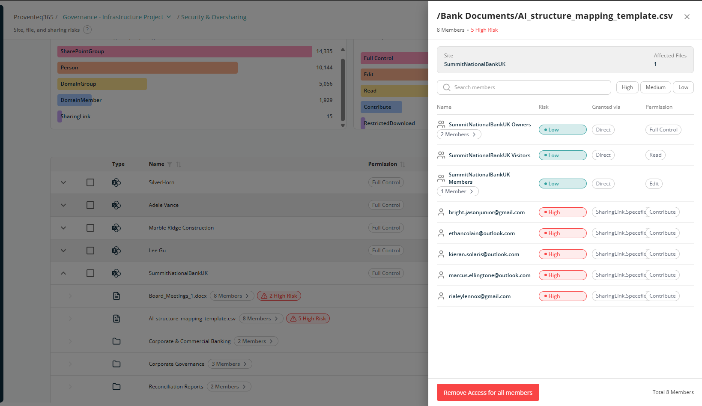

# Security & Oversharing

The **Security & Oversharing** screen provides a detailed view of sharing and permission-related risks across your Microsoft 365 environment. It helps you identify overexposed content, understand who has access, and prioritise remediation based on risk severity.

## User Scope Tabs

At the top of the screen you can view the report by user category:

- **All Users** — Displays permission data for both internal and external users. Selected by default.
- **External Users** — Filters the report to show only permissions granted to users outside the organisation.
- **Internal Users** — Filters the report to show only permissions granted to users within the organisation.

Selecting a tab refreshes the summary cards, analysis widgets, and detail table to reflect the chosen user category.

## Permission Risk Summary

The summary section shows aggregate counts across four categories, presented as interactive cards.

- **Documents** — Total number of documents evaluated for permission risk.
- **High** — Count of permissions in a document classified as high risk.
- **Medium** — Count of permissions in a document classified as medium risk.
- **Low** — Count of permissions in a document classified as low risk.

Each card is interactive and functions as a filter. Selecting a card filters the analysis widgets and the detail table accordingly, and the applied filter appears at the top of the page next to the header text **Permissions**.

**Note:** Multiple filters can be applied. They appear at the top of the page with a remove icon and can be removed individually.

## Permission Analysis Widgets

Below the Permission Risk Summary, five interactive widgets display permission data across different dimensions. Each widget contains a search box and shows items ranked by affected file count. Selecting an entry in any widget filters the other widgets and the detail table to that selection.

### Type

Shows permission data distributed by access type. Common values include:

- **Indirect** — Files accessible indirectly through group or inherited permissions.
- **Direct** — Files granted with explicit (direct) permissions.
- **SharingLink.Specific** — Files shared through a link targeted to specific people.
- **SharingLinks.AnonymousEdit** — Files shared through an anonymous link with edit rights.
- **SharingLinks.AnonymousView** — Files shared through an anonymous link with view rights.
- **SharingLinks.OrganizationEdit** — Files shared through an organisation-wide link with edit rights.
- **SharingLinks.OrganizationView** — Files shared through an organisation-wide link with view rights.

### Site

Shows permission data grouped by site (SharePoint, OneDrive, or Teams). Each entry lists the site name alongside its associated file count.

### Users/Groups

Shows permission data grouped by user or group, listing the number of files each principal has access to. Both individual users and SharePoint or domain groups are included.

### Object Type

Shows the type of principal holding the permission:

- **Person** — Permissions assigned directly to individual user accounts.
- **SharePointGroup** — Permissions assigned to a SharePoint group.
- **DomainGroup** — Permissions assigned to a domain security group defined in Active Directory.
- **DomainMember** — Permissions assigned to a domain member account.
- **SharingLink** — Permissions granted through a sharing link.

### Permission

Shows the permission level granted across files:

- **Edit** — Users can view, add, update, and delete items.
- **Full Control** — Users have complete control of the site or item.
- **Read** — Users can only view items.
- **Contribute** — Users can view, add, and update items.
- **Restricted View** — Users can view pages and documents but cannot download.

## Table View

When you switch to **Table view**, the report displays data as shown below.

The table at the bottom of the screen lists permission assignments that match the currently applied filters. Columns:

- **Expand (chevron)** — Expands the row to show the specific permissions applied to the item.
- **Checkbox** — Selects one or more rows for bulk action via **Remove selected permissions**.
- **Type icon** — Visual indicator of the principal type (user, group, sharing link, etc.).
- **Name** — Name of the site, user, or group associated with the permission.
- **Permission** — The permission level granted (for example, Full Control, Edit, or Read).
- **Granted via** — How the permission was granted — directly, through a group, or by inheritance.
- **Risk** — Severity rating for the permission (High, Medium, or Low), colour-coded.
- **Affected Files** — The number of files impacted by this permission assignment.

The table supports sorting on Name, Permission, Granted via, and Risk. A filter is available for the Name column.

Two action buttons are displayed above the table for bulk remediation:

- **Remove scoped permissions** — Removes all permissions matching the currently applied filters (scope). Use this to remediate an entire category of risk in one action.
- **Remove selected permissions** — Removes only the permissions for rows selected via checkbox. Enabled once at least one row is selected.

At the bottom right of the table:

- **Rows Per Page** — 5, 10, 15, 20, 25, 30, 50, or 100. Default: 10.
- **Total Record Count** — Range and total record count.
- **Next/Previous Navigation** — Arrow icons to navigate.

Expanding any row reveals the individual permissions applied to that item; each permission can also be selected for removal via its checkbox. Click on any document to see the detail side panel.

## File Access & Risk Details Panel

This panel provides a detailed view of who has access to a specific file, what permissions they have, and the risk level associated with that access. It helps you quickly identify oversharing, especially external or high-risk access.

At the top of the panel:

- **Members** — Total number of users and groups who currently have access to the file. *Example: 8 Members*
- **Risk Indicator** — How many of those members are considered **High Risk**. *Example: 5 High Risk*
- **Site** — The SharePoint site where the file is stored. *Example: SummitNationalBankUK*
- **Affected Files** — How many files are impacted by the listed permissions.

The main section lists all users and groups who have access to the selected file.

- **Name** — The user, group, or email address that has access. Groups (such as Owners, Members, or Visitors) can be expanded to see how many users they contain.
- **Risk** — Risk is highlighted with colour indicators:
  - **Low** — Typically internal users or standard SharePoint groups.
  - **High** — Usually external users or access granted via sharing links.
- **Granted Via** — How access was provided, e.g. **Direct**, **SharingLink.Specific**.
- **Permission** — The level of access, e.g. **Full Control**, **Edit**, **Read**, **Contribute**.

At the bottom of the panel, the **Remove Access for all members** action revokes access for every listed user and group.

**Note:** Permission risk in the reports is categorised based on how the documents are being shared with different users. For more information, see [Severity Allocations](../../appendix/severity-allocations.md).
