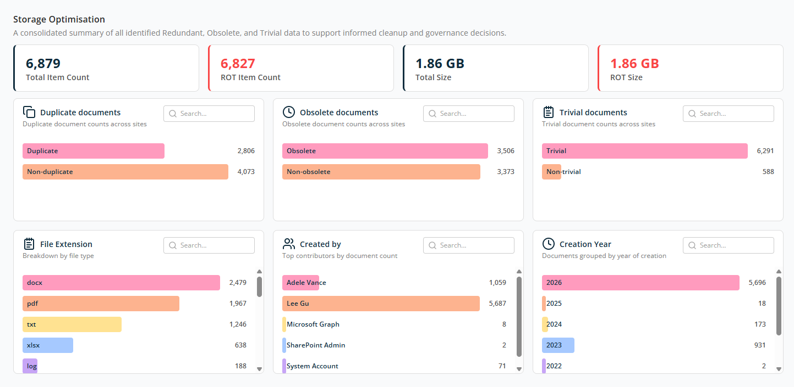
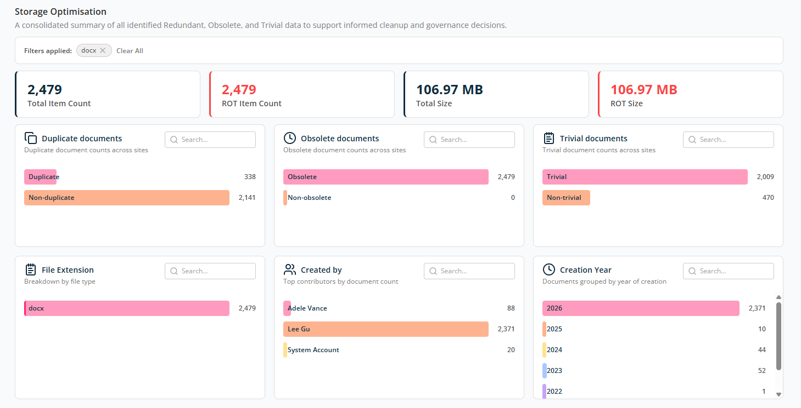

# Storage Optimization Summary Report

The **Storage Optimisation** screen gives a consolidated view of Redundant, Obsolete, and Trivial (ROT) content across your environment. It helps you understand where storage is being consumed and supports informed decisions around cleanup, retention, and governance.

## Overview

At the top of the page, a high-level summary card displays counts:

- **Total Item Count** — The total number of documents and files analysed.
- **ROT Item Count** — The number of items identified as Redundant, Obsolete, or Trivial.
- **Total Size** — The combined storage size of all analysed items.
- **ROT Size** — The total storage space consumed specifically by ROT content.

## Duplicate Documents

This widget shows duplicate files across sites. Visual bars help compare duplicate versus unique content at a glance.

- **Duplicate** — Number of documents that exist in more than one location.
- **Non-duplicate** — Unique files that don't have any copy.

## Obsolete Documents

This widget shows documents classified as obsolete, typically based on age, inactivity, or outdated relevance, identified based on the workspace's obsolete document analysis criteria.

- **Obsolete** — Files that are no longer actively used or updated.
- **Non-obsolete** — Files that are still relevant or actively maintained.

## Trivial Documents

This widget shows documents considered trivial, such as low-value or temporary files, identified based on the workspace's trivial document analysis criteria.

- **Trivial** — Documents with minimal business value.
- **Non-trivial** — Content that may still be important or relevant.

## File Extension Breakdown

Shows ROT documents grouped by file types like `.docx`, `.pdf`, `.txt`, `.xlsx`, `.log`, and more. The counts indicate which file types consume the most storage.

## Created By

Shows ROT documents grouped by the account that created them, including named users as well as system accounts (such as SharePoint Admin or System Account).

## Creation Year

Shows ROT documents grouped by the year they were created. Helps identify aged content that may no longer be required. Older years often indicate strong candidates for archiving or deletion.

For all widgets, use the **Search** box to find specific values.

Data shown in each widget is clickable. When you click on a value, the summary screen filters by that value and shows it as **Filter Applied** at the top of the screen. Example: clicking `docx` in the File Extension widget filters the report as shown below.

