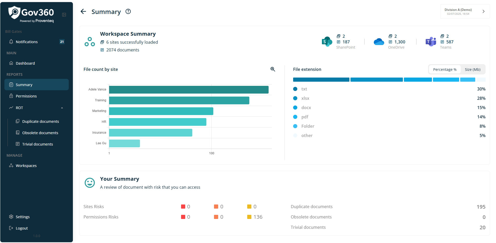
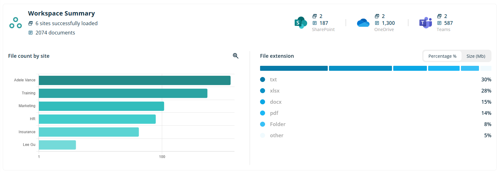
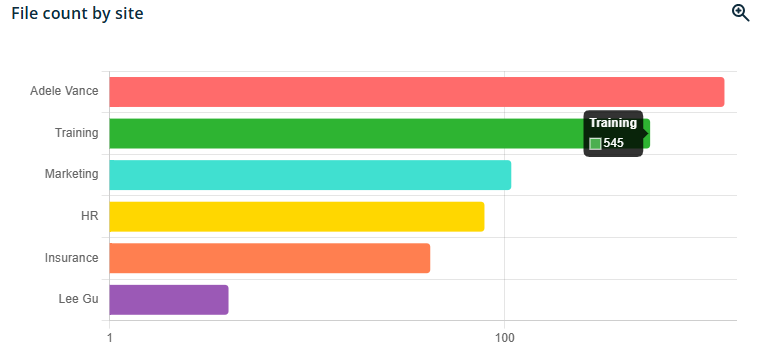
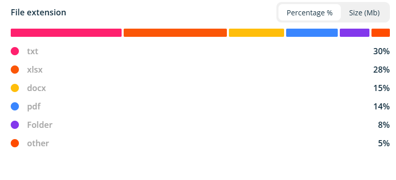
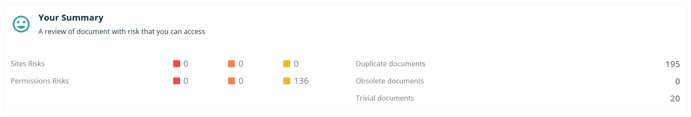
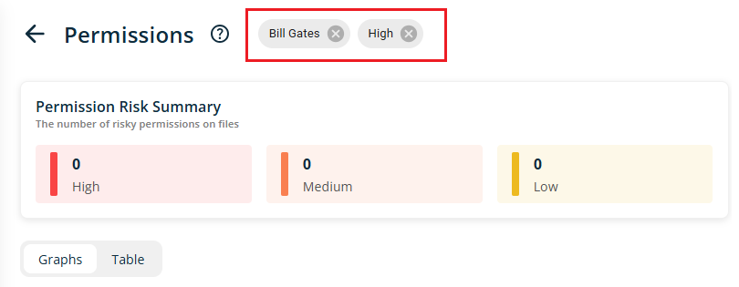
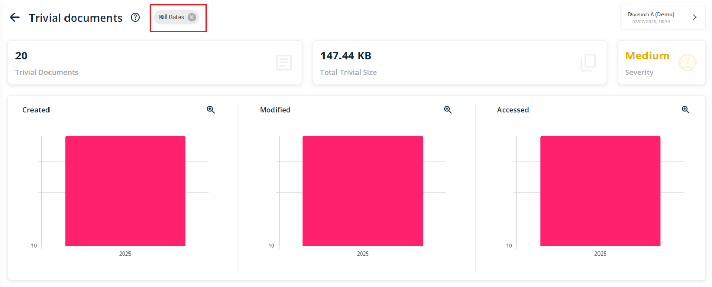

# Summary

When click on Summary from main menu, it will open following screen

Following section will be displayed on the right side of the Summary Screen.

### 4.1.1 Header

Header section will show following information/details

- **Header Text** -- The header reads - Summary

- **Information icon** -- when click on icon, it will open popup with text - **This is your personal summary and summaries of the ROT and Permission reports.** Popup will have See More link and when click on it, it redirect use to external link -

### 4.1.1 Workspace Summary

This section summarizes workspace entities, including counts of SharePoint, OneDrive, and Teams sites, along with file totals and file extension breakdowns across all sites.

The top left section will display the number of sites scanned within the workspace, along with the corresponding document count.

The top right section will present the count of each entity and indicate the number of documents identified for each entity.

Below the summary, a graphical representation of file count by site and by file extension will be presented in distinct views.

**File Count by site**

A horizontal bar chart will display document counts for each site (SharePoint, OneDrive, and Teams). Hovering over any bar will show the exact count for that site. Top right corner having glass icon to maximise graph view.

**File extension**

This section presents the distribution of files by their respective extensions. A toggle option is available to display distributions either by percentage or by size (MB).

### 4.1.2 Your Summary

This section will show data related to logged in user.

The left section displays the Sites Risks and Permission risk counts related to documents for the logged-in user. These are categorized as High (red block), Medium (orange block), or Low (yellow block), and each category is clickable. Selecting a category opens the permission detail page, filtered by the current user\'s data and the chosen severity level.

The right-hand section displays the counts of Duplicate, Obsolete, and Trivial documents. These counts are interactive; clicking on them will navigate to the corresponding report for each document category.

