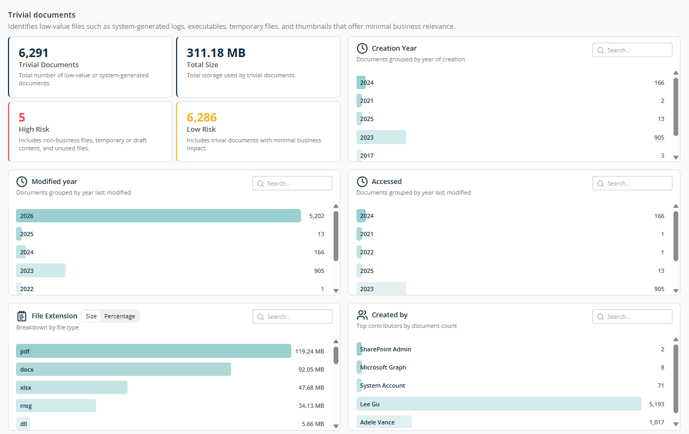
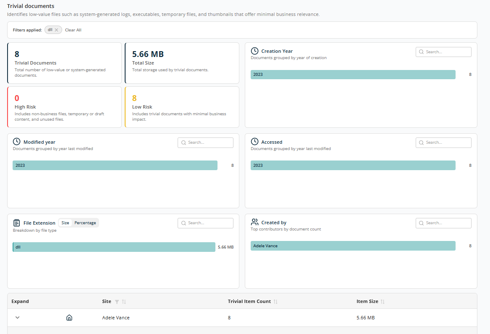
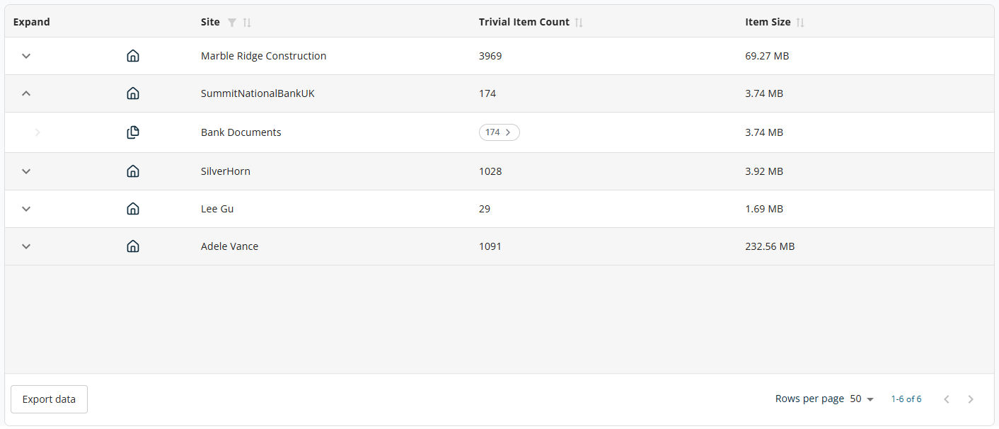
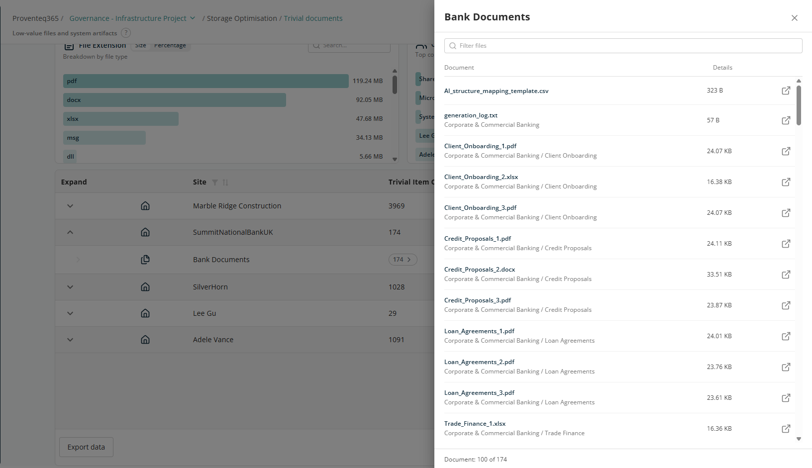

# Trivial Documents Report

The **Trivial Documents** screen helps you identify low-value or non-business-critical files within your environment. These include system-generated files, temporary files, logs, and other content that offers minimal business relevance.

This view supports **storage optimisation and cleanup efforts** by highlighting files that can typically be removed with low impact.

## Overview

At the top of the screen, key metrics summarise trivial content:

- **Trivial Documents** — Total number of low-value or system-generated files.
- **Total Size** — Storage consumed by trivial documents.
- **High Risk** — Trivial files that pose higher governance risks. May include temporary or draft files containing sensitive information or misplaced system files in shared locations.
- **Low Risk** — Files with minimal business or compliance impact. Typically older, unused documents that can be cleaned up safely.

## Creation Year

Shows trivial documents grouped by the year they were created. Helps identify how old the unused content is. Data is displayed in descending order. Use the **Search** box to locate a specific year.

## Modified Year

Shows trivial documents grouped by the year they were last modified. Helps identify how long documents have remained unchanged. Use the **Search** box to locate a specific year.

## Accessed

Shows trivial documents grouped by their last access (usage) year. Helps identify files that haven't been opened recently or are no longer actively used. Use the **Search** box to locate a specific year.

## File Extension

Breaks down trivial documents by file type, such as PDF, DOCX, MSG, LOG, TEMP. You can switch between:

- **Size view** — Storage consumed by each file type.
- **Percentage view** — Relative contribution to trivial storage.

## Created By

Shows trivial documents created by different users in descending order. Use the **Search** box to locate a specific user.

## Report Filtering

For all panels, each bar is clickable. The entire report filters based on the selected record, and the selected criteria appear next to **Filter by** at the top of the report. You can filter on multiple criteria simultaneously.

## Table View

The table at the bottom of the screen shows details of trivial documents grouped by Site or OneDrive, with the following columns:

- **Expand** — Use the expand icon (arrow) to drill down into site-level or OneDrive-level details.
- **Site** — Name of the SharePoint site or OneDrive.
- **Trivial Item Count** — Total number of trivial documents in the site or OneDrive.
- **Modified Year** — Last modified year for the trivial items.

Sorting is available on Site, Trivial Item Count, and Modified Year. A filter is available for the Site column.

The table supports an expanded view for each row. Expanding a site displays specific locations within the site where trivial items exist.

The **Export Data** button at the bottom left of the table downloads the report for offline analysis or reporting.

At the bottom right of the table:

- **Rows Per Page** — 5, 10, 15, 20, 25, 30, 50, or 100. Default: 10.
- **Total Record Count** — Range and total record count.
- **Next/Previous Navigation** — Arrow icons to navigate.

In the expanded view, clicking on a trivial item count opens a side panel listing the trivial documents in that library or OneDrive location.

Each record has an icon to open it in another browser tab.
