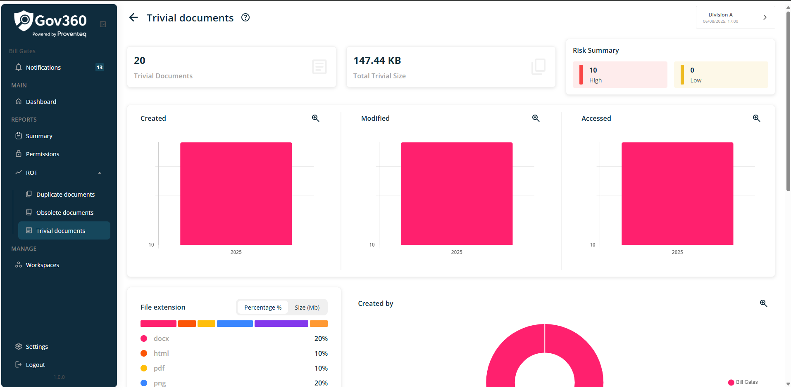
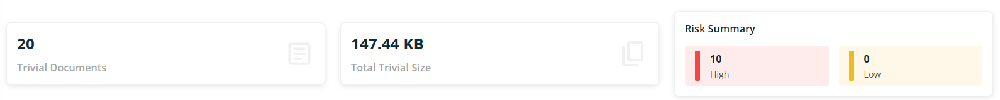
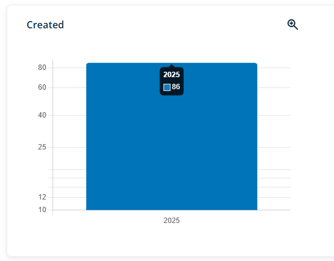
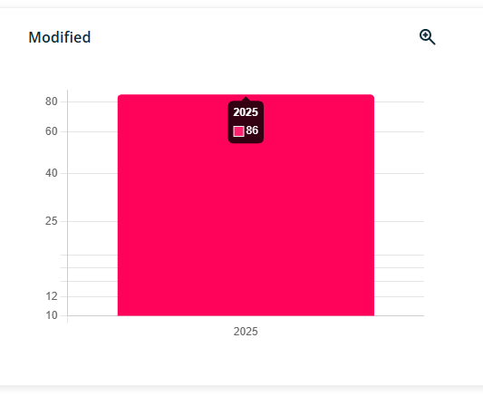
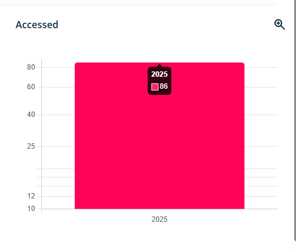
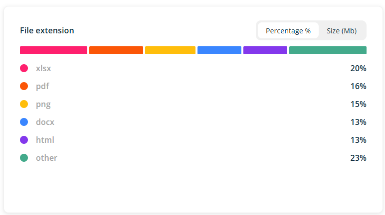
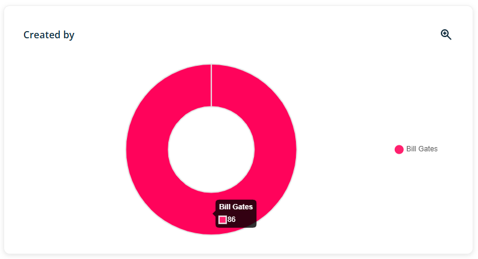
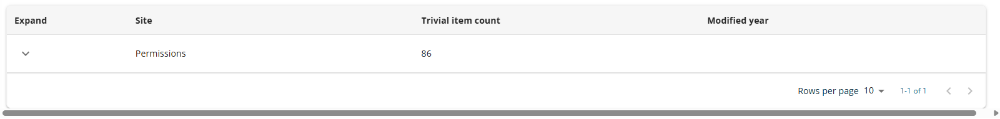
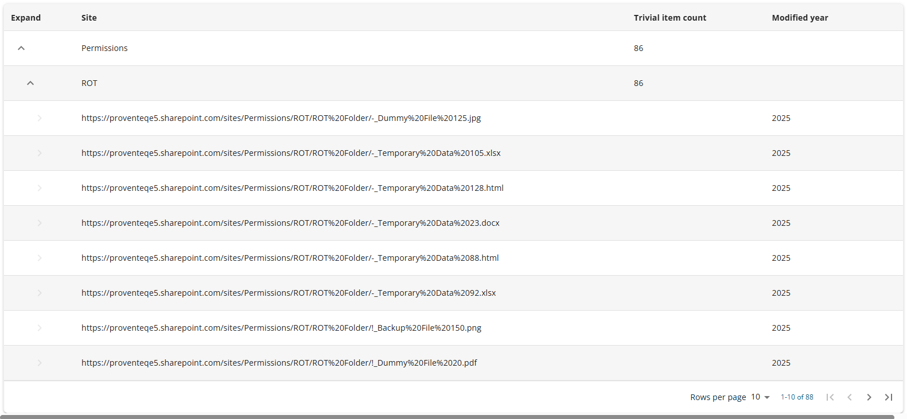

# Trivial Documents Report

When you click the down arrow icon under the ROT Analysis menu, a sub-menu will appear allowing you to access the Trivial Documents Report. This report provides detailed information on trivial documents identified within the currently selected workspace scope.

When the user selects the trivial documents menu, the following screen is displayed

In right side view of Trivial documents report, following section will be visible

### 4.7.1 Header

Header section will show following information/details

- **Header Text** -- The Header reads - Trivial documents

- **Information icon** -- when click on icon, it will open popup with text - **Detailed summary on trivial data**. Popup will have See More link and when click on it, it redirect use to external link -

The current workspace name appears in the top right corner; clicking it opens the Dashboard, where users can view and switch between all available workspaces.

### 4.7.2 Count and Size Summary

This section will show count of trivial document, Total size of Trivial documents and Severity (None, Medium, High)

### 4.7.3 Create in Year Graph

A graph will represent data by the year it was created within the workspace. The graph will display a bar chart format, illustrating the relationship between each year and the corresponding data count.

When mouse hover the respective pie chart, it will show count of items

### 4.7.4 Modified in Year Graph

A graph will display data by year of modification within the workspace. The graph will use a bar chart format to present the count for each year.

When mouse hover the respective pie chart, it will show count of items

### 4.7.5 Accessed in Year Graph

A graph will display data by year within the workspace scope. The bar chart will illustrate the relationship between each year and the corresponding data count.

When mouse hover the respective pie chart, it will show count of items

### 4.7.6 File extension Graph

A bar chart will be provided to represent the analysed data by file extension. The chart will display data in the format illustrated below. Users can toggle between viewing percentage and file size using the display option located above the bar chart.

The data will be presented as percentages, categorized by file extensions such as .txt, .docx, .pptx, and .pdf, as well as by folders and other types.

### 4.7.7 Created By Graph

A graphical representation of data will be provided, separating information according to the user who created it within the workspace. The graph will utilize a pie chart format, with distinct color legends assigned to each user for clarity.

When mouse hover the respective pie chart, it will show count of items

### 4.7.8 List of Trivial Documents in Table view

At bottom of the screen, it will show list of trivial documents as list view

The table will include the following columns:

- **Expand**: Contains an arrow icon to expand or collapse the tree view for each site.

- **Site**: Displays the name of each site included within the workspace scope.

- **Trivial Item Count**: Shows the number of identified trivial documents per site that are within the workspace scope.

- **Modified Year**: Indicates the year in which the trivial document was last modified for each site included in the workspace scope.

In summary, the data in the table will first be grouped by site, followed by further grouping based on modification year. When expanding the tree view of available records, the data will then be further drilled down to the library level as shown below.

In addition, the bottom right section of the workspace list table provides the following features:

- Rows Per Page: The number of rows displayed per page can be adjusted using a dropdown menu in this section. Available options include 5, 10, 15, 20, 25, 30, 50, and 100 rows per page. The default setting is 10 records per page.

- Total Record Count: This displays the range of records currently shown and the total record count, such as \"0--10 out of 200\".

- Next/Previous Navigation: Users can navigate to the next or previous set of records using the \< and \> arrow icons.
