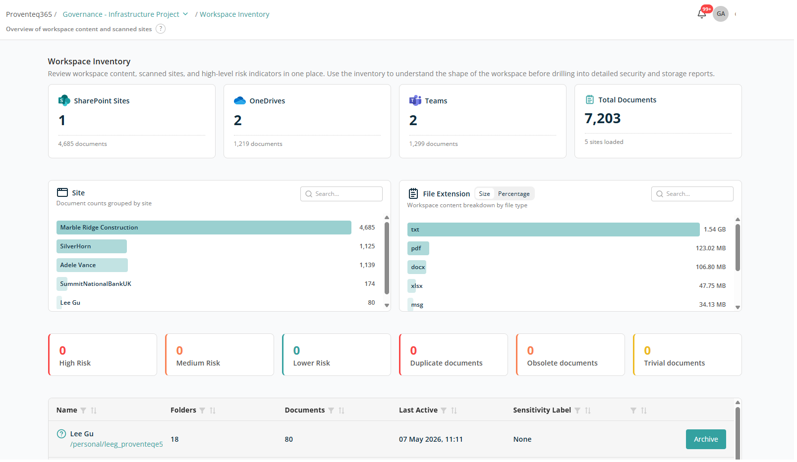
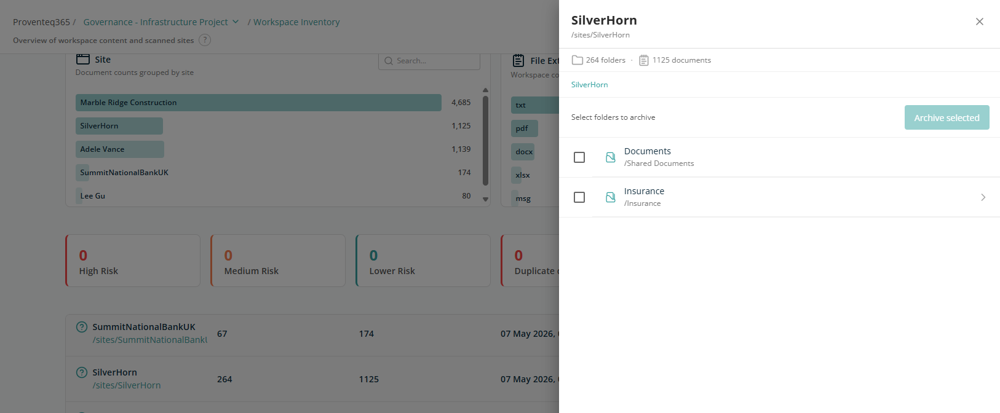

# Workspace Inventory

The **Workspace Inventory** screen provides a consolidated view of workspace content and scanned data. It helps you understand the overall structure, size, and risk posture of the workspace before reviewing detailed security or storage reports.

## Overview Cards

At the top of the screen, summary cards provide a snapshot of scanned content:

- **SharePoint Sites** — Number of SharePoint sites included in the workspace along with document counts.
- **OneDrives** — Number of OneDrive accounts analysed along with document counts.
- **Teams** — Number of Microsoft Teams included along with document counts.
- **Total Documents** — Total number of documents scanned across the workspace, along with the number of sites from which data was loaded.

These metrics reflect the current scan results for the workspace.

## Content Distribution

### Sites

Shows the number of documents grouped by site. Helps you identify where content is concentrated across the workspace.

### File Extension

Displays document distribution by file type, helping you understand which formats consume the most storage or are most prevalent. You can toggle between:

- **Size** — Storage consumed by each file type.
- **Percentage** — Storage consumed by each file type, as a percentage.

Both sections include a search box to filter data as needed. Filtering happens live as you type.

## Risk Summary

The risk cards provide a quick assessment of document risk levels:

- **High Risk** — Documents with significant governance or security concerns.
- **Medium Risk** — Documents requiring attention.
- **Lower Risk** — Documents with minimal risk.

These indicators help prioritise further review.

## Storage Insights

The storage insight cards highlight optimisation opportunities:

- **Duplicate documents** — Documents with identical content.
- **Obsolete documents** — Documents that may no longer be required, identified based on the analysis configuration criteria.
- **Trivial documents** — Low-value or insignificant documents, identified based on the analysis configuration criteria.

All these cards are interactive — click any card to drill down into the detailed report.

## Site-Level Table

Below the summary cards, a table displays site-level information for all sites or OneDrive accounts included in the scan. Each row corresponds to an individual site and provides:

- **Site Name** — Name of the site or OneDrive included in the workspace scope.
- **Site URL** — URL of the site or OneDrive included in the workspace scope.
- **Folders** — Number of folders within the site.
- **Documents** — Number of documents within the site.
- **Last Accessed** — Most recent access date for the site.
- **Sensitivity Label** — The sensitivity label applied to the site, if any. If none is applied, the column shows **None**.

Each row has an **Archive** button to archive content using the M365 Archive service.

**Note:** To archive content with the M365 Archive service, the feature must be enabled at the tenant level. For more information, see [Overview of Microsoft 365 Archive](https://learn.microsoft.com/en-us/microsoft-365/archive/archive-overview?view=o365-worldwide).

Clicking on any site or OneDrive name opens a side panel with details of documents and libraries, including the ability to archive individual libraries.

