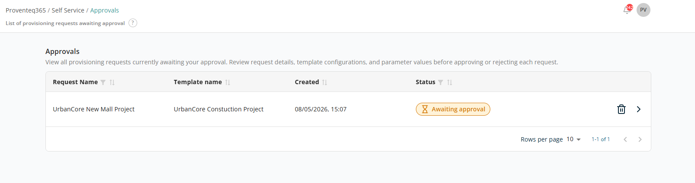

# Approvals

The **Approvals** screen displays all **provisioning requests that are pending approval**. It allows authorised approvers to **review, approve, or reject** requests before the resources (sites, channels, or users) are created.

At the top of the screen, a summary indicates that the page shows requests pending approval.

## Requests Table

The table lists all pending requests with the following columns:

- **Request Name** — The name of the provisioning request.
- **Template Name** — The template used to create the request.
- **Created** — The date and time the request was submitted.
- **Status** — The current state of the request. Example: `Awaiting approval`.
- **Actions** — Each request provides:
  - **View Details (Arrow Icon)** — Open the request details to review configuration parameters and User Input values.
  - **Delete (Trash Icon)** — Remove the request before approving it.

The table supports sorting and filtering on all columns.

At the bottom right of the table:

- **Rows Per Page** — 5, 10, 15, 20, 25, 30, 50, or 100. Default: 10.
- **Total Record Count** — Range and total record count.
- **Next/Previous Navigation** — Arrow icons to navigate.

## Request Details

The **Request Details** screen provides a complete view of a provisioning request, including the selected template, user inputs, requester information, and current status — for review before approving or rejecting the request.

At the top of the screen, the template used to create the request is displayed with the current stage. Example: **Awaiting approval**.

### Requester Information

- **Requester Name** — The name of the user who submitted the request. Example: `Glan Andrew`.
- **Requester Email** — The user's email address. Example: `Glan.andrew@sharepoint.onmicrosoft.com`.

### User Input Configuration

This section displays all the **inputs provided during request configuration**, based on the selected template:

- **Name** — The field name defined by the template.
- **Type** — The input type (e.g. TextField, UserSelection).
- **Value** — The value entered or selected during request creation.

At the top of the screen, two action buttons are available: **Approve** and **Reject**.

- Clicking **Approve** approves the request and starts the provisioning process.
- Clicking **Reject** rejects the request; the provisioning process does not start.

After approval, request status can be tracked from the Approvals list as well as the [Request History](../request-history/README.md) screen.
