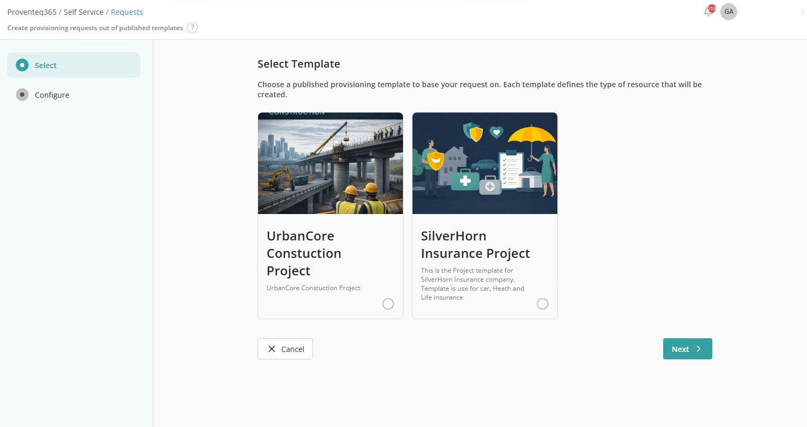
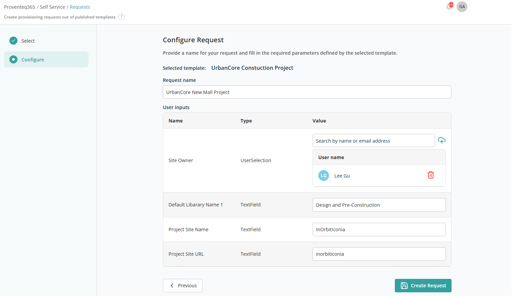

# New Request

When you click on **New Request** in the menu, the following screen opens:

## Select Template

The **Select Template** screen is the first step in creating a self-service provisioning request. It allows you to choose a predefined template.

Multiple template cards are displayed on the screen. Each card includes:

- **Template Image**
- **Template Name with description**

Select the relevant template and click **Next** to move on to the Configuration step.

## Configuration

The **Configure Request** screen is the second step in the self-service provisioning workflow. It lets you define request details and provide required user input values based on the selected template to create a new resource.

At the top of the screen, the selected template is displayed.

Below the template name:

- **Request Name** — Enter a unique name for your provisioning request. This helps identify and track the request in the system.
- **User Inputs Section** — Contains the list of user inputs added to the template. Each row includes:
  - **Name** — The field label.
  - **Type** — The type of input (e.g. text, user selection).
  - **Value** — The value you need to provide.

After entering all details and user input values, click **Create Request**. Once the request is created, you can track its status on the [Request History](../request-history/README.md) screen.

**Note:** If the template was created with the **Require Approval** setting, after the provisioning request is created it appears in the [Approvals](../approvals/README.md) module. If the template was created without **Require Approval**, the request appears directly in **Request History**.
