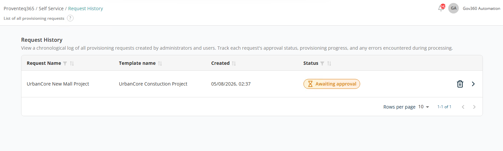
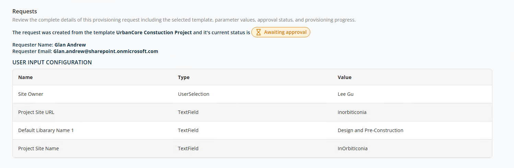

# Request History

The **Request History** screen provides a complete log of all provisioning requests created within the system. It allows you to track the status, progress, and outcomes of requests submitted by users.

At the top of the screen, a description explains that this page shows a chronological record of provisioning requests.

## List View

The following columns are displayed:

- **Request Name** — The name of the provisioning request.
- **Template Name** — The template used to create the request.
- **Created** — The date and time the request was submitted.
- **Status** — The current status of the request:
  - **Awaiting provisioning** — When the request has been generated.
  - **Provisioning failed** — When provisioning has failed for any reason.
  - **Provisioning successful** — When provisioning has completed successfully.
- **Actions** — Each request provides:
  - **View Details (Arrow Icon)** — Open the request details to review configuration parameters and User Input values.
  - **Delete (Trash Icon)** — Remove the request before approving it.

At the bottom right of the list:

- **Rows Per Page** — 5, 10, 15, 20, 25, 30, 50, or 100. Default: 10.
- **Total Record Count** — Range and total record count.
- **Next/Previous Navigation** — Arrow icons to navigate.

## Request Details

The **Request Details** screen provides a complete view of a provisioning request, including the selected template, user inputs, requester information, and current status. It allows you to review all configuration details before or after approval and provisioning.

At the top of the screen, the template used to create the request is displayed with the current stage. Example: **Awaiting approval**.

### Requester Information

This section identifies who created the request:

- **Requester Name** — The name of the user who submitted the request. Example: `Glan Andrew`.
- **Requester Email** — The user's email address. Example: `Glan.andrew@sharepoint.onmicrosoft.com`.

### User Input Configuration

This section displays all the **inputs provided during request configuration**, based on the selected template:

- **Name** — The field name defined by the template.
- **Type** — The input type (e.g. TextField, UserSelection).
- **Value** — The value entered or selected during request creation.

This entire page is read-only.
