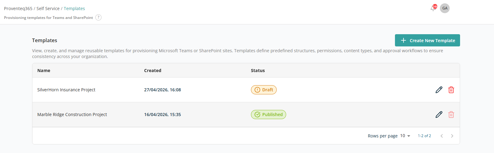
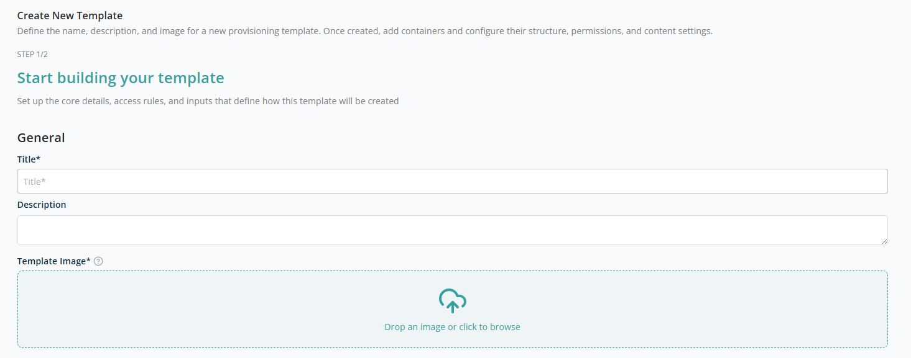
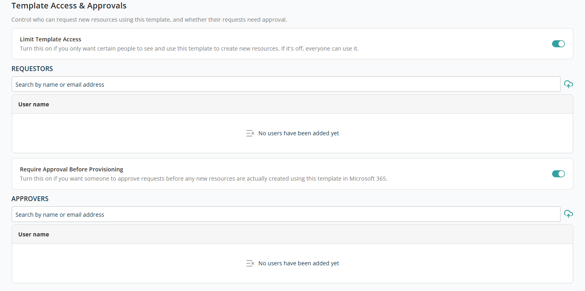
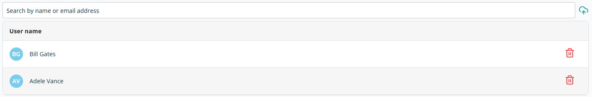
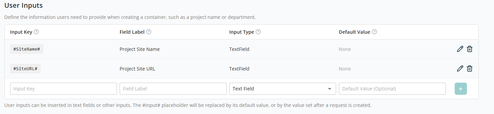
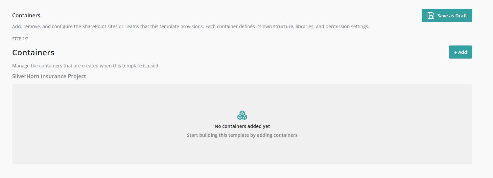
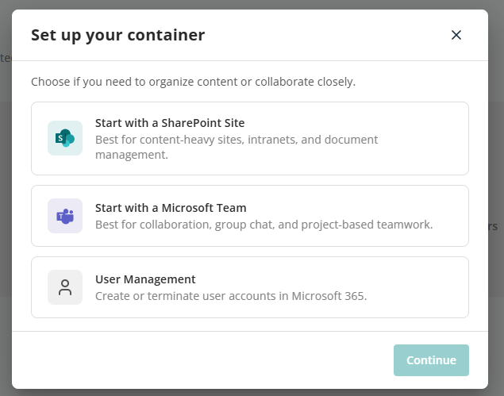

# Templates

The **Templates** screen allows administrators to create, view, and manage reusable provisioning templates for **Microsoft Teams** and **SharePoint**. Templates define standardised configurations and approval workflows to ensure consistency, governance, and control across self-service requests.

When you click on **Templates** in the menu, the following screen appears:

## Templates List

The main section of the page displays a list of all configured templates. Each row represents one template and includes:

- **Name** — The template name, typically reflecting the business or project context (for example, *Insurance Project* or *Construction Project*).
- **Created** — The date and time the template was created.
- **Last Update** — The most recent date and time the template was modified.
- **Status** — The current status of the template:
  - **Draft** — Under configuration; not available for use in self-service requests.
  - **Published** — Finalised and available to users when raising new requests.
  - **Unpublished** — The template is outdated or its configuration needs an update for new requests, and so is unpublished. Templates in this state are not available to users for raising new requests.
- **Action** — Icons to manage each template:
  - **Edit** — Modify the template configuration.
  - **Delete** — Remove the template. Only **Draft** status templates can be deleted; the Delete icon remains disabled for Published and Unpublished templates.

At the bottom right of the list:

- **Rows Per Page** — 5, 10, 15, 20, 25, 30, 50, or 100. Default: 10.
- **Total Record Count** — Range and total record count.
- **Next/Previous Navigation** — Arrow icons to navigate.

## Create Template

The **Create New Template** button at the top right of the screen, above the list, opens the create template flow. This is the first step in creating a new **provisioning template** for Microsoft Teams or SharePoint. It allows you to define the core details, access controls, approval requirements, and user inputs.

### General Details

- **Title** — A clear, descriptive name for the template. This name is visible to users when they create a new request. Use a business-friendly name that reflects the purpose of the template. *Example: Project Workspace – Construction.* Required.
- **Description** — A brief description explaining what the template is used for. Optional.
- **Template Image** — Use the file import control to upload or select an image (PNG, JPG, or SVG) for the template. The uploaded image displays here, with a Delete icon on hover to remove or replace it. Required.

### Template Access & Approvals

This section controls **who can use the template** and **whether approval is required** before provisioning.

- **Limit Template Access** — Controls who can see and use the template:
  - **Enabled** — Only selected users or groups can see and use this template.
  - **Disabled** — The template is available to all eligible users.
- **Require Approval Before Provisioning** — Controls whether provisioning requests require approval before any resources are actually created in Microsoft 365:
  - **Enabled** — Requests created using this template must be approved before any resources are provisioned. The request enters an approval workflow after submission.
  - **Disabled** — Approved users can provision resources without additional approval.

When either toggle is ON, an additional section appears to select users to assign for access and approval:

- **Search** — A text box to search users within the tenant. As you type, results are suggested. Click a result to add the user to the list (with Name and a Delete icon).

When you try to add an already-selected user, the search box result shows the text **"Already added"**.

### User Inputs

The **User Inputs** section lets users specify the information required when creating a request with this template. These inputs enhance the template's reusability, allowing a single template to accommodate multiple provisioning requests.

The following fields are available to add a new user input:

- **Input Key** — Text box for the new user input. After adding, the value is enclosed with `#…#` to indicate it is a parameter, e.g. `#SiteName#`.
- **Field Label** — Text box for a simplified name to make the input easy to recognise.
- **Input Type** — Dropdown to select the input type: Text Field, Team site selection, Hub site selection, SharePoint site selection, User selection, Generate Password.
- **Default Value** — Text box for the default value. This is only editable for **Text Field** input types; for other types it is read-only.
- **Add button** — Saves the user input after all required fields are populated.

After adding a user input, the list has the following actions to manage each entry:

- **Edit** — Opens the input for editing; values auto-populate in the bottom controls. After editing, click the `+` icon to save again.
- **Delete** — Removes the user input.

After adding all required details, click **Continue** to be redirected to the screen where you add containers to the template.

## Containers

The **Containers** screen allows you to define and manage the **SharePoint sites or Microsoft Teams** that will be created when this template is used.

At the top of the screen, the template name (for example, *SilverHorn Insurance Project*) is displayed. All containers added here belong to this template and will be created together when the template is used.

If no containers have been added, the screen displays an empty state message **"No Containers Added Yet"**, prompting you to start building the template by adding containers.

To add a new container, click **+ Add**. This opens the **Set up your container** screen, where you choose the type of resource that will be created as part of this template. A container represents the primary Microsoft 365 object that users will work with — a SharePoint site, Microsoft Team, or User Management action.

From the main category, click **Continue** to open the subcategory for the container. The following container types are supported:

| Container | Subcategories |
| --- | --- |
| Start with a SharePoint Site | [Create a New Site](./containers/create-new-site.md), [Replicate an Existing Site](./containers/replicate-existing-site.md), [Create from a Template File](./containers/create-from-template-file.md), [Add Folders to an Existing SharePoint Library](./containers/add-folders-to-library.md), [Add Library to an Existing SharePoint Site](./containers/add-library-to-site.md) |
| Start with a Microsoft Team | [Create a New Team](./containers/create-new-team.md), [Add Channels to an Existing Team](./containers/add-channels-to-team.md) |
| User Management | [Create User](./containers/create-user.md), [Terminate User](./containers/terminate-user.md) |

## Container Reference

- [Create a New Site](./containers/create-new-site.md)
- [Replicate an Existing Site](./containers/replicate-existing-site.md)
- [Create from a Template File](./containers/create-from-template-file.md)
- [Add Folders to an Existing SharePoint Library](./containers/add-folders-to-library.md)
- [Add Library to an Existing SharePoint Site](./containers/add-library-to-site.md)
- [Create a New Team](./containers/create-new-team.md)
- [Add Channels to an Existing Team](./containers/add-channels-to-team.md)
- [Create User](./containers/create-user.md)
- [Terminate User](./containers/terminate-user.md)
