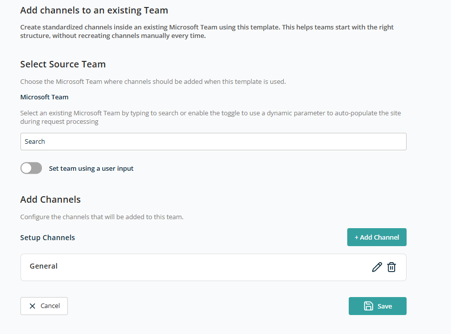
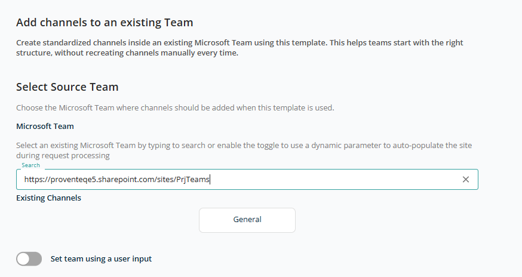
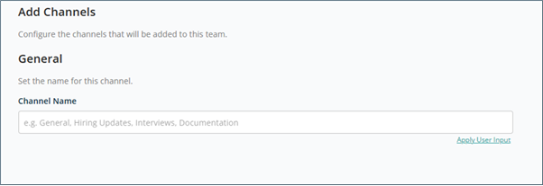
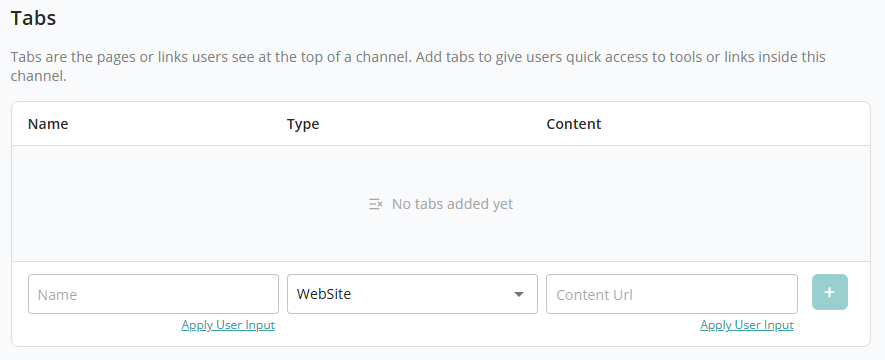
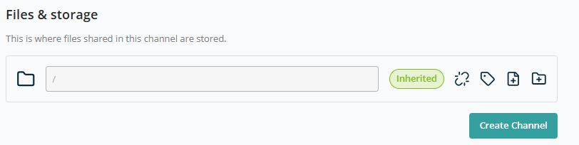
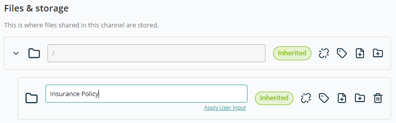

# Container — Add Channels to an Existing Team

This container lets you extend and enhance an already provisioned Microsoft Team by adding new channels, tabs, and folder structures.

When selected, the following screen opens:

## Select Source Team

This section lets you identify the target Microsoft Team where channels will be created.

- **Microsoft Team** — Search box to find and select an existing Team.
- **Set team using a user input (Toggle)** — Enables dynamic selection of the Team during request creation.

When you search and select an existing team, the existing channel names are displayed below the search text box.

## Add Channels

Use this section to add new channels to the selected Team or modify the default General channel.

### Channels List

This section displays the list of channels to be created. By default it shows **General** (the default channel entry). Each channel provides:

- **Edit (Pencil Icon)** — Modify channel configuration (name, tabs, storage, etc.).
- **Delete (Trash Icon)** — Remove the channel from the configuration list.

Click **+ Add Channel** to create additional channels. When clicked, a screen opens with the following sections.

### Select Source Team (again)

This section lets you select and confirm the Microsoft Team where new channels will be added as part of a template configuration.

- **Microsoft Team (Search Field)** — Use to find the existing team. Once selected, existing channels are displayed below the search box.
- **Set team using a user input (Toggle)** — Configure team selection using User Input for dynamic selection during request creation.

### Add Channels

#### General

- **Channel Name** — Enter the name of the channel.

Use **Apply User Input** for a reusable channel name.

#### Tabs

This section lets you add default tabs to the channel:

- **Name** — Tab display name.
- **Type** — Tab type (e.g. Website, DocumentLibrary).
- **Content URL** — URL or reference content.

Based on the selected Type, the Content URL text box appears next to the dropdown.

| Tab Type | Content URL text box visible? |
| --- | --- |
| WebSite | Yes |
| DocumentLibrary | Yes |
| Wiki | No |
| Planner | No |
| MicrosoftStream | No |
| MicrosoftForms | No |
| Word | Yes |
| Excel | Yes |
| PowerPoint | No |
| PDF | Yes |
| OneNote | No |
| PowerBI | No |
| SharePointPageOrList | No |
| Custom | No |

After adding the Name and relevant tab type, click **+** to add it to the list. Both Name and Content URL can be set using User Input to make them reusable.

#### Files & Storage

This section lets you define folder structures within a team channel and control how permissions and labels are applied.

- **Root Folder (/)** — `/` represents the root of the team channel.

For each folder, the following actions are available:

- **Inherited** — Indicates inheritance of Permissions, Sensitivity, or Retention labels from the parent.
- **Break or Reset Inheritance** — Opens a popup to manage inheritance.

  

  

- **Apply Retention Labels** — Set a retention label.

  

- **Import a File** — Upload files up to 100 MB.

  

- **Add New Folder** — Create a new folder. Folder Name can be fixed or use the **User Input** feature.

  

**Note:** Each added folder offers a **Create new folder** option to build a hierarchy.

After selecting all channel configuration, click **Create Channel** to add this channel to the container configuration.

After adding channel configuration, click **Save** to add the container to the template.
