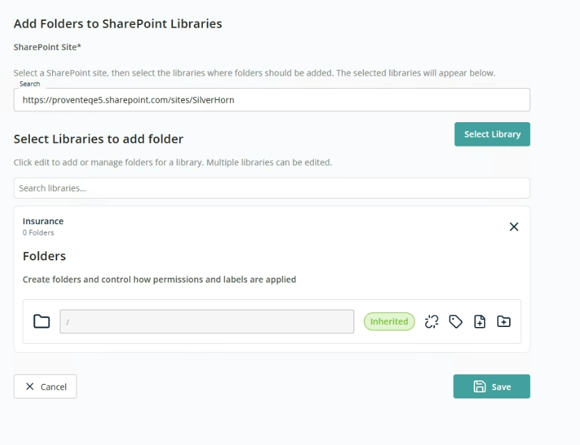

# Container — Add Folders to an Existing SharePoint Library

This container creates a folder structure that can be added inside one or more folders within an existing SharePoint site library. It also lets you control how permissions and labels are applied at the folder level.

- **SharePoint Site** — Search field to find and select an existing SharePoint site. The selected site defines the structure that will be modified.

Once a site is selected, click **Select Library** to choose one or more document libraries from the selected site. The folder structure will be copied into these selected libraries.

## Setup Folders

This section uses the same controls as the **Folders** section in the [Create New Site](./create-new-site.md#folders) container — break/reset inheritance, retention labels, file imports, and add new folder.
