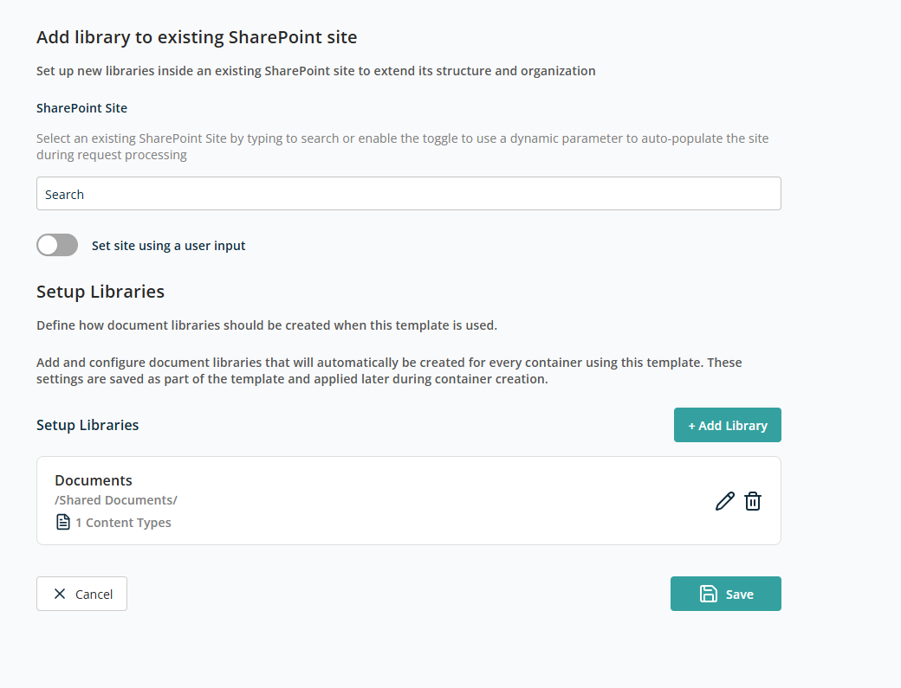

# Container — Add Library to an Existing SharePoint Site

This container lets you add one or more new document libraries to an existing SharePoint site. It helps extend the site's structure and organisation without creating a new site or modifying existing content.

## Select SharePoint Site

This section lets you choose the **existing SharePoint site** where the new libraries will be added.

- **SharePoint Site** — Search field to find and select an existing SharePoint site.
- **Set site using a user input** — Enable this toggle if the source site should be provided dynamically during request submission instead of being fixed in the template.

## Setup Libraries

This section uses the same controls as the **Setup Libraries** section in the [Create New Site](./create-new-site.md#setup-libraries) container.

After doing all configuration, click **Save** to add this container to the template. Click **Cancel** to discard.
