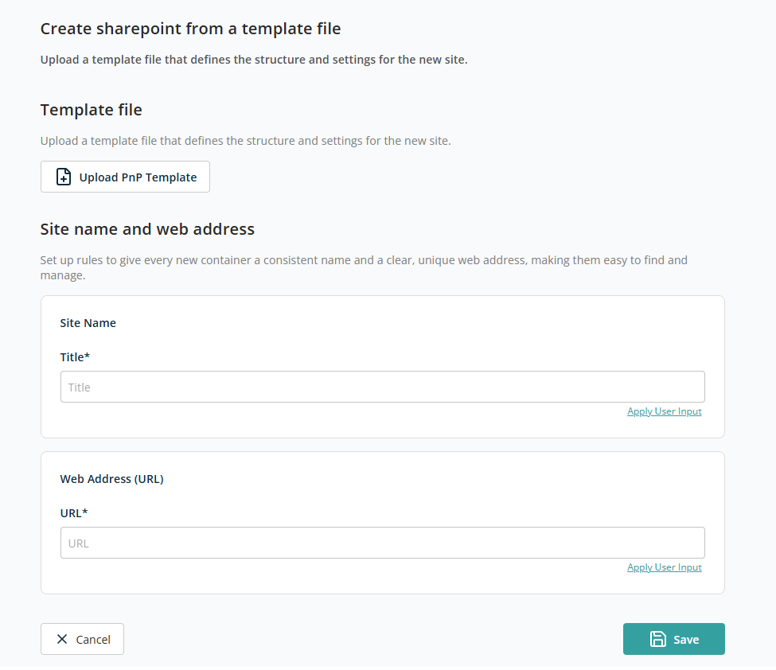

# Container — Create from a Template File

This container creates a new SharePoint site (container) using a **predefined PnP template file**. The template defines the site's structure, settings, and configuration, helping you provision sites quickly and consistently without manual setup.

## Template File

Use this section to upload a **PnP (Patterns and Practices) template file** that defines the structure of the new SharePoint site.

Click **Upload PnP Template** and select a valid template file from your local system using the standard web-based file selection popup.

## Site Name and Web Address

This section lets you define how the new SharePoint site (container) will be named and how its URL will be created. These settings ensure each site has a clear identity and a unique, easy-to-find web address.

- **Title** — The display name of the SharePoint site.
- **URL** — The unique web address for the SharePoint site.

Use the **Apply User Input** functionality to define Title and URL to be entered dynamically during the request process.

Click **Save** to add this container to the template. Click **Back** to discard the container addition.
