# Container — Create New Site

This container creates a brand-new SharePoint site with predefined settings, library structure, access, and appearance.

When this container is selected, a screen with a left-side menu opens. The left-side menu represents a step-by-step configuration flow for defining how a SharePoint container is provisioned when the template is used. Each section groups related settings and ensures a structured, governed setup process. The menu also indicates progress through the configuration lifecycle.

## Configuration

This configuration section lets you do the following:

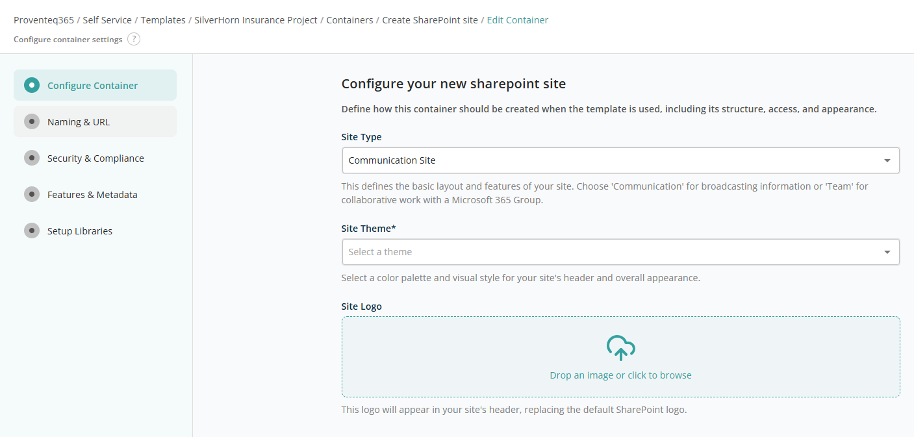

### Configure Your New SharePoint Site

This section allows you to configure the site's type and appearance:

- **Site Type** — Dropdown for the type of SharePoint site. Options: Communication Site, Team site (with Microsoft 365 group), Team site (without Microsoft 365 group).
- **Site Theme** — Dropdown to select the visual theme for the SharePoint site.
- **Site Logo** — File import control. You can drag and drop an image or use the standard file selection feature. Once imported, a preview appears; hover to reveal a Delete icon to replace the image. Required. Supported formats: PNG, JPG, SVG.

### Hub Site

This section allows you to associate the new site with an existing Hub Site.

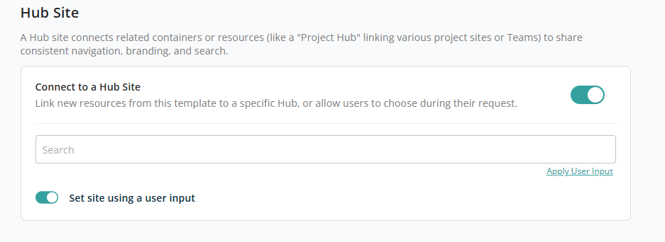

When the **Connect to Hub site** toggle is ON, the following controls appear:

- **Associated Hub Site** — Text box to search for the hub site to associate with the SharePoint site. See [Hub Site](../../../appendix/README.md#hub-site) for more information.
- **Set site using Params** — Toggle to set the hub site using a user input. OFF by default. When ON, an **Apply User Input** link appears below the search box. Click it to open the User Input popup and add a dynamic user input so this can be reused for every request.

**Note:** When configuring user input for this field, only the **Hub site selection** input type is available for selection.

### Default Site Access

This section lets you define who will have access to new sites (containers) created using this template. You can predefine access for Owners, Members, and Visitors.

Each site created using this template includes three permission levels:

- **Owners (Full Control)** — Full administrative control over the site, including managing users, settings, and content. At least one owner is required, so this section is required to move ahead with configuration.
- **Members (Edit)** — Can create, edit, and manage content within the site but do not have full administrative permissions.
- **Visitors (Read)** — Read-only access; can view content without making changes.

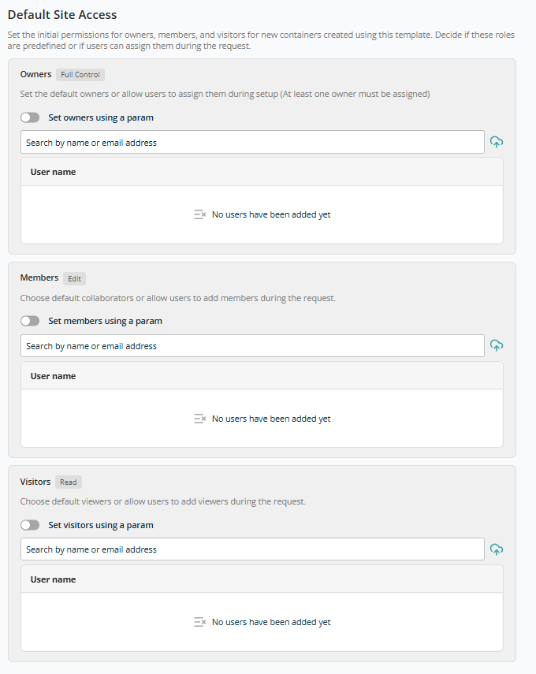

Each permission level shares the following functionality:

- **Search** — Search box to add users by name or email address. Added users appear in the list. Users can also be configured using user input — toggle ON **Set using user input** to reveal the **Apply User Input** link. Click it to open the User Input popup and add a dynamic user input so this can be reused for every request.

**Note:** When configuring user input for this field, only the **User Selection** input type is available for selection.

After adding all required configurations, click **Continue** to move on to **Naming & URL**. Click **Back** to cancel container configuration.

## Naming & URL

This configuration section lets you define consistent rules for how new sites are named and how their web addresses (URLs) are generated.

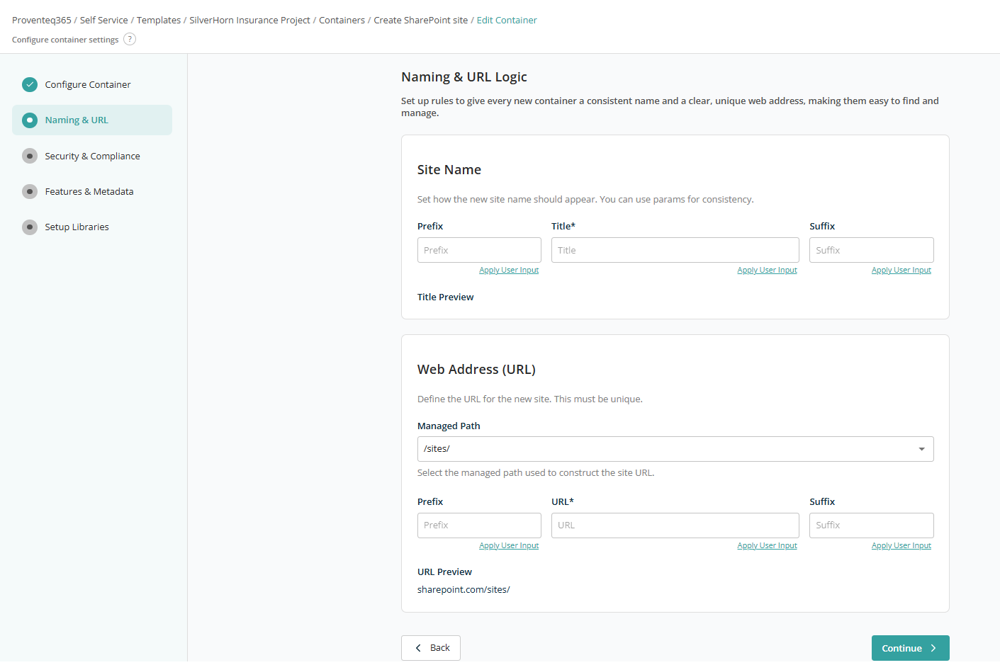

### Site Name

The Site Name section controls how the display name of the new site appears in Microsoft 365.

- **Prefix** — Optional Title prefix used while creating the site collection. Useful when multiple sites need a standard prefix, e.g. `Project - <site title>`.
- **Title** — The required title used while creating the site collection.
- **Suffix** — Optional Title suffix, e.g. `Project - <site title> - 2025`.

The **Title Preview** shows how the final site name will look once prefix, title, and suffix are combined.

### Web Address (URL)

The Web Address (URL) section defines how the site's URL is constructed. Each site URL must be unique.

- **Managed Path** — The base path used for the site URL. Options: `/sites/`, `/teams/`.
- **Prefix** — Optional URL prefix, e.g. `Governance<URL>`.
- **URL** — Required text box for the site URL. Example: if the target URL is `http://demo.sharepoint.com/sites/Governance`, enter `Governance` in this text box.
- **Suffix** — Optional URL suffix, e.g. `Governance<URL>2025`.

The **URL Preview** displays how the complete site address will appear, for example: `sharepoint.com/sites/project-hr-2026`. Use this to verify correctness and uniqueness before the site is created.

Below each text box, the **Apply User Input** link opens the User Input popup to configure user inputs or select an existing one for that field.

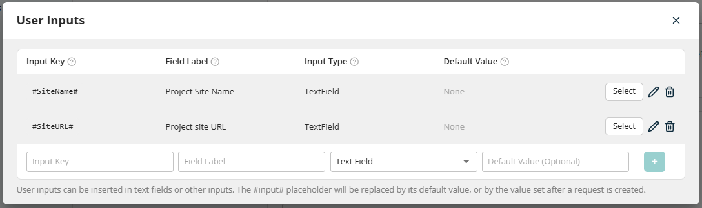

To use a user input, click **Select** and it will be set for that field.

After adding all required configurations, click **Continue** to move on to **Security & Compliance**. Click **Back** to return to the previous section.

## Security & Compliance

This screen lets you define security controls, compliance settings, and regional defaults for SharePoint sites created using this template.

### Security & Compliance

- **Allow external file sharing** — A toggle to restrict external file sharing of documents and folders. OFF by default. When ON, an additional dropdown appears with options: Anyone, New and existing guests, Existing guests, Only people in your organization. A multiline text box also appears to add external domains that are allowed for sharing.

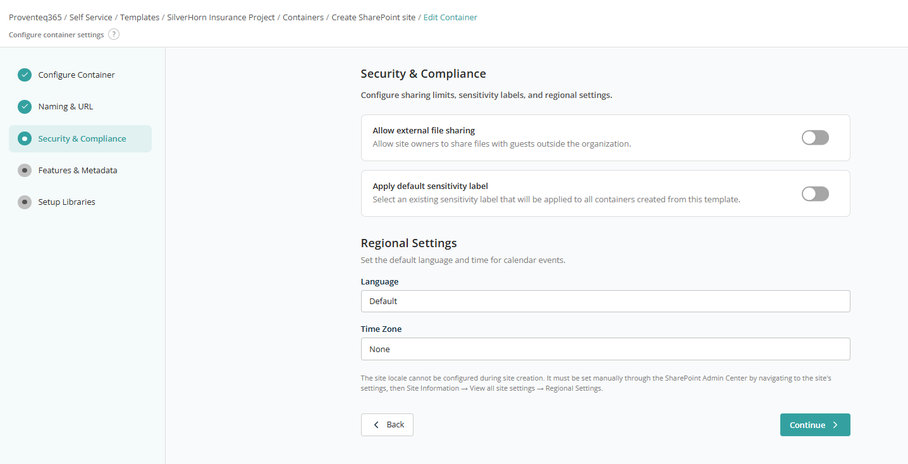

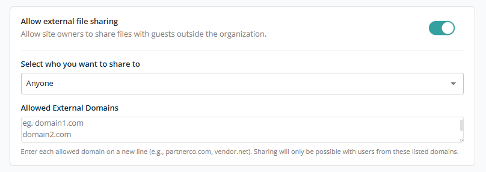

- **Apply default sensitivity label** — Toggle to set a default sensitivity label for sites created using this template. When ON, a dropdown lists site-level sensitivity labels. (Sensitivity labels can only be set at site level.)

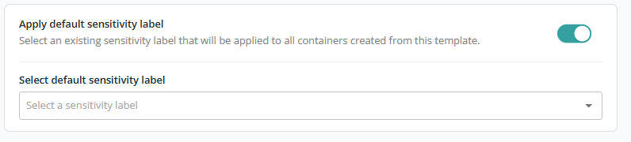

### Regional Settings

- **Language** — Specifies the default language for the site interface and regional formatting. Default uses the organisation or tenant default language. If needed, a specific language can be selected.
- **Time Zone** — Defines the default time zone used for calendar events and time-based information. If set to **None**, the site will not have a predefined time zone during creation.

**Note:** Regional settings (language and time zone) cannot always be fully configured at site creation. If required, they can be updated later via the SharePoint Admin Center: *Site Information > View all site settings > Regional Settings*.

After adding all required configurations, click **Continue** to move on to **Features & Metadata**.

## Features & Metadata

The Features & Metadata screen lets you enable built-in SharePoint features and define container-level metadata for all sites created using this template.

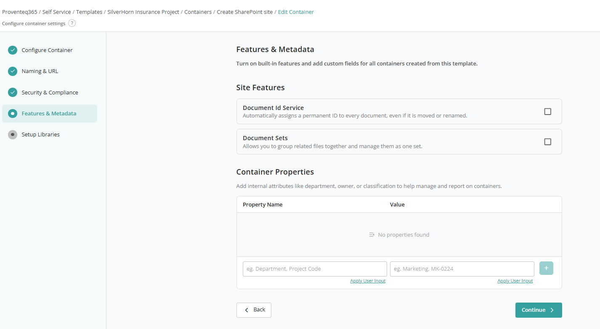

### Site Features

Use this section to enable SharePoint features that will be automatically activated for every site created from this template. Both **Document ID Service** and **Document Sets** can be enabled by ticking the check box as required.

### Container Properties

Container Properties allow you to define custom metadata for the site itself. These properties help categorise, manage, and report on sites across the organisation.

- **Property Name** — Use the first text box to give a property name such as Department, Project Code, Business Unit, or Classification.
- **Value** — Based on the Property Name, use the second text box to enter its corresponding value, such as `Marketing` or `MK-0224`.

Use the **(+)** button to add the property to the list. If no properties are defined, the message **"No properties found"** is displayed. You can add multiple properties. Each property defined here will be associated with all sites created using this template.

**Apply User Input** is also available for both text boxes to allow values to be provided during the site request instead of being hard-coded in the template.

After adding all required configurations, click **Continue** to move on to **Setup Libraries**.

## Setup Libraries

This screen lets you define which **document libraries** will be automatically created when a new SharePoint site (container) is provisioned using this template. This ensures every site starts with a consistent library structure aligned with business and governance requirements.

All configurations defined here are saved as part of the template and applied during site creation.

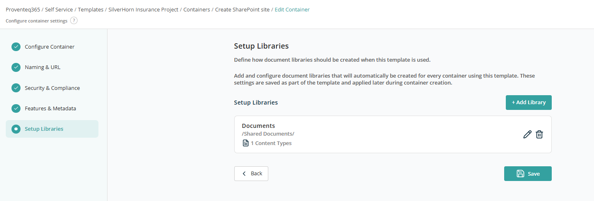

### Existing Libraries List

This section displays all document libraries that will be created by default for the site. For each library, you can see:

- Library name (for example, `Documents`).
- Library path (for example, `/Shared Documents/`).
- Configured content types associated with the library.
- Actions to **Edit** library settings (Edit icon) or **Delete** the library from the template (Delete icon).

By default, the Document Library configuration is always added with default settings. You can edit it as required.

To add a new library, click **Add Library**. The following screen opens:

### General

This section defines the **name** and **location** of the document library:

- **Library Name** — Text box for the library name. **Required**.
- **Library Path** — Text box for the library path. Optional.

Use the User Input feature to provide the library name and path dynamically during the site creation request instead of fixing them in the template.

### Content Types

This section lets you configure what types of content users can create within this library.

The Content Type list displays all content types enabled for the library. **Document** is shown as the default content type. The **Default** label indicates which content type is set as default — that one cannot be removed.

Use the **Select a Content Type** dropdown to add additional content types. After selecting a content type, choose whether it should be the default. Once added, the content type is removed from the dropdown so it cannot be added again.

Use the **Delete** icon to remove an unwanted content type from the library.

### Folders

This section lets you define folder structures within a document library and control how **permissions** and **labels** are applied to those folders.

- **Root Folder (/)** — The path field displays the current folder location within the library. `/` represents the root of the document library. You can create folders under the root or navigate into existing folders to manage sub-folders. Folders created here are automatically set up when the library is provisioned using this template.

For each folder, the following actions are available:

- **Inherited** — Indicates that the folder currently inherits Permissions, Sensitivity, or Retention labels from its parent (for example, the library or parent folder).
- **Break or Reset Inheritance** — Lets you break or reset permission inheritance for the folder. Clicking opens a popup to manage inheritance.

Once permission is broken using the popup, the changed permission is displayed below the folder path:

- **Apply Retention Labels** — Sets a retention label at the folder. Clicking the icon shows a dropdown with the list of retention labels.

- **Import a File** — Lets you add files to a folder. All imported files are copied into the root directory across all sites created with this template. Clicking the icon opens a file import browser. Files up to 100 MB can be uploaded. After successful upload, the file appears in the section with options to apply a retention label or remove it using the Delete icon.

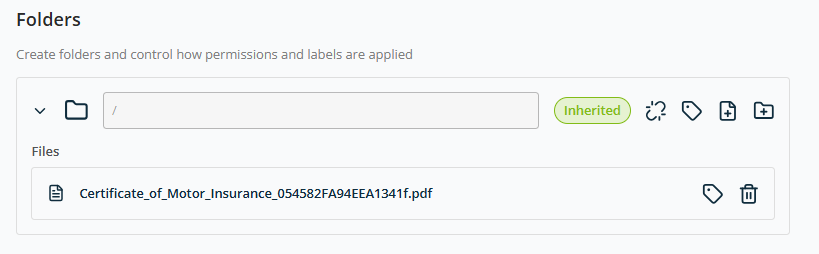

- **Add New Folder** — Creates a new folder under the current path. You provide a Folder Name — either a fixed name or one using the **User Input** feature for dynamic content.

**Note:** For each added folder, the **Create new folder** option lets you build a folder hierarchy. Each new sub-folder gets the same management controls.

### Advanced Settings

This section lets you configure **optional governance, compliance, and content controls** for libraries created using this template. These settings help manage version history, approvals, sensitivity, and retention to meet organisational and regulatory requirements.

All options configured here are applied automatically to content created in the container.

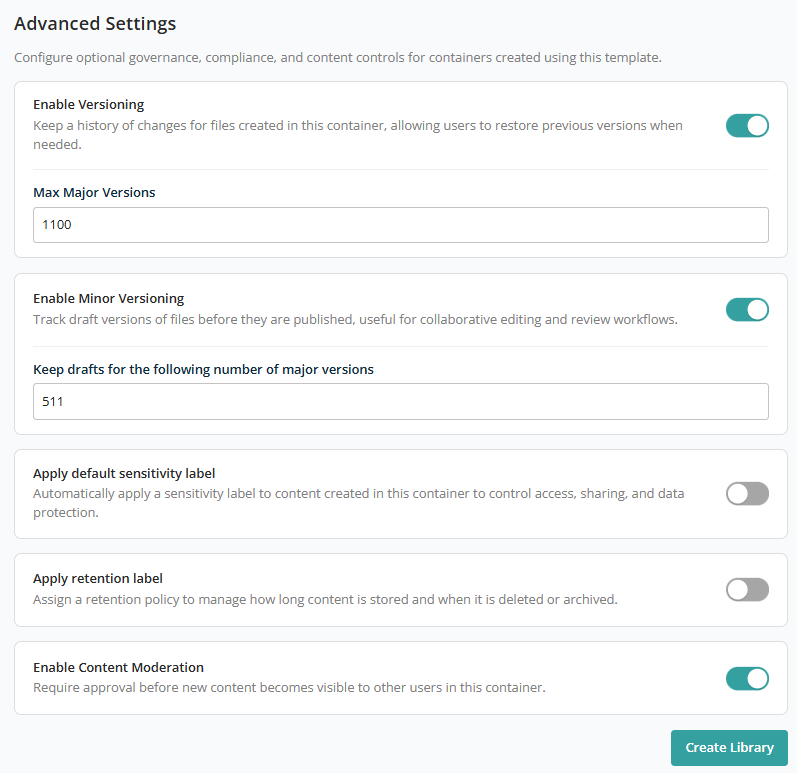

- **Enable Versioning** — Toggle, ON by default. When ON, a text box appears to define the maximum number of major versions allowed in the library. Default: 1100.
- **Enable Minor Versioning** — Toggle, ON by default. When ON, a text box appears to define the maximum number of minor versions allowed. Default: 750.
- **Apply default sensitivity label** — Toggle, OFF by default. When ON, a dropdown lists the sensitivity labels available to assign to the library.
- **Apply retention label** — Toggle, OFF by default. When ON, a dropdown lists the retention labels available to assign to the library.
- **Enable Moderation** — Toggle, ON by default. Controls the visibility and approval status of items (like documents or list entries) before they are made available to all users.

After configuring all library settings, click **Create Library** to add it to the container.

After adding all configuration, click **Save** to add the container to the template.
