# Container — Create a New Team

This container creates a brand-new Team site with predefined settings, channels, library structure, access, and appearance.

When this container is selected, a screen with a left-side menu opens. The left-side menu represents a step-by-step configuration flow for defining how a SharePoint container is provisioned when the template is used. Each section groups related settings and ensures a structured, governed setup process. The menu also indicates progress through the configuration lifecycle.

## Configuration

This configuration section lets you do the following:

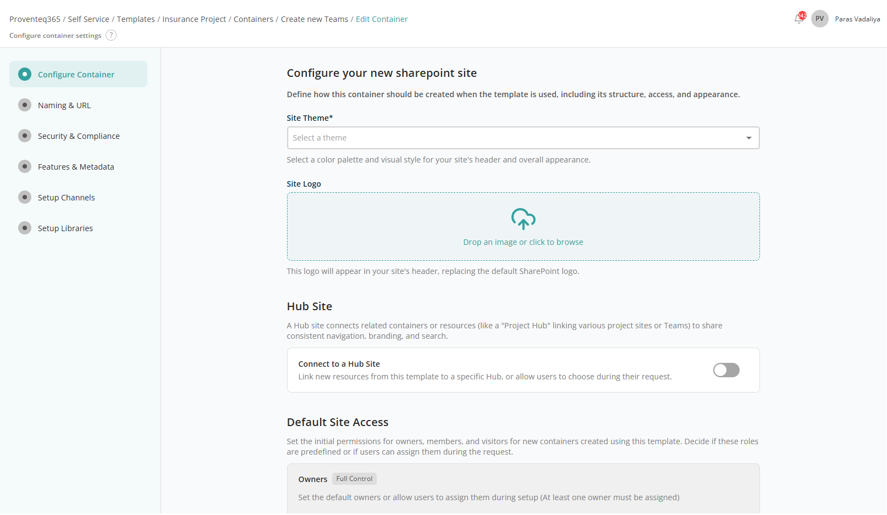

### Configure Your New SharePoint Site

This section allows you to configure the site's appearance:

- **Site Theme** — Dropdown to select the visual theme for the SharePoint site.
- **Site Logo** — File import control. You can drag and drop an image or use the standard file selection feature. Once imported, a preview appears; hover to reveal a Delete icon to replace the image. Required. Supported formats: PNG, JPG, SVG.

### Hub Site

This section allows you to associate the new site with an existing Hub Site.

When the **Connect to Hub site** toggle is ON, the following controls appear:

- **Associated Hub Site** — Text box to search for the hub site to associate with the SharePoint site. See [Hub Site](../../../appendix/README.md#hub-site) for more information.
- **Set site using Params** — Toggle to set the hub site using a user input. OFF by default. When ON, an **Apply User Input** link appears below the search box.

**Note:** When configuring user input for this field, only the **Hub site selection** input type is available for selection.

### Default Site Access

This section lets you define who will have access to new sites (containers) created using this template. You can predefine access for Owners, Members, and Visitors.

Each site created using this template includes three permission levels:

- **Owners (Full Control)** — Full administrative control. At least one owner is required.
- **Members (Edit)** — Can create, edit, and manage content but do not have full administrative permissions.
- **Visitors (Read)** — Read-only access.

Each permission level shares the following functionality:

- **Search** — Search box to add users by name or email address. Added users appear in the list. Toggle ON **Set using user input** to reveal the **Apply User Input** link for dynamic configuration.

**Note:** When configuring user input for this field, only the **User Selection** input type is available for selection.

After adding all required configurations, click **Continue** to move on to **Naming & URL**. Click **Back** to cancel container configuration.

## Naming & URL

This configuration section lets you define consistent rules for how new sites are named and how their web addresses (URLs) are generated.

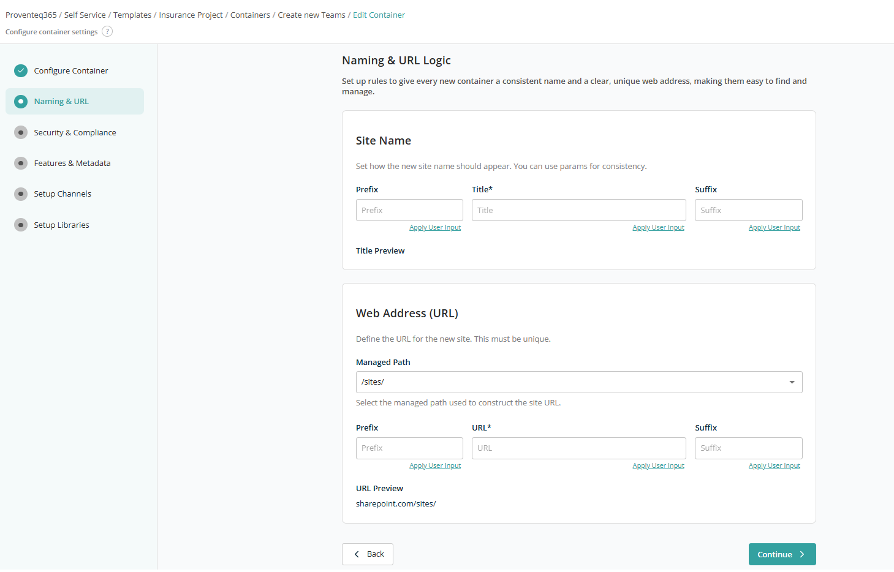

### Site Name

The Site Name section controls how the display name of the new site appears in Microsoft 365.

- **Prefix** — Optional Title prefix used while creating the site collection. Example: `Project - <site title>`.
- **Title** — The required title.
- **Suffix** — Optional Title suffix, e.g. `Project - <site title> - 2025`.

The **Title Preview** shows how the final site name will look once prefix, title, and suffix are combined.

### Web Address (URL)

The Web Address (URL) section defines how the site's URL is constructed. Each site URL must be unique.

- **Managed Path** — The base path used for the site URL. Options: `/sites/`, `/teams/`.
- **Prefix** — Optional URL prefix, e.g. `Governance<URL>`.
- **URL** — Required text box for the site URL.
- **Suffix** — Optional URL suffix.

The **URL Preview** displays how the complete site address will appear.

Below each text box, the **Apply User Input** link opens the User Input popup to configure or select user inputs for that field.

After adding all required configurations, click **Continue** to move on to **Security & Compliance**.

## Security & Compliance

This section lets you define security controls, compliance settings, and regional defaults for SharePoint sites created using this template.

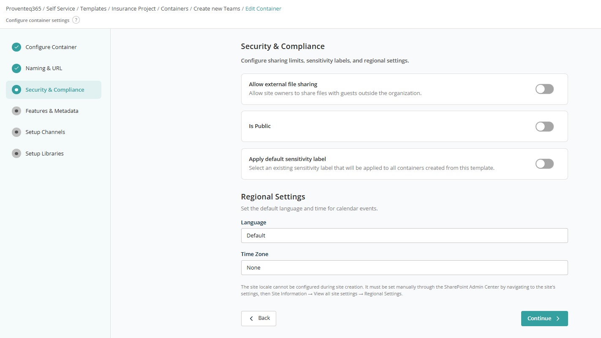

- **Allow external file sharing** — Toggle to restrict external file sharing. OFF by default. When ON, an additional dropdown appears with options: Anyone, New and existing guests, Existing guests, Only people in your organization. A multiline text box also appears to add external domains that are allowed for sharing.

- **Is Public** — Toggle to make the team site public or for internal use.
- **Apply default sensitivity label** — Toggle to set a default sensitivity label. When ON, a dropdown lists site-level sensitivity labels. (Sensitivity labels can only be set at site level.)

### Regional Settings

- **Language** — Specifies the default language for the site interface and regional formatting. Default uses the organisation or tenant default language.
- **Time Zone** — Defines the default time zone used for calendar events and time-based information. If set to **None**, the site will not have a predefined time zone during creation.

**Note:** Regional settings (language and time zone) cannot always be fully configured at site creation. If required, they can be updated later via the SharePoint Admin Center: *Site Information > View all site settings > Regional Settings*.

After adding all required configurations, click **Continue** to move on to **Features & Metadata**.

## Features & Metadata

The Features & Metadata screen lets you enable built-in SharePoint features and define container-level metadata for all sites created using this template.

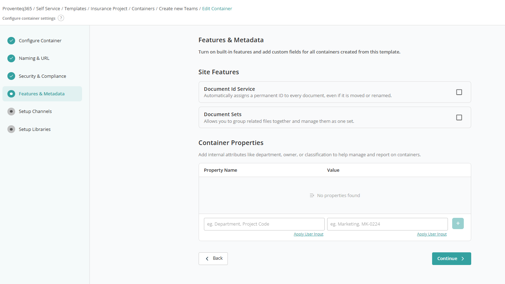

### Site Features

Use this section to enable SharePoint features that will be automatically activated for every site created from this template. Both **Document ID Service** and **Document Sets** can be enabled by ticking the check box as required.

### Container Properties

Container Properties allow you to define custom metadata for the site itself:

- **Property Name** — Use the first text box to give a property name such as Department, Project Code, Business Unit, or Classification.
- **Value** — The corresponding value for the property, such as `Marketing` or `MK-0224`.

Use the **(+)** button to add the property to the list. If no properties are defined, the message **"No properties found"** is displayed. You can add multiple properties.

**Apply User Input** is available for both text boxes to allow values to be provided during the site request instead of being hard-coded in the template.

After adding all required configurations, click **Continue** to move on to **Setup Channels**.

## Setup Channels

The **Setup Channels** screen lets you configure **Microsoft Teams channels** within a team site. Channels help organise conversations, files, and collaboration areas within the provisioned resource.

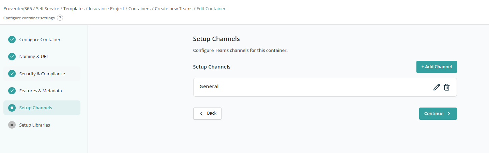

### Channels List

This section displays a list of channels that will be created in Microsoft Teams.

By default, the **General** channel exists in the list and is automatically included in every team. Each channel provides:

- **Edit (Pencil Icon)** — Modify the channel name or configuration.
- **Delete (Trash Icon)** — Remove the channel from the container.

Click **+ Add Channel** to add a new channel. This opens the Create Channel screen, which lets you define detailed settings for a Microsoft Teams channel within the container — including channel name, tabs, and file storage location.

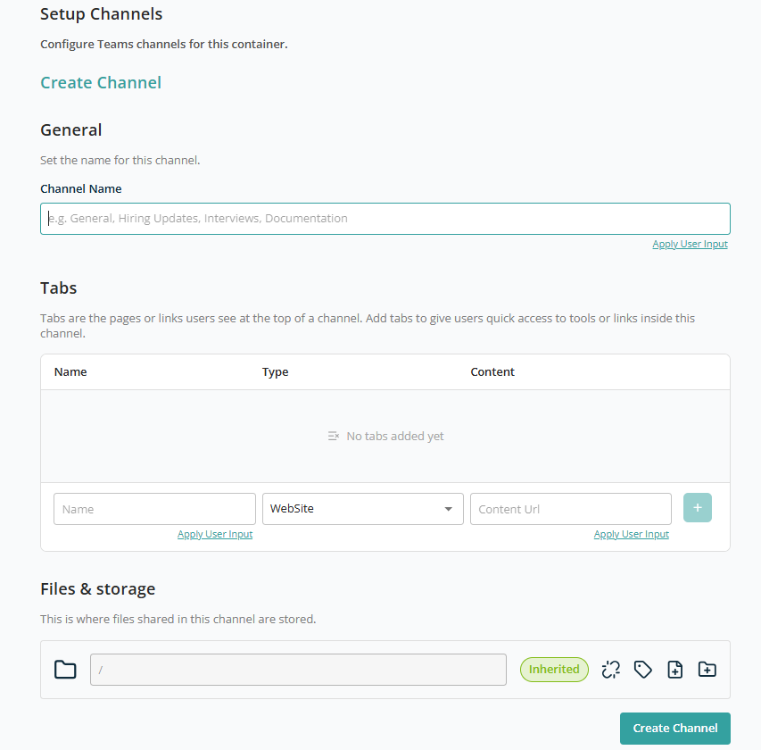

### General

- **Channel Name** — Enter the name of the channel.

Use **Apply User Input** to set a reusable channel name so it can be set dynamically when creating the request using this template.

### Tabs

This section lets you add default tabs to the channel. Provide:

- **Name** — Tab display name.
- **Type** — Tab type (e.g. Website, DocumentLibrary).
- **Content URL** — URL or reference content.

Based on the selected value in the Type dropdown, the **Content URL** text box appears next to the dropdown.

| Tab Type | Content URL text box visible? |
| --- | --- |
| WebSite | Yes |
| DocumentLibrary | Yes |
| Wiki | No |
| Planner | No |
| MicrosoftStream | No |
| MicrosoftForms | No |
| Word | Yes |
| Excel | Yes |
| PowerPoint | No |
| PDF | Yes |
| OneNote | No |
| PowerBI | No |
| SharePointPageOrList | No |
| Custom | No |

After adding Name and the relevant Type, click **+** to add it to the list.

Both Name and Content URL values can be set using **User Input** to make them reusable across requests.

### Files & Storage

This section lets you define folder structures within a team channel and control how permissions and labels are applied.

- **Root Folder (/)** — The path field displays the current folder location within the team channel. `/` represents the root. You can create folders under the root or navigate into existing folders to manage sub-folders.

For each folder, the following actions are available:

- **Inherited** — Indicates the folder inherits Permissions, Sensitivity, or Retention labels from its parent.
- **Break or Reset Inheritance** — Lets you break or reset permission inheritance.

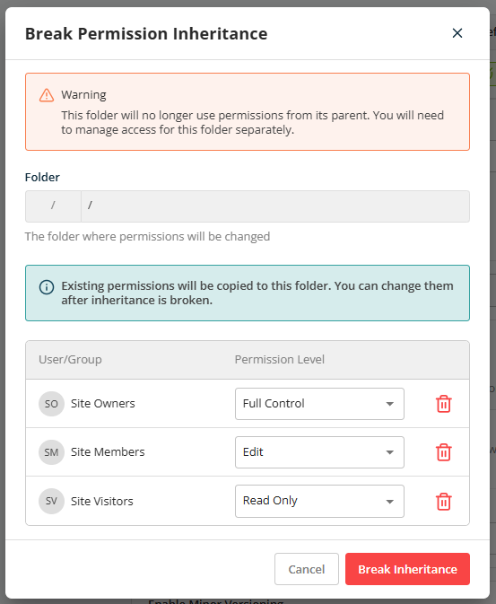

Once permission is broken, the changed permission is displayed below the folder path:

- **Apply Retention Labels** — Sets a retention label at the folder. Clicking shows a dropdown with the list of retention labels.

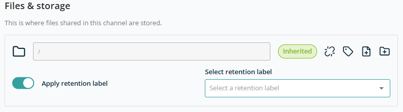

- **Import a File** — Lets you add files to a folder. All imported files are copied into the root directory across all sites created with this template. Files up to 100 MB can be uploaded.

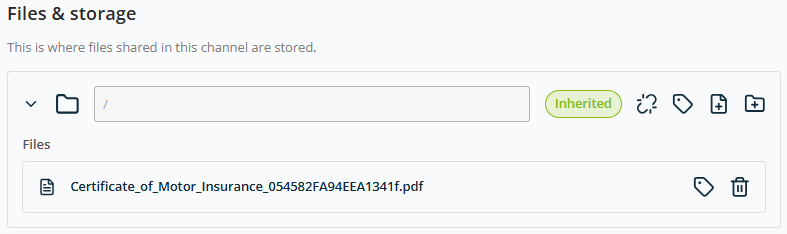

- **Add New Folder** — Creates a new folder under the current path. Folder Name can be fixed or use the **User Input** feature for dynamic values.

**Note:** Each added folder offers a **Create new folder** option to build a hierarchy. Each sub-folder gets the same management controls.

After selecting all channel configuration, click **Create Channel** to add this channel to the container configuration.

After adding all required configurations, click **Continue** to move on to **Setup Libraries**.

## Setup Libraries

This screen lets you define which **document libraries** will be automatically created when a new SharePoint site (container) is provisioned using this template.

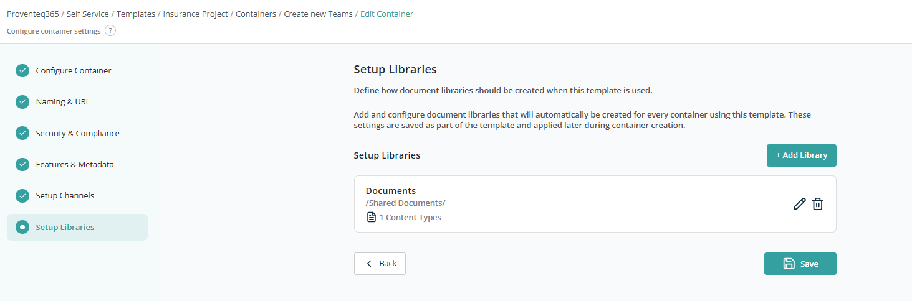

### Existing Libraries List

This section displays all document libraries that will be created by default for the site, including library name, library path, configured content types, and Edit/Delete actions. By default, a Document Library configuration is always added; it can be edited as needed.

To add a new library, click **Add Library**. The general configuration screen opens.

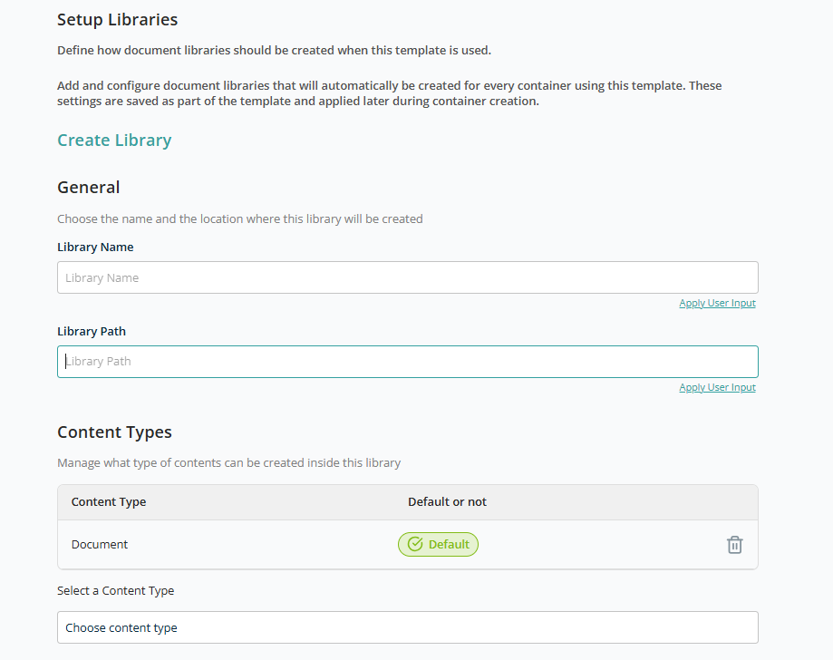

### General

- **Library Name** — Required text box for the library name.
- **Library Path** — Optional text box for the library path.

Use the User Input feature for dynamic values.

### Content Types

The Content Type list displays all content types enabled for the library. **Document** is the default content type. The **Default** label cannot be removed.

Use the **Select a Content Type** dropdown to add additional content types. Use the **Delete** icon to remove an unwanted content type.

### Folders

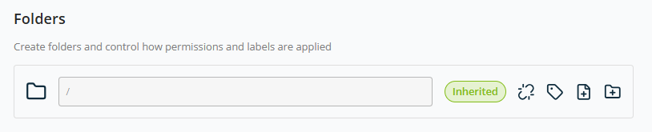

The Folders section uses the same controls as the channel folder structure:

- Root Folder (/)
- Inherited indicator
- **Break or Reset Inheritance**

  

  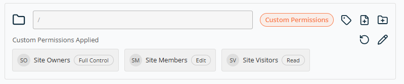

- **Apply Retention Labels**

  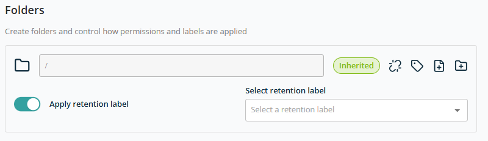

- **Import a File**

  

- **Add New Folder**

  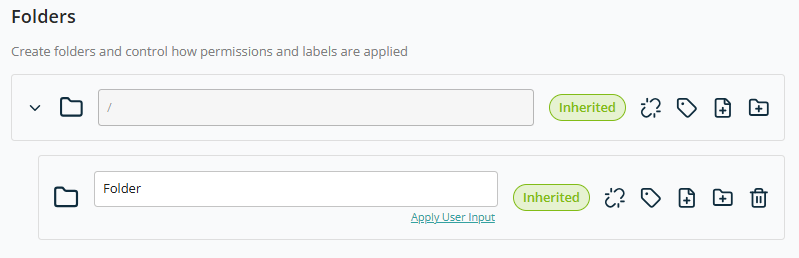

**Note:** Each added folder offers a **Create new folder** option to build a hierarchy.

### Advanced Settings

This section lets you configure **optional governance, compliance, and content controls** for libraries created using this template.

- **Enable Versioning** — Toggle, ON by default. Default major versions: 1100.
- **Enable Minor Versioning** — Toggle, ON by default. Default minor versions: 750.
- **Apply default sensitivity label** — Toggle, OFF by default.
- **Apply retention label** — Toggle, OFF by default.
- **Enable Moderation** — Toggle, ON by default.

After configuring all library settings, click **Create Library** to add it to the container.

Click **Save** to add this container to the template.
