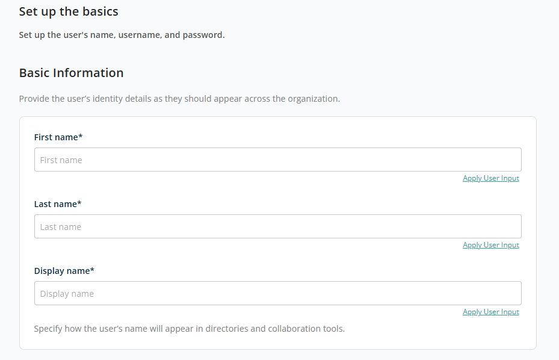
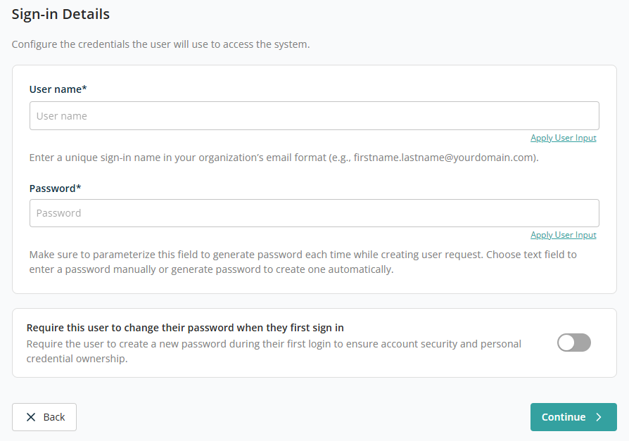
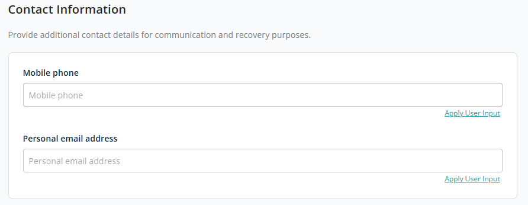
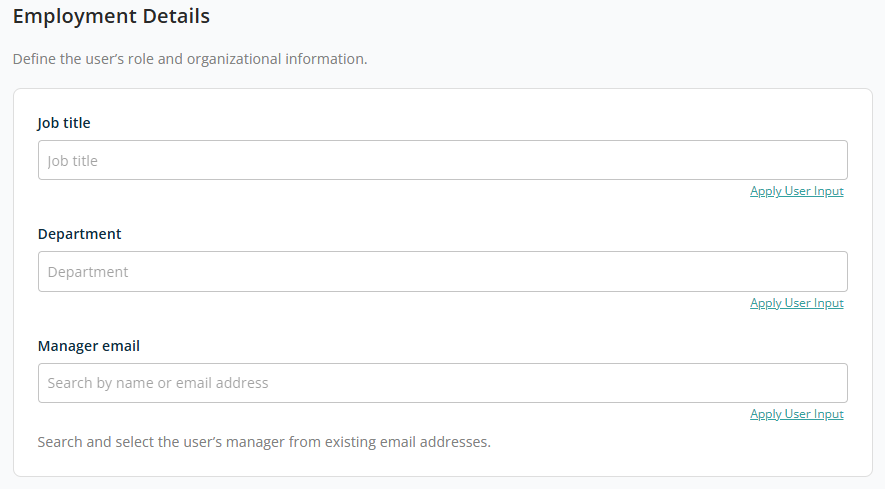
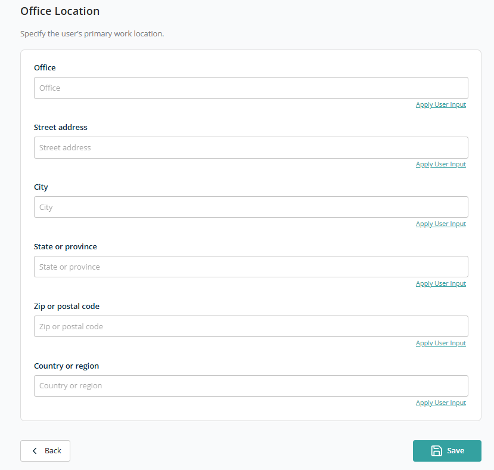

# Container — Create User

This container is used to provision new Microsoft 365 users in a structured, automated, and governance-driven manner. It simplifies user onboarding by capturing essential identity, security, and organisational details through a guided workflow.

When selected, a screen with a left-side menu opens, showing two configuration steps: **Set Up the Basics** and **User Profile Information**.

## Set Up the Basics

The **Set Up the Basics** screen defines the initial identity and login details for a new user. It is the first step in the user provisioning process and ensures the user's account is correctly created and accessible.

### Basic Information

This section captures the user's identity details as they will appear across the organisation:

- **First Name** — The user's given name. Required.
- **Last Name** — The user's surname. Required.
- **Display Name** — How the user's name will appear. Required.

The **Apply User Input** link is available beside each field to map or reuse values from user input.

### Sign-In Details

This section defines how the user will log into the system:

- **User Name** — A unique username in email format. Example: `firstname.lastname@yourdomain.com`.
- **Password** — Enter directly or configure using user input to generate it new every time.
- **Require user to change password at first sign-in** — Toggle to enforce password reset on first login. When enabled, the user must set a new password upon first access.

After adding all required configurations, click **Continue** to move on to **User Profile Information**.

## User Profile Information

The **User Profile Information** screen lets you define additional details about a user, including contact information, job role, and office location. This information is used to enhance user identity, improve communication, and support organisational structure.

### Contact Information

This section captures communication and recovery details:

- **Mobile Phone** — The user's mobile contact number. Commonly used for notifications, account recovery, and communication purposes.
- **Personal Email Address** — An alternate (non-work) email address. Commonly used for account recovery and backup communication.

### Employment Details

This section defines the user's role within the organisation.

- **Job Title** — The user's designation.
- **Department** — The department the user belongs to.
- **Manager Email** — The user's reporting manager. You can search and choose from existing email addresses.

### Office Location

This section defines the user's primary workplace location:

- **Office** — The office name or location identifier.
- **Street Address** — The detailed address of the office.
- **City** — The city where the office is located.
- **State or Province** — The state or region.
- **Zip or Postal Code** — The postal or zip code for the location.
- **Country or Region** — The country of the office location.

For all fields, the **Apply User Input** option is available to configure the field using user input so values can be reused for every new user request using this template.

After doing all configuration, click **Save** to add this container to the template. To discard the container, click **Back** to return to the first step, then click **Cancel**.

