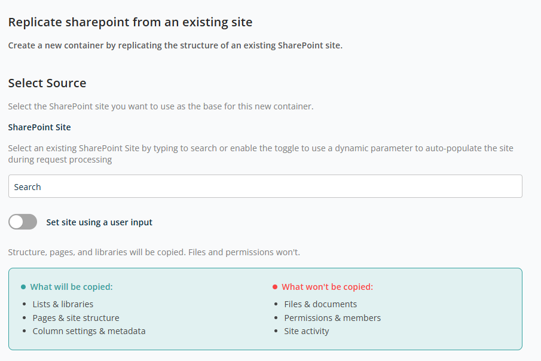
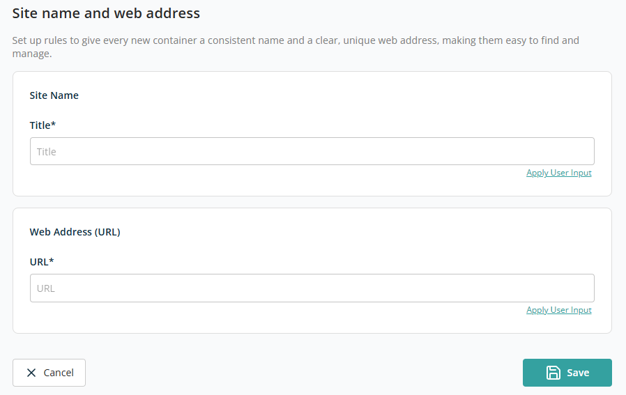

# Container — Replicate an Existing Site

This container creates a new SharePoint container by replicating the structure of an existing SharePoint site. It helps you quickly provision new sites with a familiar layout and configuration while avoiding manual setup.

Only the structure and configuration of the source site are replicated — **not its content or permissions**.

## Select Source

This section lets you select the existing SharePoint site that will act as the **base (source)** for the new container.

- **SharePoint Site** — Search field to find and select an existing SharePoint site. The selected site defines the structure that will be copied.
- **Set site using a user input** — Enable this toggle if the source site should be provided dynamically during request submission instead of being fixed in the template.

## Site Name and Web Address

This section lets you define how the new SharePoint site (container) will be named and how its URL will be created. These settings ensure each site has a clear identity and a unique, easy-to-find web address.

- **Title** — The display name of the SharePoint site.
- **URL** — The unique web address for the SharePoint site.

Use the **Apply User Input** functionality to define Title and URL to be entered dynamically during the request process.

Click **Save** to add this container to the template. Click **Back** to discard the container addition.
