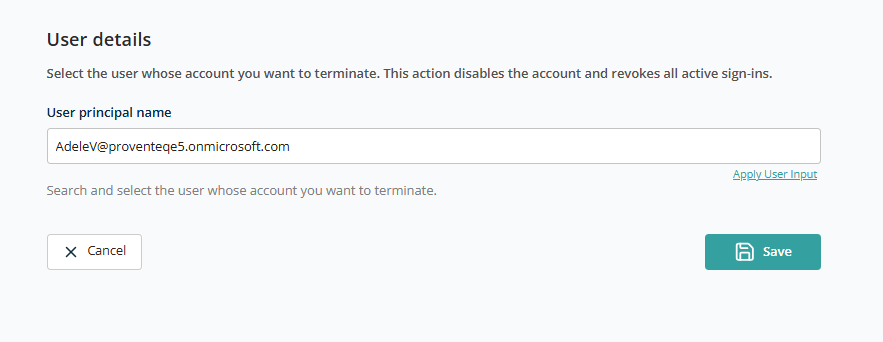

# Container — Terminate User

This container lets you select and terminate a Microsoft 365 user account. Terminating a user disables access and revokes all active sign-ins, helping maintain security and compliance when a user leaves the organisation or no longer requires access.

When selected, the following screen opens:

## User Selection

- **User Principal Name** — Search for an existing user (by name or email) to terminate.

Use the **Apply User Input** feature to configure this field so the template can be reused across multiple requests.

After selecting the user, click **Save** to add this container to the template. Click **Cancel** to discard.
