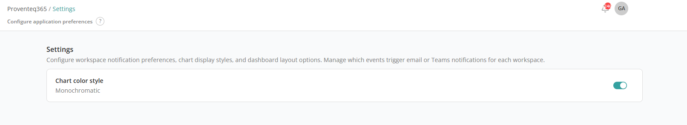

# Settings

The **Settings** screen allows you to configure application-level preferences that control how information is displayed within Proventeq365. These options help personalise how information is presented while maintaining a consistent user experience across reports.

When you click **Settings** in the menu, the following screen appears:

## Chart Colour Style

This setting controls the colour scheme used for data sections in reports throughout Proventeq365.

- **Monochromatic** — When the toggle is **ON**, data is displayed using a single-colour or neutral colour palette.
- **Colourful** — When the toggle is **OFF**, data is displayed using multiple colours to differentiate data points clearly.
