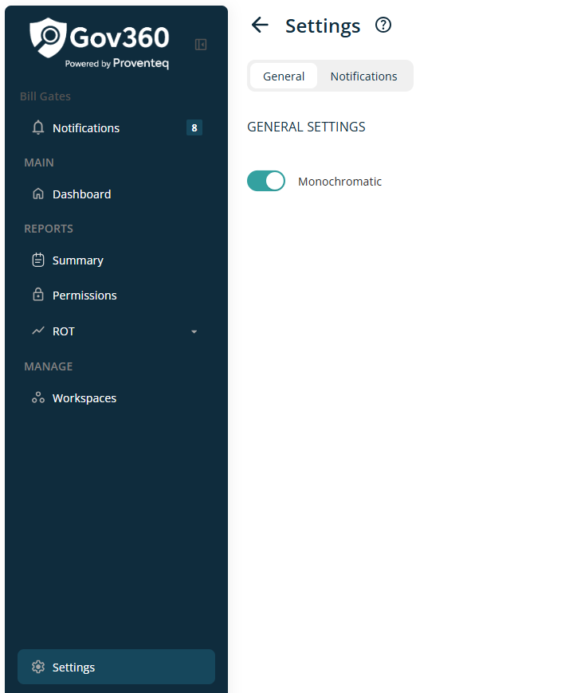
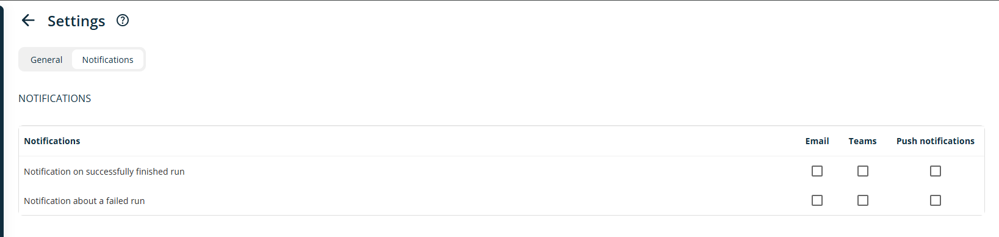

# Settings

When click on Settings menu, it will show below screen

In right side view of Screen, following section will be visible

### 6.1.1 Header

Header section will show following information/details

- **Header Text** -- The Header reads - Settings

- **Information icon** -- when click on icon, it will open popup with text - **Information about workspaces and their settings**. Popup will have See More link and when click on it, it redirect use to external link -

### 6.1.2 Setting Tab - General

In the General settings screen, the following control is available:

- **Toggle Control** -- This toggle allows users to switch between the Monochromatic and Colorful themes. By default, the Monochromatic theme is enabled.

### 6.1.3 Setting Tab - Notification

In Notification setting screen, following controls are available

For notification settings, users can configure notifications to be sent through three available methods: Email, Teams, or Push Notifications. A checkbox control will be provided to allow selection of the preferred notification method. Notifications will be sent according to this configuration.

Users can set up notifications for the following actions:

- Notification when a run completes successfully

- Notification about a failed run
