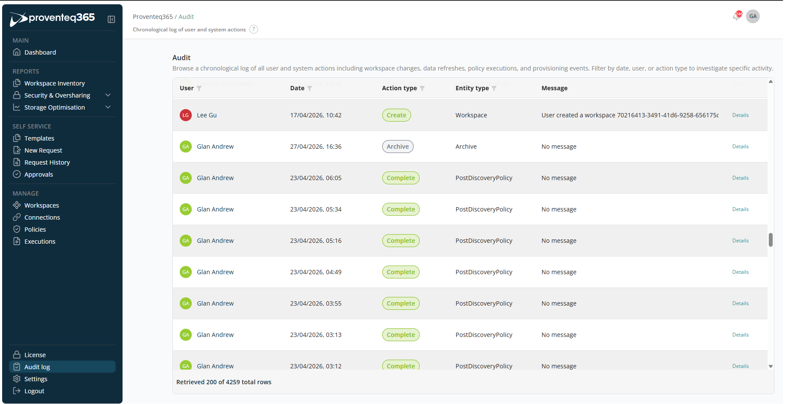
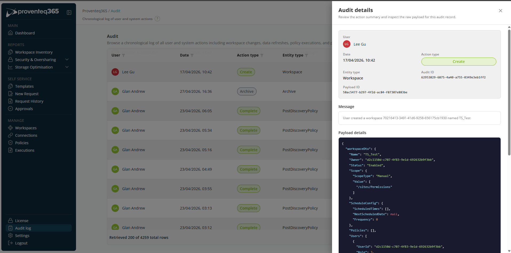

# Audit Log

The **Audit** screen provides a **chronological log of user and system activities** within Proventeq365. It helps administrators and compliance teams track actions, investigate issues, and maintain accountability across workspaces, policies, and automated processes.

This screen captures important events such as workspace creation, policy execution, archiving actions, and system-driven operations.

The audit log displays a list of recorded activities in reverse chronological order (most recent first). Each entry represents a single action performed by a user or triggered by the system.

## Columns

- **User** — The user (or system account) that performed the action.
- **Date** — The exact date and time when the action occurred.
- **Action Type** — The kind of action performed, for example: Create, Complete, Archive.
- **Entity Type** — The object affected by the action, such as Workspace, Archive, Policy (for example, Post-Discovery Policy).
- **Message** — Additional context or details about the action. If no additional information is available, this may display "No message".
- **Details** — Click **Details** to view extended information about the selected audit entry.

The audit log can be filtered using the **User, Date, Action Type, and Entity Type** columns.

Click **Details** to open a side panel that shows audit details.

## Audit Details

The Audit Details screen provides a **detailed view of a single audit log entry**. It lets you review a summarised description of an action and inspect the **raw payload data** captured at the time the action occurred.

This view is typically accessed by selecting **Details** from an entry in the audit log.

### Action Summary

The top section provides a high-level overview of the audited action:

- **User** — The user account that performed the action.
- **Date** — The exact date and time when the action occurred.
- **Action Type** — The type of action performed, for example: Create, Update, Complete, Archive.
- **Entity Type** — The object affected by the action, such as Workspace, Policy, Archive.
- **Audit ID** — A unique identifier for this audit record. Used for traceability, support, or compliance references.
- **Payload ID** — Identifies the underlying event payload associated with this audit record.
- **Message** — A human-readable description of the action, such as: *User created a workspace 70216413-3491-41d6-9258-656175cb1930 named Insurance project.*
- **Payload Details** — The Payload Details section displays the raw JSON data captured for the action.
