# Provisioning

When click on Templates menu, it will show below screen

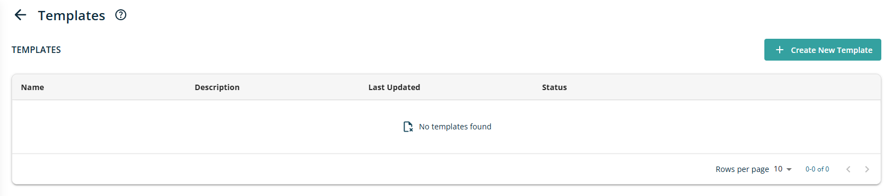

In right side view of Screen, following section will be visible

### 7.1.1 Header

Header section will show following information/details

- **Header Text** -- The Header reads - Templates

- **Information icon** -- when click on icon, it will open popup with text - **Information about templates and their settings.** Popup will have See More link and when click on it, it redirect use to external link -

### 7.1.2 Templates List

All created templates will be presented in a table format with the following columns:

- **Name:** Shows the name assigned to the template.

- **Description:** Shows the description of the template added while creating configuring table.

- **Last Update:** Shows the last updated data of template. When user modified template. It will update date in this column.most recent refresh date and time.

- **Status:** Indicates the current status of the template.

- **Action:** Contains icons allowing users to Edit, Run, or Show Runs for the workspace.

- **Edit:** Clicking this allows the template to be modified in edit mode.

- **Delete:** Deletes the selected template.

Additional functionalities are available at the bottom right of the workspace list table:

- **Rows Per Page:** Users can select the number of rows displayed per page using a dropdown menu. Options include 5, 10, 15, 20, 25, 30, 50, and 100, with the default set to 10 records per page.

- **Total Record Count:** Shows the range and total number of records, e.g., \"0--10 out of 200.\"

- **Next/Previous Navigation:** Users can navigate between record sets using left (\<) and right (\>) arrow icons.

### 7.1.3 Create Template

A button labeled \"Create New Template\" is displayed at the top right corner of the screen, above the list. When clicked, it opens the following Wizard screen.

The first screen of the wizard is titled **General**. On the Sites screen, the following sections and controls are shown:

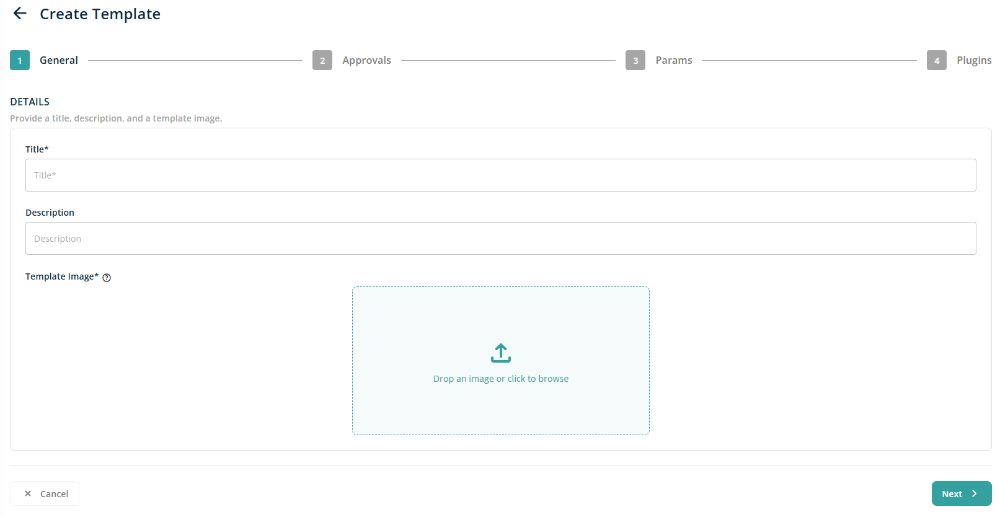

- **Header Text**: The header reads "Details"

- **Subheader Text**: The subheader text reads \"Provide a title, description, and a template image"

- **Title**: This will be a text box control for entering the Title of template. Providing this information is required.

- **Description**: This will be a text box control to add description of the template. Providing this information is not mendetory.

- **Template Image**: This will be file import control, where either drop a image to upload or use standard import file feature to select image for template. After successful import, image preview will be displayed in this section. Also, when hover on preview image, it will show Delete icon, if required to change the imported image. Providing this information is required. Currently, PNG, JPG and SVG format file is supported.

After providing the necessary information on the General wizard screen, clicking the Next button opens the second screen, **Approvals**.

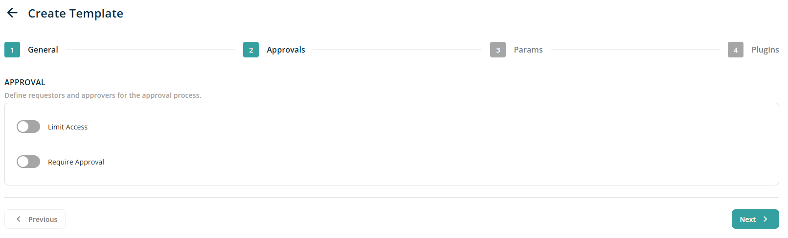

On the Approval screen, the following sections and controls are displayed:

- **Header Text** -- The header reads "Approval".

- **Subheader Text** - The subheader reads \"Define requestors and approvers for the approval process."

- **Limited Access** -- This will be a toggle switch to give access of configured template to Limited people.If any user selected, only those people can see this templated. By default this toggle will be OFF. When toggle ON this, it will following screen to setup access

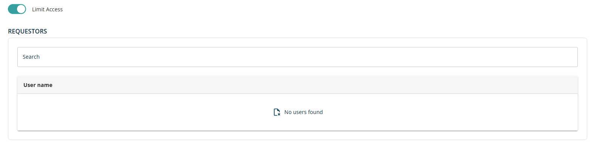

In this new section, following field will be displayed

- **Search --** This will be text box control to search users within the tenant. User can start typing and it will find and suggest user list. After searching relevant user, when clicking in search result will add user to below list along with Name and Delete icon

When try to add already selected user, Search box result shows text Already added

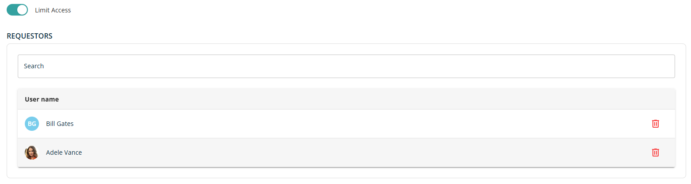

- **Required Approval** -- This will be a toggle switch to setup user list for approval before initiating provisioning. By default this toggle will be OFF. When toggle ON this, it will following screen to setup access

In this new section, following field will be displayed

- **Search --** This will be text box control to search users within the tenant. User can start typing and it will find and suggest user list. After searching relevant user, when clicking in search result will add user to below list along with Name and Delete icon

When try to add already selected user, Search box result shows text Already added.

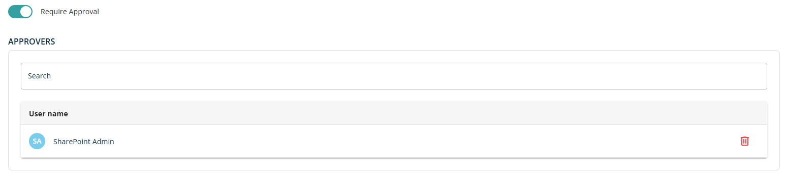

Both the toggle configuration is optional. After providing the necessary information on the Approvals wizard screen, clicking the Next button opens the third screen, **Params**.

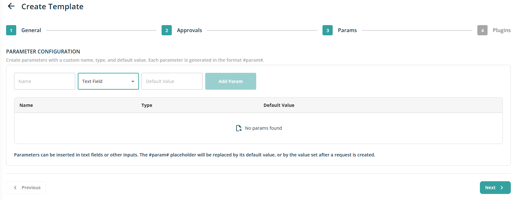

On the **Params** screen, the following sections and controls are displayed:

- **Header Text** -- The header reads "Parameter Configuration".

- **Subheader Text** - The subheader reads \"Create parameters with a custom name, type, and default value. Each parameter is generated in the format #param#."

- **Name** -- This will be a text box control to give parameter name.

- **Type** -- This will be a dropdown control to select parameter type. Dropdown having possible value -- Text Field, Team Site Selection, Sharpoint Site Selection. By default, Text Field option shows as selected.

There will be text box control display next to Type dropdown to add Default value of Paremeter. If user select Team Site Selection or Sharpoint Site Selection option, default value text box will get hide.

After selecting required values when click on Add Param button, it will add new row in below table with delete icon

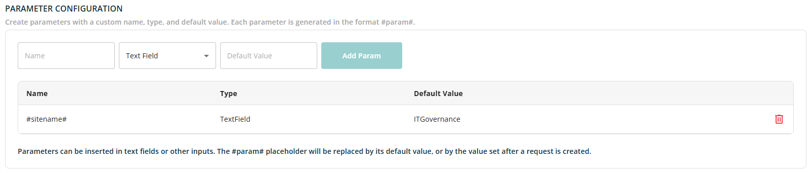

Configuration of parameter is optional. After providing the necessary information on the Params wizard screen, clicking the Next button opens the forth screen, **Plugins.**

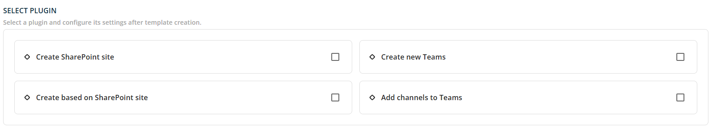

On the **Plugins** screen, the following sections and controls are displayed:

- **Header Text** -- The header reads "Select Plugin".

- **Subheader Text** - The subheader reads \"Select a plugin and configure its settings after template creation."

Users have the following plugin options to select from, with only one selection possible at a time:

- **Create SharePoint Sit**e -- Select this option if the template is intended for creating a SharePoint site without teams.

- **Create New Teams** -- Select this option if the template is to be used for creating a SharePoint site alongside Teams and channel creation.

- **Create Based on SharePoint Site** -- Select this option if the template is to be used for creating a SharePoint site based on an existing site.

- **Add Channel to Teams** -- Select this option if the template is to be used for adding a new channel to an existing Teams group.

After selecting the relevant option, click the Create Template button. This will generate a new template, which will appear in the templates list in Edit mode as shown below.

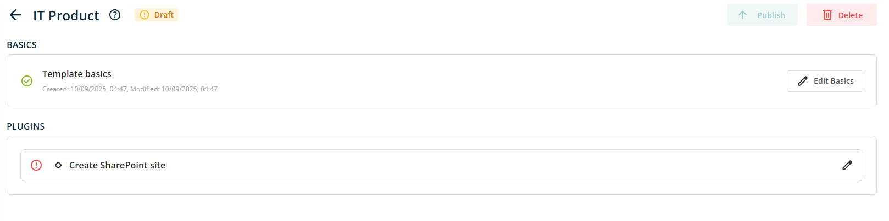

In this Edit view, two sections are displayed: BASICS and PLUGINS.

- **BASICS** -- This section allows you to edit the fundamental details of the template provided during configuration, such as basic information, approval settings, and parameters.

- **PLUGINS** -- This section is used to configure the selected plugin as defined during the template setup process.

The BASICS section displays the template's creation and modification date and time, along with an Edit Basics button. Clicking this button will open a page containing all the pre-filled details entered during template creation. Each section is presented as an accordion for ease of navigation and editing. After updating information, click on Save button displayed at top right corner of the screen to save the modified information.

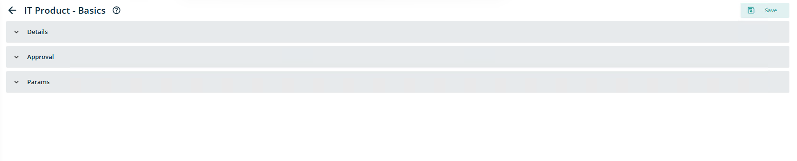

PLUGINS section will show selected pluging name along with Edit option. Clicking this will open plugin edit screen with accordians. By default all the accordians will be in expanded mode. At top right corner, there will be a Save button to save modifications if made any.

Based on selected plugin, Plugin Edit screen will be different. Lets see different screens based on select plugins

## Plugins

- [Plugin - Create SharePoint site](./plugins/plugin-create-sharepoint-site.md)
- [Plugin - Create new Teams](./plugins/plugin-create-new-teams.md)
- [Plugin - Create based on SharePoint site](./plugins/plugin-create-based-on-sharepoint-site.md)
- [Plugin -- Add channels to Teams](./plugins/plugin-add-channels-to-teams.md)
