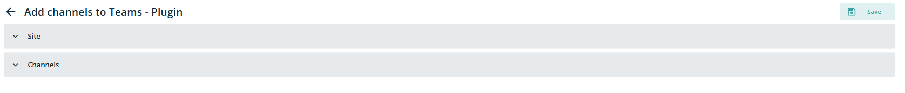
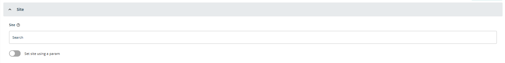
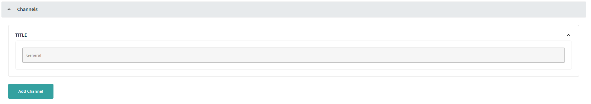
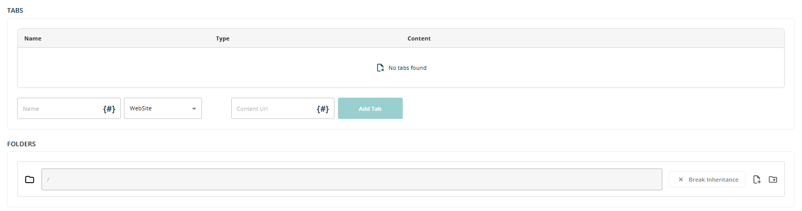
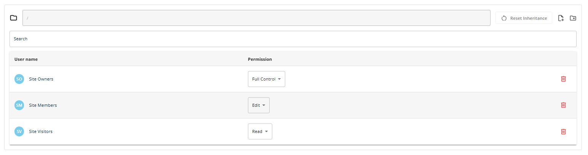
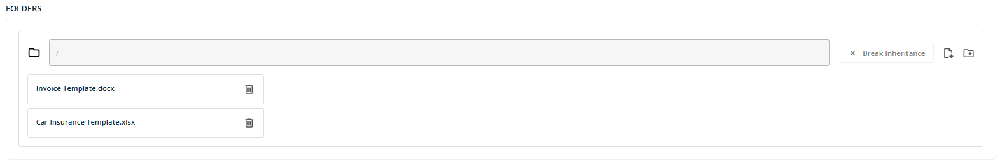
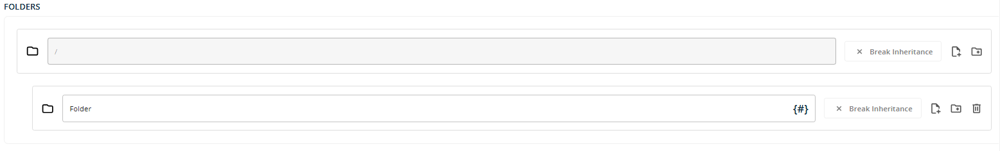
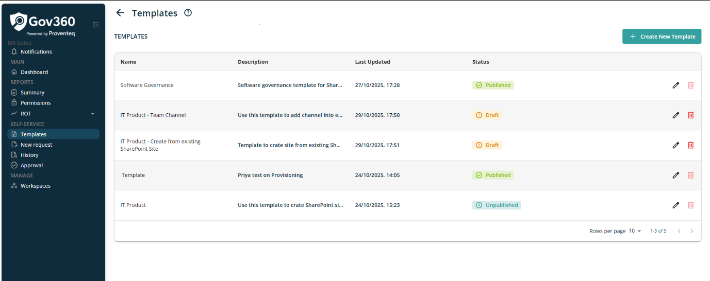

# Plugin -- Add channels to Teams

When this plugin selected and open in edit mode, following accordians will be displayed

**Site**

In this section, following fields are vailable

- **Teams --** This will text box control to search team site in which team channel need to add. This should be a required field.

- **Set site using Params:** Toggle control to set hub site using parameters. By default this toggle is OFF. When toggle it to ON, additional icon {#} displayed into Associated Hub site field to open popup to select parameter.

**Channels**

In this section, following field is visible

- **Name:** By default, One Channel got created with title **General** when use this template. In order to add some channels click on Add Channel button and it shows another section on screen with following controls

  - **Title:** This is will be a text box control to add team channel title. This is a required field. At the end of text box {#} icon displayed to setup parameters to this field.

  - **Delete:** There will be a delete icon in case this channel needs to delete.

  - **Arrow icon:** There will be a **V** arrow icon next to delete ti add some more configuration to the channel.

**Tabs**

To add default tab, this section can be used. User can add different type of tab by choosing required one from following available dropdown list options.

Based on selected value in dropdown, text box field Content URL will be displayed next to dropdown to configure it.

  -----------------------------------------------------------------------
  Tab Type                       Content URL Text box visible?
  ------------------------------ ----------------------------------------
  WebSite                        Yes

  DocumentLibrary                Yes

  Wiki                           No

  Planner                        No

  MicrosoftStream                No

  MicrosoftForms                 No

  Word                           Yes

  Excel                          Yes

  PowerPoint                     No

  PDF                            Yes

  OneNote                        No

  PowerBI                        No

  SharePointPageOrList           No

  Custom                         No
  -----------------------------------------------------------------------

After adding Name and Relavent tab, click on Add tab to add it in list.

**Folders**

For Folder, user have following functionality for each added folder

**Break Inheritance:** When click on this button, it will show list of existing user permissions applied on site level as table view with following columns.

- **User name:** Lists groups or roles (e.g., Site Owners, Site Members, Site Visitors).

- **Permission:** Dropdown for assigning permission levels. Dropdown have value - Full Control, Design, Edit, Contribute, Read

- **Delete Icon:** Present at the end of each row to remove that group's permissions.

This permissions can be altered as per need as for each existing permission. Also, user have Search box to add new user.

**Import File:** When click on this icon, it will open standard file selection control of browser to add file into root library. User can select single file at a time. After uploading a file, selected file will be displayed along with Delete icon.

**NOTE:** If fiile added without adding any folder, those files will be added at root level of libarary

**Add New Folder:** When click on this icon, it will add following fields to setting it up

- **Folder Name:** Text box control to add Folder name. For ease of user, it will prefil with text **Folder.** Also, there is a {#} icon in the text box in case this name needs to parameterised.

- **Break Inheritance:** Same functionality of bracking inheritance on newly added folder, which is preset at root level library.

- **Import File:** Click on this icon to add files into this newly added folder. User can add single file at a time using standard file selection control of a browser.

- **Add New Folder:** Add new subfolder into this newly added folder by clicking on this icon.

- **Delete Icon:** Click on this icon to remove newly added folder.

**NOTE**: For each added folder, user have create new folder option to create hierarchy of the folder if required. When add new subfolder, it will give all above control to manage that folder

When click on Template menu, it will load list of all existing templats created in tool as below

On List view, following columns will be displayed

- **Name:** This column will show name of the template added while creating new request

- **Description:** This column will show description of the template added while creating new request.

- **Last Update:** This column will show date and time when template was last modified. It will update everytime when user modified template.

- **Status:** This column will show current status of the template. Possible value for this column will be

  - If Template is only created and not published, status will be: **Draft**

  - If template is created and published, status will be: **Published**

  - If template is unpublished, status will be: **Unpublished**

- **Action:** This column will show two icons

  - Pencil -- Click on this icon to edit template

  - Delete - Click on this icon to delete template. User can only delete the template which is in draft status.

**NOTE**: If any template created with Limited access, only those user(s) and Tenant admin user (who has created that) can see that in template list
