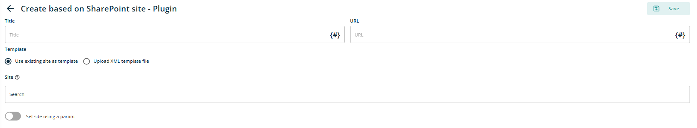
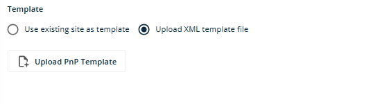
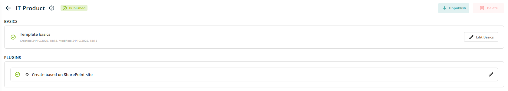

# Plugin - Create based on SharePoint site

When this plugin selected and open in edit mode, following fields will be displayed

- **Title:** Text box control to add Title that can be used while creating site collection. This will be a required field.

- **URL:** Text box control to add site URL that can be used while creating site collection. This will be a required field. Eg. If site need to created like <http://demo.sharepoint.com/sites/Governance>, **Governance** needs to provide in this text box.

- **Tempalate:** There will be a two options available to select from either one -- Use existing site as template, Upload XML template file.

For the Template option, **Use existing site as template** is selected by default. This displays an additional text box that allows users to search for existing sites within the tenant\'s scope. If required, the site selection can be parameterised by toggling ON the \"Set site using a parameter\" option. When enabled, a {#} icon will appear within the Site text box. Clicking this icon opens a pop-up window displaying a list of existing parameters, from which users can select or add new parameters as needed.

When select other option, **Upload XML template file,** additional button Upload PnP Template will be displayed. When click on it, it will open standard file selection control of browser to choose PnP template file. File format which is allowed is XML.

After setting up all template setting, Click on Save button save all updates. Once this is done, Click on Publish button to publish this template, so that can be available in Requests tab to use it.

its published, user can unpublished or delete it using buttons displayed at top right corner of screen.
