# Plugin - Create SharePoint site

When this plugin selected and open in edit mode, following accordians will be displayed

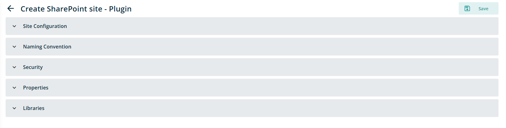

**Site Configuration**

In this section, following fields are vailable

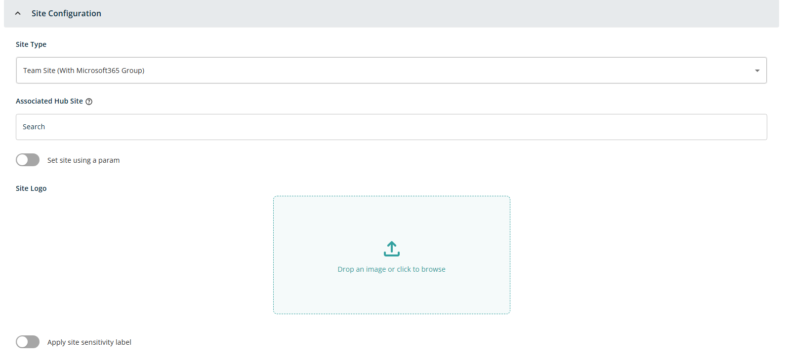

- **Site Type:** Dropdown control to define type of site with options -- Communication site, Team Site (with Microsoft365 Group), Team Site (without Microsoft365 Group)

- **Associated Hub Site:** Text box control to search hub site to associate it with sharepoint site. Refer section -- [Hub Site](/appendix#hub-site) for more information

- **Set site using Params:** Toggle control to set hub site using parameters. By default this toggle is OFF. When toggle it to ON, additional icon {#} displayed into Associated Hub site field to open popup to select parameter.

- **Site Logo:** This will be file import control, where either drop a image to upload or use standard import file feature to select image for template. After successful import, image preview will be displayed in this section. Also, when hover on preview image, it will show Delete icon, if required to change the imported image. Providing this information is required. Currently, PNG, JPG and SVG format file is supported.

- **Apply Site Sensitivity Lable:** Toggle control to setup sensitivity label to site. By default this toggle is OFF. When toggle it to ON, Additional dropdown control will be displayed with list of available sensitivity label.

**Naming Convention**

In this section, following fields are visible

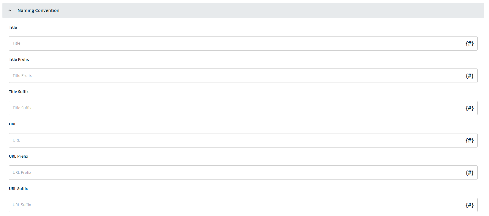

- **Title:** Text box control to add Title that can be used while creating site collection. This will be a required field.

- **Title Prefix:** Text box control to add Title Prefix that can be used while creating site collection. When multiple site provisioning need to done with some standard prefix, this field can be use. Eg. Project - \<site title\>

- **Title Suffix:** Text box control to add Title Suffix that can be used while creating site collection. When multiple site provisioning need to done with some standard suffix, this field can be use. Eg. Project - \<site title\> - 2025

- **URL:** Text box control to add site URL that can be used while creating site collection. This will be a required field. Eg. If site need to created like <http://demo.sharepoint.com/sites/Governance>, **Governance** needs to provide in this text box.

- **URL Prefix:** Text box control to add URL Prefix that can be used while creating site collection. When multiple site provisioning need to done with some standard prefix, this field can be use. Eg. **Governance**\<URL\>

- **URL Suffix:** Text box control to add URL suffix that can be used while creating site collection. When multiple site provisioning need to done with some standard suffix, this field can be use. Eg. **Governance**\<URL\>2025

Each text box control having {#} icon to open parameters popup to configure parameters for that field as per requirement.

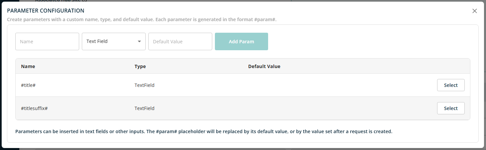

In order to use parameter, click on Select button and its got set for selected field.

**Security**

In this section, following field is visible

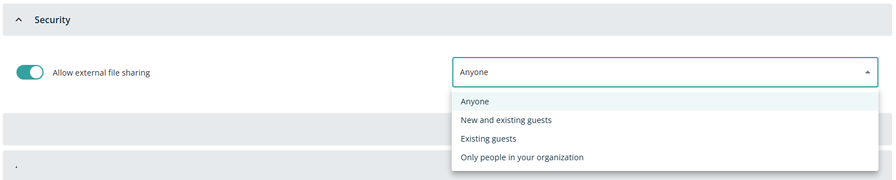

- **Allow external file sharing:** This will be a toggle control to restrict external file sharing of the document and folders. By default this toggle is OFF. When toggle it to ON, additional dropdown control will be displayed with following options

  - Anyone

  - New and existing guests

  - Existing guests

  - Only people in your organization

**Properties**

In this section, following field is visible

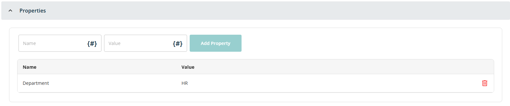

- **Name:** Text box control to add Name of the property bag. This added property can be use for tagging sites with metadata such as department or purpose, aiming to enhance governance and reporting capabilities, enabling more granular governance, and decision-making beyond basic data analysis. This will be a **required** field.

- **Value:** Text box control to add Name of the property bag.This will be a **required** field.

- **Add Property:** This will be button control. After adding Name and Value, click on this will add Name and Value into below grid view along with Delete icon. If want to remove added property, click on delete icon displayed for each added value.

Both Name and Value field can be parameterized using existing parameter added at template or can add new parameter. Click on {#} icon to open parameter configuration popup.

**Libraries**

Using this section, use can add multiple libraries with settings as per need. Shared document library is displayed by default in this section with read only field of Title and Path (since its default library given by SharePoint, user don't have option to modify name and path. However, user can modify settings of that.

For this section, Title and Path whould be the fields need to configure. For that when click on Add Library button,

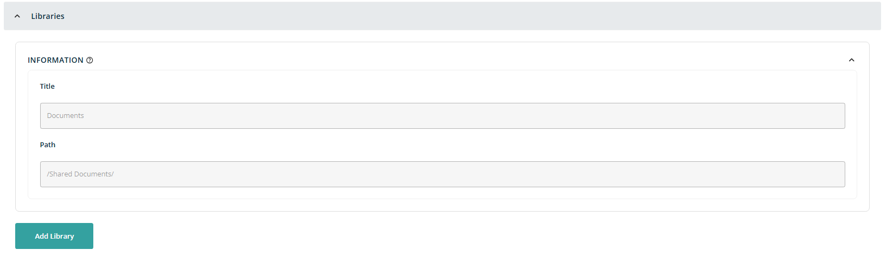

When user click on Add Library button, it will show following controls on screen

- **Title:** Text box control to Title of the Library. This will be a **required** field.

- **Path:** Text box control to add Path of the Library.This will be a **required** field.

Both the field can be parameterized using {#} icon displayed in each field.

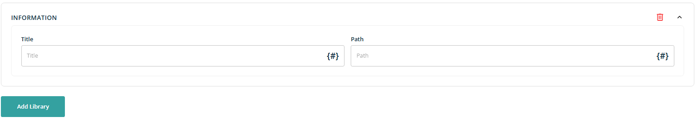

After adding this information, when click on Down arrow **V** displayed at right corner, it will expand section to add do some additional configuration like adding Content Type, Folder to the created library and define some advanced settings.

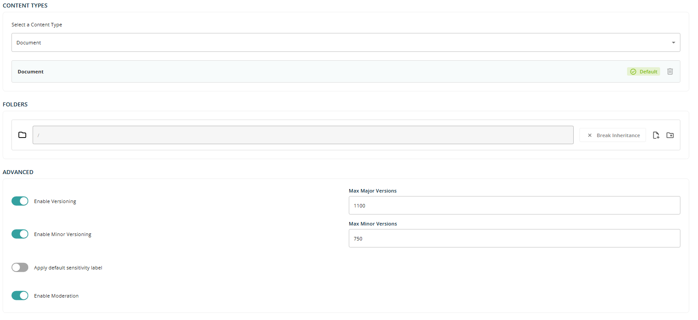

**Content Types**

For Content type configuration, Following controls visible on screen

- **Select a Content Type:** This will be a Dropdown control with list of content type available at site level. Once user select content type from dropdown, it will get added below to dropdown with option to make it Default and Delete icon

**Folders**

For Folder, user have following functionality for each added folder

**Break Inheritance:** When click on this button, it will show list of existing user permissions applied on site level as table view with following columns.

- **User name:** Lists groups or roles (e.g., Site Owners, Site Members, Site Visitors).

- **Permission:** Dropdown for assigning permission levels. Dropdown have value - Full Control, Design, Edit, Contribute, Read

- **Delete Icon:** Present at the end of each row to remove that group's permissions.

This permissions can be altered as per need as for each existing permission. Also, user have Search box to add new user.

**Import File:** When click on this icon, it will open standard file selection control of browser to add file into root library. User can select single file at a time. After uploading a file, selected file will be displayed along with Delete icon.

**NOTE:** If fiile added without adding any folder, those files will be added at root level of libarary

**Add New Folder:** When click on this icon, it will add following fields to setting it up

- **Folder Name:** Text box control to add Folder name. For ease of user, it will prefil with text **Folder.** Also, there is a {#} icon in the text box in case this name needs to parameterised.

- **Break Inheritance:** Same functionality of bracking inheritance on newly added folder, which is preset at root level library.

- **Import File:** Click on this icon to add files into this newly added folder. User can add single file at a time using standard file selection control of a browser.

- **Add New Folder:** Add new subfolder into this newly added folder by clicking on this icon.

- **Delete Icon:** Click on this icon to remove newly added folder.

**NOTE**: For each added folder, user have create new folder option to create hierarchy of the folder if required. When add new subfolder, it will give all above control to manage that folder

**Advanced**

For Advanced configuration, Following controls visible on screen

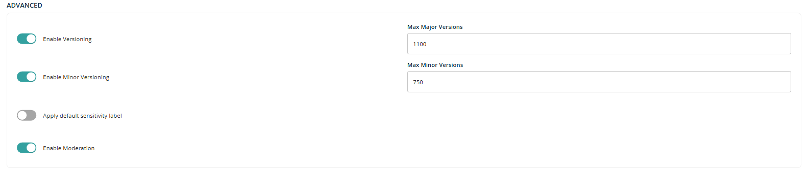

- **Enable Versioning:** This will be a toggle control. By defaut, it's ON, so additional text box control diaplayed to define max major versions allowed into that library. Default value is 1100. User can change it if needed.

- **Enable Minor Versioning:** This will be a toggle control. By defaut, it's ON, so additional text box control diaplayed to define max minor versions allowed into that library. Default value is 750. User can change it if needed.

- **Apply default sensitivity label:** This will be a toggle control. By defaut, it's OFF. When turn it ON, additional dropdown will be displayed on sceen with list of sensitivity label available to assigned for library.

- **Enable Moderation:** This will be a toggle control. By default, It's ON. This setting refers to the process of controlling the visibility and approval status of items (like documents or list entries) before they are made available to all users.

After setting up all template setting, Click on Save button save all updates. Once this is done, Click on Publish button to publish this template, so that can be available in Requests tab to use it.

its published, user can unpublished or delete it using buttons displayed at top right corner of screen.

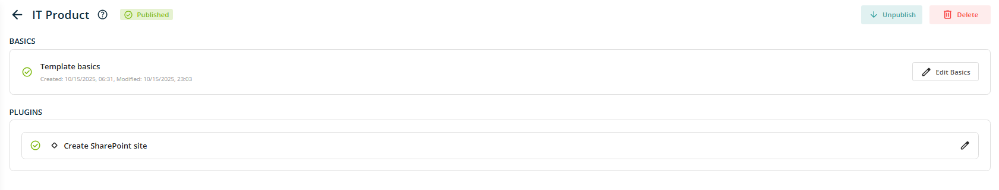
