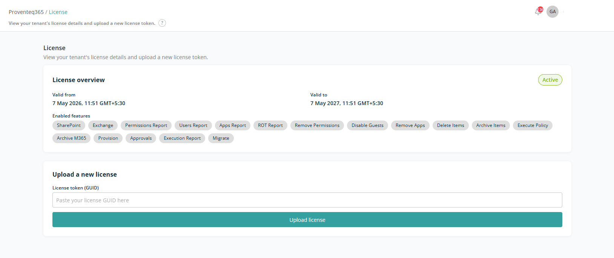

# License

The **License** screen lets you view license details and renew a license. It provides a clear overview of your license status, validity period, and enabled features.

## License Overview

The License Overview section displays key information about your current license:

- **License Status** — Whether the license is currently active.
- **Valid From** — The start date and time of the license.
- **Valid To** — The license expiry date and time.
- **Enabled Features** — All features currently available under the license. Each feature is displayed as a tag for quick reference. Examples include: **SharePoint, Permissions Report, Remove Permissions, Provision, Archive M365**.

## Upload a New License

Use this section to renew the Proventeq365 license. Enter the license key provided in GUID format and click **Upload License**. The system validates and applies the new license.
