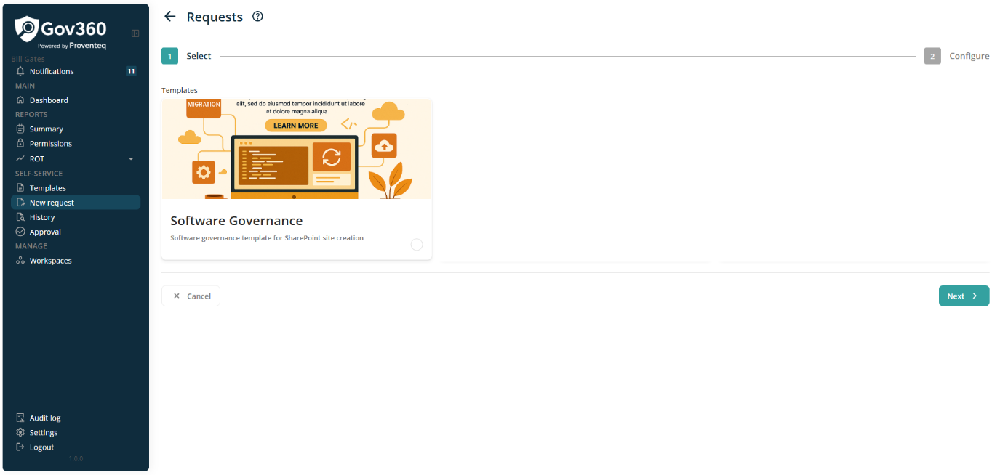
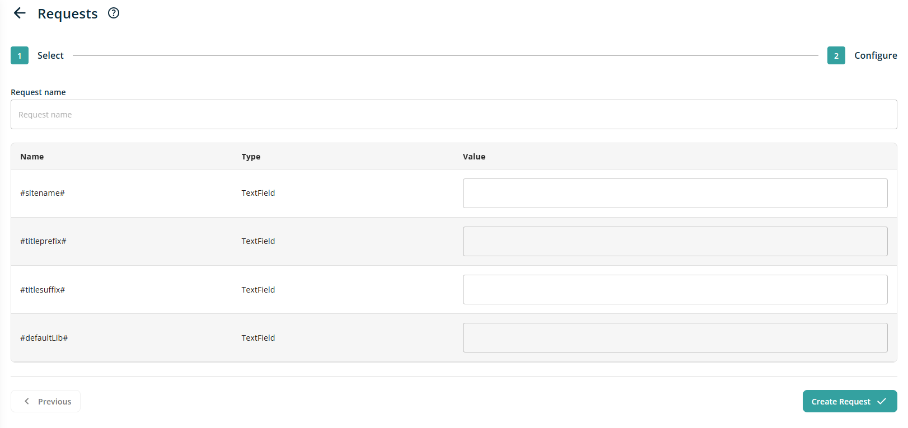

# Request

When click on New Request from menu, it will open following screen

From this screen, user can create new provisioning request using relevant template.

For that, First screen to generate request is **Select**

This screen will show all the templates which are published and accessible to current logged in user will be displayed as Card with Name, Description and Image.

After selecting relevant templates, click on Next button will move on Configuration screen

On Configuration screen, Following fields will be displayed

- **Request Name**: This will be a text box control for entering the name of the request. Providing this information is required.

- **List of Parameters**: Below Request name, List of parameters will be displayed to setup its value. This list will show all the parameters used while congiring the template or plugin.

After adding all required information, click on Create Request button will create new provisioning request. Once request get generated, all request will be displayed in History module.

**NOTE**: If Template is create with Require Approval setting, after creating provisioning request, it will display into Approval module. If Template is create without Require Approval setting, after creating provisioning request, it will display into History
