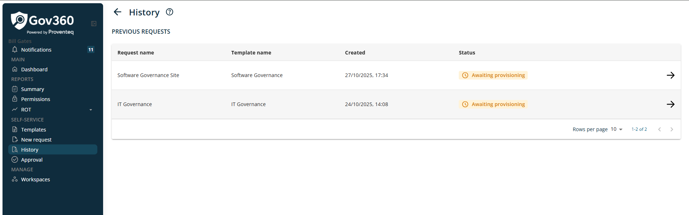
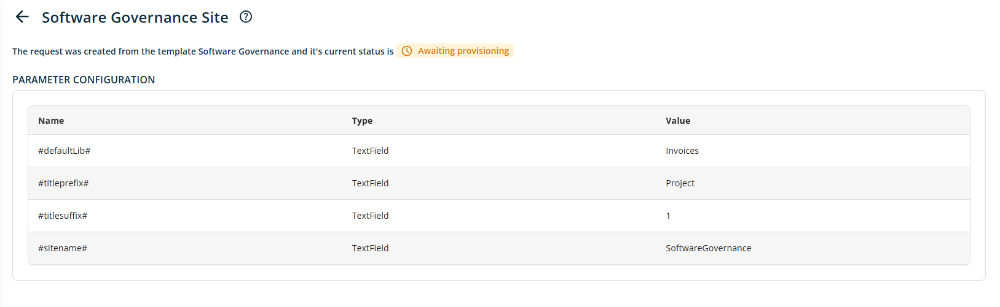

# History

When click on History from menu, it will show following screen.

On request history list view, following columns will be displayed

- **Request Name:** This column will show Name of the provisioning request.

- **Template Name:** This column will show name of the template used to create provisioning request.

- **Created:** This column will show date and time when provisioning request is created.

- **Status:** This column will show status of provisioning. Possible values for this column is following

  - **Awaiting provisioning:** when request has been generated.

  - **Provisioning failed:** when provisioning is failed due to any reason.

  - **Provisioning successful:** when provisioning is completed successfully.

- **Action:** This column will show Arrow icon to open details of request as show below

This screen will show current status of request and detail of parameter configuration.

In addition, the bottom right section of the list table provides the following features:

- Rows Per Page: The number of rows displayed per page can be adjusted using a dropdown menu in this section. Available options include 5, 10, 15, 20, 25, 30, 50, and 100 rows per page. The default setting is 10 records per page.

- Total Record Count: This displays the range of records currently shown and the total record count, such as \"0--10 out of 200\".

- Next/Previous Navigation: Users can navigate to the next or previous set of records using the \< and \> arrow icons.
